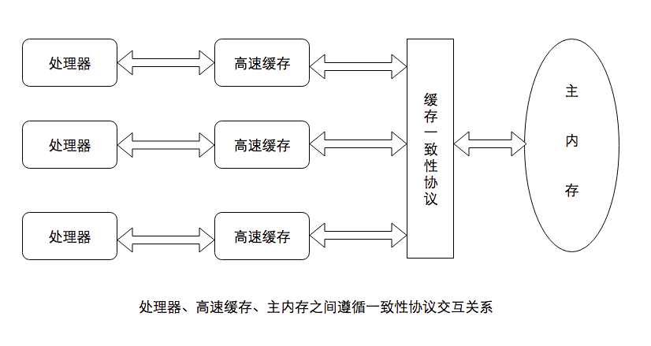
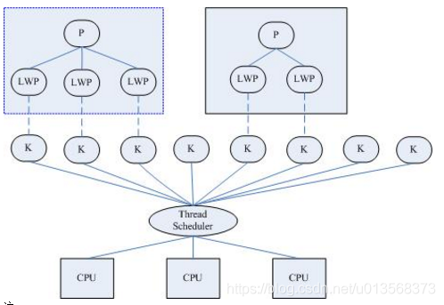
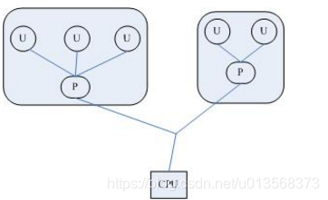
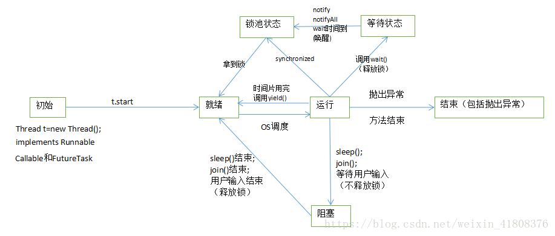

[java内存模型](##java内存模型)

- [计算机内存模型 vs java内存模型](###计算机内存模型 vs java内存模型)
- [java工作内存与主内存的交互](###java工作内存与主内存的交互)
- [volatile修饰的变量的特殊规则](###volatile修饰的变量的特殊规则)
- [并发内存模型的实质](###并发内存模型的实质)
- [先行发生原则](###先行发生原则)
- [java线程实现](###java线程的实现)

[java锁实现](##java锁实现)

- [jvm源码中来分析锁的膨胀过程](###从jvm源码中来分析锁的膨胀过程（锁升级的过程))

- [案列分析锁的膨胀过程](###从案例入手开始分析偏向锁（批量重偏向、批量撤销）、轻量级锁、重量级锁及膨胀过程)

  - [偏向锁](###偏向锁)

  - [轻量级锁](####轻量级锁)

  - [重量级锁](####重量级锁)

    

​	**摩尔定律(硬件定律)：** *集成电路上可以容纳的晶体管数目在大约每经过24个月便会增加一倍，换言之每隔两年处理的性能提升一倍*；摩尔定律描述处理器晶体管数量与运行效率之间的关系

​	**admdahl：** *系统中对某一部件采用更快执行方式所能获得的系统性能改进程度，取决于这种执行方式被使用的频率，或所占总执行时间的比例*。通过并行化与串行化的比重来描述多处理器系统能获得的运算加速能力

## java内存模型

### 计算机内存模型 vs java内存模型

- **计算机内存模型**：计算机的存储设备与计算器的运算速度有几个数量级的差距，为了更好的压榨处理器的运算能力，现代计算机在内存和每个计算机处理器之间增加了一层告诉缓存（cache）; 将数据提前缓存到cache中，处理从cache中获取数据，并将计算结果缓存回cache，再同步到住内存

- **java内存模型**：java的内存模型和计算机的内存模型类似，分为：主内存和每个线程的工作内存，这是由jvm实现的，和平台、操作系统无关；每个线程操作的数据都是对自己的工作内存进行处理，所以jvm也有从主内存读入数据到工作内存，将工作内存写回主内存的步骤。

  

  - **主内存：**java虚拟机规定所有的对象都必须在主内存中产生，存放的变量：**实例字段、静态字段**；为了方便理解，可以认为是堆区。可以与前面说的物理机的主内存相比，只不过物理机的主内存是整个机器的内存，而虚拟机的主内存是虚拟机内存中的一部分。

  - **工作内存：**java虚拟机中每个线程都有自己的工作内存，存放的变量：**包括局部变量、方法参数**；该内存是线程私有的为了方便理解，可以认为是虚拟机栈。可以与前面说的高速缓存相比。线程的工作内存保存了线程需要的变量在主内存中的副本。虚拟机规定，线程对主内存变量的修改必须在线程的工作内存中进行，不能直接读写主内存中的变量。不同的线程之间也不能相互访问对方的工作内存。如果线程之间需要传递变量的值，必须通过主内存来作为中介进行传递。

    *这里需要说明一下：主内存、工作内存与java内存区域中的java堆、虚拟机栈、方法区并不是一个层次的内存划分。这两者是基本上是没有关系的，上文只是为了便于理解，做的类比*

###  java工作内存与主内存的交互

物理机高速缓存和主内存之间的交互有协议，同样的，**java内存中线程的工作内存和主内存的交互是由java虚拟机定义了如下的8种操作来完成的**，每种操作必须是原子性的(double和long类型可能会进行两次内存读取或存储，在并发情况下可能读取到的数据表现出高低位不一致的情况，现在大多数的java虚拟机对这种类型数据作了优化，保证参考操作的原子性。[volatile详解和非原子性协定](##volatile修饰的变量的特殊规则))。

**jvm中8种内存交互命令（具有原子性）：**

- **lock(锁定)**:作用于主内存的变量，一个变量在同一时间只能一个线程锁定，该操作表示这条线成独占这个变量
- **unlock(解锁)**:作用于主内存的变量，表示这个变量的状态由处于锁定状态被释放，这样其他线程才能对该变量进行锁定
- **read(读取)**:作用于主内存变量，表示把一个主内存变量的值传输到线程的工作内存，以便随后的load操作使用
- **load(载入)**:作用于线程的工作内存的变量，表示把read操作从主内存中读取的变量的值放到工作内存的变量副本中(副本是相对于主内存的变量而言的)
- **use(使用)**:作用于线程的工作内存中的变量，表示把工作内存中的一个变量的值传递给执行引擎，每当虚拟机遇到一个需要使用变量的值的字节码指令时就会执行该操作
- **assign(赋值)**:作用于线程的工作内存的变量，表示把执行引擎返回的结果赋值给工作内存中的变量，每当虚拟机遇到一个给变量赋值的字节码指令时就会执行该操作
- **store(存储)**:作用于线程的工作内存中的变量，把工作内存中的一个变量的值传递给主内存，以便随后的write操作使用
- **write(写入)**:作用于主内存的变量，把store操作从工作内存中得到的变量的值放入主内存的变量中

如果要把一个变量从主内存传输到工作内存，那就要顺序的执行read和load操作，如果要把一个变量从工作内存回写到主内存，就要顺序的执行store和write操作。**对于普通变量，虚拟机只是要求顺序的执行，并没有要求连续的执行，所以如下也是正确的**。对于两个线程，分别从主内存中读取变量a和b的值，并不一样要read a; load a; read b; load b; 也会出现如下执行顺序：read a; read b; load b; load a; (对于volatile修饰的变量会有一些其他规则,后边会详细列出)，对于这8中操作，虚拟机也规定了一系列规则，在执行这8中操作的时候必须遵循如下的规则：

- **不允许read和load、store和write操作之一单独出现**，也就是不允许从主内存读取了变量的值但是工作内存不接收的情况，或者不允许从工作内存将变量的值回写到主内存但是主内存不接收的情况
- **不允许一个线程丢弃最近的assign操作**，也就是不允许线程在自己的工作线程中修改了变量的值却不同步/回写到主内存
- **不允许一个线程回写没有修改的变量到主内存**，也就是如果线程工作内存中变量没有发生过任何assign操作，是不允许将该变量的值回写到主内存
- **变量只能在主内存中产生**，不允许在工作内存中直接使用一个未被初始化的变量，也就是没有执行load或者assign操作。也就是说在执行use、store之前必须对相同的变量执行了load、assign操作
- **一个变量在同一时刻只能被一个线程对其进行lock操作**，也就是说一个线程一旦对一个变量加锁后，在该线程没有释放掉锁之前，其他线程是不能对其加锁的，*但是同一个线程对一个变量加锁后，可以继续加锁，同时在释放锁的时候释放锁次数必须和加锁次数相同*。
- **对变量执行lock操作，就会清空工作空间该变量的值**，执行引擎使用这个变量之前，需要重新load或者assign操作初始化变量的值
- **不允许对没有lock的变量执行unlock操作**，如果一个变量没有被lock操作，那也不能对其执行unlock操作，当然一个线程也不能对被其他线程lock的变量执行unlock操作
- **对一个变量执行unlock之前，必须先把变量同步回主内存中**，也就是执行store和write操作

**当然，最重要的还是如开始所说，这8个动作必须是原子的，不可分割的。**


### volatile修饰的变量的特殊规则

**关键字volatile可以说是java虚拟机中提供的最轻量级的同步机制（可见性、volatile变量间的有序性）**。java内存模型对volatile专门定义了一些特殊的访问规则。这些规则有些晦涩拗口，先列出规则，然后用更加通俗易懂的语言来解释：
 假定T表示一个线程，V和W分别表示两个volatile修饰的变量，那么在进行read、load、use、assign、store和write操作的时候需要满足如下规则：

- **只有当线程T对变量V执行的前一个动作是load，线程T对变量V才能执行use动作；同时只有当线程T对变量V执行的后一个动作是use的时候线程T对变量V才能执行load操作。**所以，线程T对变量V的use动作和线程T对变量V的read、load动作相关联，必须是连续一起出现。*也就是在线程T的工作内存中，每次使用变量V之前必须从主内存去重新获取最新的值，用于保证线程T能看得见其他线程对变量V的最新的修改后的值*（volatile变量读取时，采用了lock指令，会刷新当前工作内存的缓存）。
- **只有当线程T对变量V执行的前一个动作是assign的时候，线程T对变量V才能执行store动作；同时只有当线程T对变量V执行的后一个动作是store的时候，线程T对变量V才能执行assign动作。**所以，线程T对变量V的assign操作和线程T对变量V的store、write动作相关联，必须一起连续出现。也即是在线程T的工作内存中，每次修改变量V之后必须立刻同步回主内存，用于保证线程T对变量V的修改能立刻被其他线程看到。
- **假定动作A是线程T对变量V实施的use或assign动作，动作F是和动作A相关联的load或store动作，动作P是和动作F相对应的对变量V的read或write动作；类似的，假定动作B是线程T对变量W实施的use或assign动作，动作G是和动作B相关联的load或store动作，动作Q是和动作G相对应的对变量W的read或write动作。如果动作A先于B，那么P先于Q。**也就是说在同一个线程内部，被volatile修饰的变量不会被指令重排序，保证代码的执行顺序和程序的顺序相同。

总结上面三条规则，前面两条可以概括为：**volatile类型的变量保证对所有线程的可见性**。第三条为：**volatile类型的变量间禁止指令重排序优化**。

- **valatile类型的变量保证对所有线程的可见性**
   可见性是指当一个线程修改了这个变量的值，新值（修改后的值）对于其他线程来说是立即可以得知的。正如上面的前两条规则规定，volatile类型的变量每次值被修改了就立即同步回主内存，每次使用时就需要从主内存重新读取值。返回到前面对普通变量的规则中，并没有要求这一点，所以普通变量的值是不会立即对所有线程可见的。

```java
误解：volatile变量对所有线程是立即可见的，所以对volatile变量的所有修改(写操作)都立刻能反应到其他线程中。或者换句话说：volatile变量在各个线程中是一致的，所以基于volatile变量的运算在并发下是线程安全的。
 这个观点的论据是正确的，但是根据论据得出的结论是错误的，并不能得出这样的结论。volatile的规则，保证了read、load、use的顺序和连续行，同理assign、store、write也是顺序和连续的。也就是这几个动作是原子性的，但是对变量的修改，或者对变量的运算，却不能保证是原子性的。如果对变量的修改是分为多个步骤的，那么多个线程同时从主内存拿到的值是最新的，但是经过多步运算后回写到主内存的值是有可能存在覆盖情况发生的。如下代码的例子：
public class VolatileTest {
  public static volatile int race = 0;
  public static void increase() {
    race++
  }

  private static final int THREADS_COUNT = 20;

  public void static main(String[] args) {
      Thread[] threads = new Thread[THREADS_COUNT);
      for (int = 0; i < THREADS_COUNT; i++) {
          threads[i] = new Thread(new Runnable(){
              @Override
              public void run() {
                  for (int j = 0; j < 10000; j++) {
                     increase();
                  }
              }
          });
          threads[i].start();
      }
      while (Thread.activeCount() > 1) {
         Thread.yield();
      }
      System.out.println(race);
  }
}
代码就是对volatile类型的变量启动了20个线程，每个线程对变量执行1w次加1操作，如果volatile变量并发操作没有问题的话，那么结果应该是输出20w，但是结果运行的时候每次都是小于20w，这就是因为`race++`操作不是原子性的，是分多个步骤完成的。假设两个线程a、b同时取到了主内存的值，是0，这是没有问题的，在进行`++`操作的时候假设线程a执行到一半，线程b执行完了，这时线程b立即同步给了主内存，主内存的值为1，而线程a此时也执行完了，同步给了主内存，此时的值仍然是1，线程b的结果被覆盖掉了。
```

- **volatile变量禁止指令重排序优化**
   普通的变量仅仅会保证在该方法执行的过程中，所有依赖赋值结果的地方都能获取到正确的结果，但不能保证变量赋值的操作顺序和程序代码的顺序一致。因为在一个线程的方法执行过程中无法感知到这一点，这也就是java内存模型中描述的所谓的“线程内部表现为串行的语义”。

  *也就是在单线程内部，我们看到的或者感知到的结果和代码顺序是一致的，即使代码的执行顺序和代码顺序不一致，但是在需要赋值的时候结果也是正确的，所以看起来就是串行的*。但实际结果有可能代码的执行顺序和代码顺序是不一致的。这在多线程中就会出现问题。
   看下面的伪代码举例：

```java
Map configOptions;
char[] configText;
//volatile类型bianliang
volatile boolean initialized = false;

//假设以下代码在线程A中执行
//模拟读取配置信息，读取完成后认为是初始化完成
configOptions = new HashMap();
configText = readConfigFile(fileName);
processConfigOptions(configText, configOptions);
initialized = true;

//假设以下代码在线程B中执行
//等待initialized为true后，读取配置信息进行操作
while ( !initialized) {
  sleep();
}
doSomethingWithConfig();
如果initialiezd是普通变量，没有被volatile修饰，那么线程A执行的代码的修改初始化完成的结果`initialized = true`就有可能先于之前的三行代码执行，而此时线程B发现initialized为true了，就执行`doSomethingWithConfig()`方法，但是里面的配置信息都是null的，就会出现问题了。
 现在initialized是volatile类型变量，保证禁止代码重排序优化，那么就可以保证`initialized = true`执行的时候，前边的三行代码一定执行完成了，那么线程B读取的配置文件信息就是正确的。

跟其他保证并发安全的工具相比，volatile的性能确实会好一些。在某些情况下，volatile的同步机制性能要优于锁(使用synchronized关键字或者java.util.concurrent包中的锁)。但是现在由于虚拟机对锁的不断优化和实行的许多消除动作，很难有一个量化的比较。
```

 与自己相比，就可以确定一个原则：**volatile变量的读操作和普通变量的读操作几乎没有差异，但是写操作会性能差一些，慢一些，因为要在本地代码中插入许多内存屏障指令来禁止指令重排序，保证处理器不发生代码乱序执行行为**。

### long和double变量的特殊规则

Java内存模型要求对主内存和工作内存交换的八个动作是原子的，正如章节开头所讲，对long和double有一些特殊规则。**八个动作中lock、unlock、read、load、use、assign、store、write对待32位的基本数据类型都是原子操作，对待long和double这两个64位的数据，java虚拟机规范对java内存模型的规定中特别定义了一条相对宽松的规则：允许虚拟机将没有被volatile修饰的64位数据的读写操作划分为两次32位的操作来进行，也就是允许虚拟机不保证对64位数据的read、load、store和write这4个动作的操作是原子的**。这也就是我们常说的long和double的非原子性协定(Nonautomic Treatment of double and long Variables)。

## 并发内存模型的实质

Java内存模型围绕着并发过程中如何处理**原子性、可见性和顺序性**这三个特征来设计的。

- **原子性(Automicity)**

  由Java内存模型来直接保证原子性的变量操作包括**read、load、use、assign、store、write**这6个动作，虽然存在long和double的特例，但基本可以忽律不计，目前虚拟机基本都对其实现了原子性。如果需要更大范围的控制，**lock和unlock**也可以满足需求。lock和unlock虽然没有被虚拟机直接开给用户使用，但是**提供了字节码层次的指令monitorenter和monitorexit对应这两个操作，对应到java代码就是synchronized关键字，因此在synchronized块之间的代码都具有原子性**。

- **可见性**

  可见性是指一个线程修改了一个变量的值后，其他线程立即可以感知到这个值的修改。正如前面所说，**volatile类型的变量在修改后会立即同步给主内存，在使用的时候会从主内存重新读取，是依赖主内存为中介来保证多线程下变量对其他线程的可见性的**。
   除了volatile，**synchronized和final也可以实现可见性**。synchronized关键字是通过unlock之前必须把变量同步回主内存来实现的，final则是在初始化后就不会更改，*所以只要在初始化过程中没有把this指针传递出去也能保证对其他线程的可见性*。

- **有序性**

  有序性从不同的角度来看是不同的。单纯单线程来看都是有序的，但到了多线程就会跟我们预想的不一样。可以这么说：**如果在本线程内部观察，所有操作都是有序的；如果在一个线程中观察另一个线程，所有的操作都是无序的**。前半句说的就是“**线程内表现为串行的语义**”，后半句值得是“**指令重排序”现象和主内存与工作内存之间同步存在延迟的现象**“。
   *保证有序性的关键字有volatile和synchronized，volatile禁止了指令重排序，而synchronized则由“一个变量在同一时刻只能被一个线程对其进行lock操作”来保证*。

总体来看，synchronized对三种特性都有支持，虽然简单，但是如果无控制的滥用对性能就会产生较大影响。


### 先行发生原则

如果Java内存模型中所有的有序性都要依靠volatile和synchronized来实现，那是不是非常繁琐。Java语言中有一个“先行发生原则”，是判断数据是否存在竞争、线程是否安全的主要依据。

### 什么是先行发生原则

先行发生原则是Java内存模型中定义的两个操作之间的偏序关系。比如说操作A先行发生于操作B，那么在B操作发生之前，A操作产生的“影响”都会被操作B感知到。这里的影响是指修改了内存中的共享变量、发送了消息、调用了方法等。个人觉得更直白一些就是有可能对操作B的结果有影响的都会被B感知到，对B操作的结果没有影响的是否感知到没有太大关系。

#### Java内存模型自带先行发生原则有哪些

- **程序次序原则**（线程内表现为串行）
   在一个线程内部，按照代码的顺序，书写在前面的先行发生与后边的。或者更准确的说是在控制流顺序前面的先行发生与控制流后面的，而不是代码顺序，因为会有分支、跳转、循环等。
- **管程锁定规则**
   一个unlock操作先行发生于后面对同一个锁的lock操作。这里必须注意的是对同一个锁，后面是指时间上的后面
- **volatile变量规则**
   对一个volatile变量的写操作先行发生与后面对这个变量的读操作，这里的后面是指时间上的先后顺序
- **线程启动规则**
   Thread对象的start()方法先行发生与该线程的每个动作。当然如果你错误的使用了线程，创建线程后没有执行start方法，而是执行run方法，那此句话是不成立的，但是如果这样其实也不是线程了
- **线程终止规则**
   线程中的所有操作都先行发生与对此线程的终止检测，可以通过Thread.join()和Thread.isAlive()的返回值等手段检测线程是否已经终止执行
- **线程中断规则**
   对线程interrupt()方法的调用先行发生于被中断线程的代码检测到中断事件的发生，可以通过Thread.interrupted()方法检测到是否有中断发生。
- **对象终结规则*8
   一个对象的初始化完成先行发生于他的finalize方法的执行，也就是初始化方法先行发生于finalize方法
- **传递性**
   如果操作A先行发生于操作B，操作B先行发生于操作C，那么操作A先行发生于操作C。

```java
看一个例子:
private int value = 0;
public void setValue(int value) {
  this.value = value;
}
public int getValue() {
  return this.value;
}

如果有两个线程A和B，A先调用setValue方法，然后B调用getValue方法，那么B线程执行方法返回的结果是什么？
```

 我们去对照先行发生原则一个一个对比。首先是**程序次序规则**，这里是多线程，不在一个线程中，不适用；然后是**管程锁定规则**，这里没有synchronized，自然不会发生lock和unlock，不适用；后面对于**线程启动规则**、**线程终止规则**、**线程中断规则**也不适用，这里与**对象终结规则**、**传递性规则**也没有关系。所以说B返回的结果是不确定的，也就是说在多线程环境下该操作不是线程安全的。
 如何修改呢，一个是对get/set方法加入synchronized 关键字，可以使用**管程锁定规则**；要么对value加volatile修饰，可以使用**volatile变量规则**。

```java
 通过上面的例子可知，一个操作时间上先发生并不代表这个操作先行发生，那么一个操作先行发生是不是代表这个操作在时间上先发生？也不是，如下面的例子：

int i = 2;
int j = 1;

在同一个线程内，对i的赋值先行发生于对j赋值的操作，但是代码重排序优化，也有可能是j的赋值先发生，我们无法感知到这一变化。
```

所以，综上所述，时间先后顺序与先行发生原则之间基本没有太大关系。我们衡量并发安全的问题的时候不要受到时间先后顺序的干扰，一切以先行发生原则为准。


<hr>

### java线程的实现

线程是 CPU能够 独立调度的最小单位，通过引入线程，实现时分复用，利用并发思想使得我们的程序运行的更加迅速。

**主流的操作系统都提供了线程的实现**，注意这句话，谁实现的线程？是**操作系统**，实际上实现线程的老大哥，是运行在内核态的操作系统。

Java 语言提供了不同硬件和操作系统平台下对线程操作的统一处理，每个已经执行 start() 且还未结束的 java.lang.Thread 类的实例就代表了一个线程。但是正如我们刚刚所强调的那样，线程可是由操作系统来实现的啊，那么 Java 是如何面向开发者提供的线程统一操作呢？我们来简单的看一下 Thread 类的几个关键方法。

```java
    private static native void registerNatives();
    
    public static native Thread currentThread();

    public static native void yield();
    
    public static native void sleep(long millis) throws InterruptedException;

    public final native boolean isAlive(); 
```

**这些方法都是被 native 关键字所修饰的**，在 Java 的 API 中，一个 native 方法往往意味着这个方法无法使用平台无关的手段来实现。所以，实际上线程的实现与 Java 无关，由平台所决定，Java 所做的是将 Thread 对象映射到操作系统所提供的线程上面去，对外提供统一的操作接口，向程序员隐藏了底层的细节，使程序员感觉在哪个平台上编写的有关于线程的代码都是一样的。这也是 Java 这门语言诞生之初的核心思想，一处编译，到处运行，只面向虚拟机，实现所谓的平台无关性，而这个平台无关性就是由虚拟机为我们提供的。

操作系统实现线程主要有 3 种方式：

- **用户级线程**
- **内核级线程**
- **用户级线程 + 内核级线程，混合实现**

下面简单的介绍一下前两种基础的线程模型.


#### 内核线程 
内核线程就是直接由操作系统内核支持的线程，这种线程由内核来完成线程切换，内核通过操纵调度器对线程进行调度，并负责将线程的任务映射到各个处理器上。*每个内核线程可以视为内核的一个分身*。

程序一般不会直接去使用内核线程，**而是去使用内核线程的一种高级接口——轻量级进程（Light Weight Process，LWP），轻量级进程就是我们通常意义上所讲的线程，由于每个轻量级进程都由一个内核线程支持，因此只有先支持内核线程，才能有轻量级进程**。这种轻量级进程与内核线程之间 1 ： 1 的关系称为一对一的线程模型，如下图所示。


由于有内核线程的支持，每个轻量级进程都成为一个独立的调度单元，即使有一个轻量级进程在系统调用中阻塞了，也不会影响整个进程继续工作，但是轻量级进程具有它局限性，主要有如下两点

- 线程的创建、销毁等操作，都需要进行系统调用，而系统调用的代价相对较高，**需要在用户态和内核态之间来回切换**。
- 每个轻量级进程都需要有一个内核线程的支持，因此轻量级进程要消耗一定的内核资源（比如内核线程的栈空间），因此**一个系统支持轻量级线程的数量是有限的**。


#### 用户线程

从广义上讲，一个线程只要不是内核线程，就可以认为是用户线程。从狭义上讲，用户线程指的是完全建立在用户空间的线程库上，系统内核不能感知线程存在的实现。用户线程的建立、同步、销毁和调度完全在用户态中完成，不需要内核的帮助。**如果程序实现得当，这种线程不需要切换到内核态，因此操作可以是非常快速且低消耗的，并且可以支持规模更大的线程数量**。这种进程与用户线程之间 1 ： N 的关系称为一对多的线程模型，如下图所示。



**使用用户线程的优势在于不需要内核支援，劣势也在于没有内核的支援**，所有的线程操作都需要用户程序自己处理。线程的创建、切换和调度都是需要考虑的问题。**因而使用用户线程实现的程序都比较复杂，除了以前在不支持多线程的操作系统中的多线程程序与少数有特殊需求的程序外，现在使用用户线程的程序越来越少了**。

对于这两种线程模型的实现介绍的更加详细，可参考[**线程模型：用户级线程与内核级线程介绍与对比**](https://blog.csdn.net/u013568373/article/details/93468678)。


#### Java 线程的实现

Java 线程在 JDK1.2之前，是基于称为“绿色线程”的用户线程实现的，而在 JDK 1.2 中，线程模型替换为基于操作系统原生线程模型来实现，**因此，在目前的 JDK 版本中，操作系统支持怎样的线程模型，在很大程度上决定了 Java 虚拟机的线程是怎样映射的**，这点在不同平台上没有办法达成一致，虚拟机规范中也并未限定 Java 线程需要使用哪种线程模型来实现。

举个例子，对于 Sun JDK 来说，**它的 Windows 版与 Linux 版都是使用一对一的线程模型实现的，一条 Java 线程就是映射到一条轻量级进程之中，因为 Windows 和 Linux 系统提供的线程模型就是一对一的**。

#### java线程调度

线程调度是指系统为 线程分配处理器使用权的过程，主要调度方式有两种：**协同式线程调度和抢占式线程调度**；java是通过**抢占式**进行线程调度的，由系统分配执行时间，不由线程本身决定（java可以通过Thread.yield()来让出执行时间）。

线程优先级：在操作系统中可以通过设置线程的优先级来调整线程的执行时间，在java中也实现了相应的优先级设置，一共分为10个优先级，java通过将线程优先级与操作系统的优先级进行映射来调整具体某个线程的优先级。*但不建议依赖优先级控制java线程执行时间：1、java10个优先级可能和操作系统本身的优先级不匹配，当操作系统的线程优先级别小于10个时，会出现不同优先级映射到相同系统优先级的情况；2、优先级可能会被系统自行改变*

#### java线程状态转换

java语言定义了5种线程状态，在任意时间，一个线程只能有且只有其中的一种状态，这5种状态如下：

- 新建(new)：创建后尚未启动的线程处于这种状态
- 运行(runnable)：runnable包含了操作系统线程状态的ready和running，即线程正在运行或系统正在为线程分配执行时间
- 无限期等待(waiting)：处于这种状态的线程不会被分配时间，它们要等待被其他线程显示地唤醒
- 限期等待（timed waiting)：处于这种状态的线程也不会被分配时间，不过无需等待被其他线程显示地唤醒，在一定时间后会被系统自动唤醒
- 阻塞（blocked）: 线程被阻塞了，在等待着获取到一个排他锁，这个事件将在另外一个线程放弃这个锁的时候发生；它与等待状态不同的是，等待需要等待一段时间或唤醒动态的发生。
- 结束（terminated）: 已终止线程的线程状态，线程已经结束执行

线程状态间的转换关系如下



## java锁实现

因为在并发情况为了保证线程的安全性，是在一个多线程环境下正确性的概念，也就是保证多线程环境下共享的、可修改的状态的正确性（这里的状态指的是程序里的数据），在java程序中我们可以使用synchronized关键字来对程序进行加锁。

当声明synchronized代码块的时候，编译成的字节码将包含monitorenter指令 和 monitorexit指令。这两种指令均会消耗操作数栈上的一个引用类型的元素（也就是 synchronized 关键字括号里的引用），作为所要加锁解锁的锁对象。（注意：jdk 1.6以前synchronized 关键字只表示重量级锁，1.6之后区分为偏向锁、轻量级锁、重量级锁。）

*所谓锁的升级、降级，就是 JVM 优化 synchronized 运行的机制，当 JVM 检测到不同的竞争状况时，会自动切换到适合的锁实现，这种切换就是锁的升级、降级*：

- 当没有竞争出现时，默认会使用偏向锁。JVM 会利用 CAS 操作（compare and swap），在对象头上的 Mark Word 部分设置线程 ID，以表示这个对象偏向于当前线程，所以并不涉及真正的互斥锁。这样做的假设是基于在很多应用场景中，大部分对象生命周期中最多会被一个线程锁定，使用偏向锁可以降低无竞争开销。
- 如果有另外的线程试图锁定某个已经被偏向过的对象，JVM 就需要撤销（revoke）偏向锁，并切换到轻量级锁实现。轻量级锁依赖 CAS 操作 Mark Word 来试图获取锁，如果重试成功，就使用轻量级锁；否则，进一步升级为重量级锁

 

**那么我们来看段synchronized代码分析**:

java代码：

```java
public class TestDemo {
}
public class DemoExample1 {
    static TestDemo testDemo;
    public static void main(String[] args) throws Exception {
        testDemo= new TestDemo();
        synchronized (testDemo){
            System.out.println("lock ing");
            testDemo.hashCode();
    			System.out.println(ClassLayout.parseInstance(testDemo).toPrintable());
        }
    }
}
```

运行并分析TestDemo.class文件命令：

```java
javap -c DemoExample1.class
```

 

分析结果：

```java
Compiled from "DemoExample1.java"
public class com.boke.DemoExample1 {
  static com.boke.TestDemo testDemo;
 
  public com.boke.DemoExample1();
    Code:
       0: aload_0
       1: invokespecial #1                  // Method java/lang/Object."<init>":()V
       4: return
 
  public static void main(java.lang.String[]) throws java.lang.Exception;
    Code:
       0: new           #2                  // class com/boke/TestDemo
       3: dup
       4: invokespecial #3                  // Method com/boke/TestDemo."<init>":()V
       7: putstatic     #4                  // Field testDemo:Lcom/boke/TestDemo;
      10: getstatic     #4                  // Field testDemo:Lcom/boke/TestDemo;
      13: dup
      14: astore_1
      15: monitorenter
      16: getstatic     #5                  // Field java/lang/System.out:Ljava/io/PrintStream;
      19: ldc           #6                  // String lock ing
      21: invokevirtual #7                  // Method java/io/PrintStream.println:(Ljava/lang/String;)V
      24: getstatic     #4                  // Field testDemo:Lcom/boke/TestDemo;
      27: invokevirtual #8                  // Method java/lang/Object.hashCode:()I
      30: pop
      31: getstatic     #5                  // Field java/lang/System.out:Ljava/io/PrintStream;
      34: getstatic     #4                  // Field testDemo:Lcom/boke/TestDemo;
      37: invokestatic  #9                  // Method org/openjdk/jol/info/ClassLayout.parseInstance:(Ljava/lang/Object;)Lorg/openjdk/jol/info/ClassLayout;
      40: invokevirtual #10                 // Method org/openjdk/jol/info/ClassLayout.toPrintable:()Ljava/lang/String;
      43: invokevirtual #7                  // Method java/io/PrintStream.println:(Ljava/lang/String;)V
      46: aload_1
      47: monitorexit
      48: goto          56
      51: astore_2
      52: aload_1
      53: monitorexit
      54: aload_2
      55: athrow
      56: return
    Exception table:
       from    to  target type
          16    48    51   any
          51    54    51   any
}

```

通过字节码可以看出包含一个monitorenter指令以及多个monitorexit指令。这是因为jvm需要确保所获得的锁在正常执行路径，以及异常执行路径上都能够被解锁。

**我们可以抽象的理解为每个锁对象拥有一个锁计数器和一个指向持有该锁的线程的指针**：

- 当执行 monitorenter 时，如果目标锁对象的计数器为 0，那么说明它没有被其他线程所持有。在这个情况下，Java 虚拟机会将该锁对象的持有线程设置为当前线程，并且将其计数器加 1。

- 在目标锁对象的计数器不为 0 的情况下，如果锁对象的持有线程是当前线程，那么 Java 虚拟机可以将其计数器加 1，否则需要等待，直至持有线程释放该锁。当执行 monitorexit 时，Java 虚拟机则需将锁对象的计数器减 1。当计数器减为 0 时，那便代表该锁已经被释放掉了。

- 之所以采用这种计数器的方式，是为了允许同一个线程重复获取同一把锁。举个例子，如果一个 Java 类中拥有多个 synchronized 方法，那么这些方法之间的相互调用，不管是直接的还是间接的，都会涉及对同一把锁的重复加锁操作。因此，我们需要设计这么一个可重入的特性，来避免编程里的隐式约束。

   

------

**偏向锁、轻量级锁、重量级锁及锁的膨胀过程**：

### 从jvm源码中来分析锁的膨胀过程（锁升级的过程)

在jvm中synchronized的是行为是jvm runntime的一部分，需要先找到 Runtime 相关的功能实现。通过在代码中查询类似“monitor_enter”或“Monitor Enter”，很直观的就可以定位到：

sharedRuntime.cpp（http://hg.openjdk.java.net/jdk/jdk/file/6659a8f57d78/src/hotspot/share/runtime/sharedRuntime.cpp），它是解释器和编译器运行时的基类：

```java
// Handles the uncommon case in locking, i.e., contention or an inflated lock.
JRT_BLOCK_ENTRY(void, SharedRuntime::complete_monitor_locking_C(oopDesc* _obj, BasicLock* lock, JavaThread* thread))
  // Disable ObjectSynchronizer::quick_enter() in default config
  // on AARCH64 and ARM until JDK-8153107 is resolved.
  if (ARM_ONLY((SyncFlags & 256) != 0 &&)
      AARCH64_ONLY((SyncFlags & 256) != 0 &&)
      !SafepointSynchronize::is_synchronizing()) {
    // Only try quick_enter() if we're not trying to reach a safepoint
    // so that the calling thread reaches the safepoint more quickly.
    if (ObjectSynchronizer::quick_enter(_obj, thread, lock)) return;
  }
  // NO_ASYNC required because an async exception on the state transition destructor
  // would leave you with the lock held and it would never be released.
  // The normal monitorenter NullPointerException is thrown without acquiring a lock
  // and the model is that an exception implies the method failed.
  JRT_BLOCK_NO_ASYNC
  oop obj(_obj);
  if (PrintBiasedLockingStatistics) {
    Atomic::inc(BiasedLocking::slow_path_entry_count_addr());
  }
  Handle h_obj(THREAD, obj);
  //在 JVM 启动时，我们可以指定是否开启偏向锁
  if (UseBiasedLocking) {
  // Retry fast entry if bias is revoked to avoid unnecessary inflation
 <strong> //fast_enter 是我们熟悉的完整锁获取路径</strong>
    ObjectSynchronizer::fast_enter(h_obj, lock, true, CHECK);
  } else {
  //slow_enter 则是绕过偏向锁，直接进入轻量级锁获取逻辑
    ObjectSynchronizer::slow_enter(h_obj, lock, CHECK);
  }
  assert(!HAS_PENDING_EXCEPTION, "Should have no exception here");
  JRT_BLOCK_END
JRT_END
```

 

synchronizer.cpp（https://hg.openjdk.java.net/jdk/jdk/file/896e80158d35/src/hotspot/share/runtime/synchronizer.cpp），JVM 同步相关的各种基础（不仅仅是 synchronized 的逻辑，包括从本地代码，也就是 JNI，触发的 Monitor 动作，全都可以在里面找到例如（jni_enter/jni_exit））：

```java
// -----------------------------------------------------------------------------
//  Fast Monitor Enter/Exit
// This the fast monitor enter. The interpreter and compiler use
// some assembly copies of this code. Make sure update those code
// if the following function is changed. The implementation is
// extremely sensitive to race condition. Be careful.
void ObjectSynchronizer::fast_enter(Handle obj, BasicLock* lock,
                                    bool attempt_rebias, TRAPS) {
  if (UseBiasedLocking) {
    if (!SafepointSynchronize::is_at_safepoint()) {
      //biasedLocking定义了偏向锁相关操作，revoke_and_rebias revokeatsafepoint 则定义了当检测到安全点时的处理
      BiasedLocking::Condition cond = BiasedLocking::revoke_and_rebias(obj, attempt_rebias, THREAD);
      if (cond == BiasedLocking::BIAS_REVOKED_AND_REBIASED) {
        return;
      }
    } else {
      assert(!attempt_rebias, "can not rebias toward VM thread");
      BiasedLocking::revoke_at_safepoint(obj);
    }
    assert(!obj->mark()->has_bias_pattern(), "biases should be revoked by now");
  }
  //如果获取偏向锁失败，则进入 slow_enter，锁升级
  slow_enter(obj, lock, THREAD);
}
  
// -----------------------------------------------------------------------------
// Interpreter/Compiler Slow Case
// This routine is used to handle interpreter/compiler slow case
// We don't need to use fast path here, because it must have been
// failed in the interpreter/compiler code.
void ObjectSynchronizer::slow_enter(Handle obj, BasicLock* lock, TRAPS) {
  markOop mark = obj->mark();
  assert(!mark->has_bias_pattern(), "should not see bias pattern here");
  if (mark->is_neutral()) {
    // Anticipate successful CAS -- the ST of the displaced mark must
    // be visible <= the ST performed by the CAS.
    // 将目前的 Mark Word 复制到 Displaced Header 上
    lock->set_displaced_header(mark);
    // 利用 CAS 设置对象的 Mark Wo
    if (mark == obj()->cas_set_mark((markOop) lock, mark)) {
      return;
    }
    // Fall through to inflate() …
    // 检查存在竞争
  } else if (mark->has_locker() &&
             THREAD->is_lock_owned((address)mark->locker())) {
    assert(lock != mark->locker(), "must not re-lock the same lock");
    assert(lock != (BasicLock*)obj->mark(), "don't relock with same BasicLock”);
    // 清除
    lock->set_displaced_header(NULL);
    return;
  }
  // The object header will never be displaced to this lock,
  // so it does not matter what the value is, except that it
  // must be non-zero to avoid looking like a re-entrant lock,
  // and must not look locked either.
  // 重置 Displaced Header
  lock->set_displaced_header(markOopDesc::unused_mark());
  //锁膨胀
  ObjectSynchronizer::inflate(THREAD,
                              obj(),
                              inflate_cause_monitor_enter)->enter(THREAD);
}
// This routine is used to handle interpreter/compiler slow case
// We don't need to use fast path here, because it must have
// failed in the interpreter/compiler code. Simply use the heavy
// weight monitor should be ok, unless someone find otherwise.
void ObjectSynchronizer::slow_exit(oop object, BasicLock* lock, TRAPS) {
  fast_exit(object, lock, THREAD);
}
  
//锁膨胀
ObjectMonitor * ATTR ObjectSynchronizer::inflate (Thread * Self, oop object) {
  // Inflate mutates the heap ...
  // Relaxing assertion for bug 6320749.
  assert (Universe::verify_in_progress() ||
          !SafepointSynchronize::is_at_safepoint(), "invariant") ;
  
  
  for (;;) {//自旋
      const markOop mark = object->mark() ;
      assert (!mark->has_bias_pattern(), "invariant") ;
  
      // The mark can be in one of the following states:
      // *  Inflated     - just return
      // *  Stack-locked - coerce it to inflated
      // *  INFLATING    - busy wait for conversion to complete
      // *  Neutral      - aggressively inflate the object.
      // *  BIASED       - Illegal.  We should never see this
   
      // CASE: inflated已膨胀，即重量级锁
      if (mark->has_monitor()) {//判断当前是否为重量级锁
          ObjectMonitor * inf = mark->monitor() ;//获取指向ObjectMonitor的指针
          assert (inf->header()->is_neutral(), "invariant");
          assert (inf->object() == object, "invariant") ;
          assert (ObjectSynchronizer::verify_objmon_isinpool(inf), "monitor is invalid");
          return inf ;
      }
   
      // CASE: inflation in progress - inflating over a stack-lock.膨胀等待（其他线程正在从轻量级锁转为膨胀锁）
      // Some other thread is converting from stack-locked to inflated.
      // Only that thread can complete inflation -- other threads must wait.
      // The INFLATING value is transient.
      // Currently, we spin/yield/park and poll the markword, waiting for inflation to finish.
      // We could always eliminate polling by parking the thread on some auxiliary list.
      if (mark == markOopDesc::INFLATING()) {
         TEVENT (Inflate: spin while INFLATING) ;
         ReadStableMark(object) ;
         continue ;
      }
   
      // CASE: stack-locked栈锁（轻量级锁）
      // Could be stack-locked either by this thread or by some other thread.
      //
      // Note that we allocate the objectmonitor speculatively, _before_ attempting
      // to install INFLATING into the mark word.  We originally installed INFLATING,
      // allocated the objectmonitor, and then finally STed the address of the
      // objectmonitor into the mark.  This was correct, but artificially lengthened
      // the interval in which INFLATED appeared in the mark, thus increasing
      // the odds of inflation contention.
      //
      // We now use per-thread private objectmonitor free lists.
      // These list are reprovisioned from the global free list outside the
      // critical INFLATING...ST interval.  A thread can transfer
      // multiple objectmonitors en-mass from the global free list to its local free list.
      // This reduces coherency traffic and lock contention on the global free list.
      // Using such local free lists, it doesn't matter if the omAlloc() call appears
      // before or after the CAS(INFLATING) operation.
      // See the comments in omAlloc().
  
      if (mark->has_locker()) {
          ObjectMonitor * m = omAlloc (Self) ;//获取一个可用的ObjectMonitor
          // Optimistically prepare the objectmonitor - anticipate successful CAS
          // We do this before the CAS in order to minimize the length of time
          // in which INFLATING appears in the mark.
          m->Recycle();
          m->_Responsible  = NULL ;
          m->OwnerIsThread = 0 ;
          m->_recursions   = 0 ;
          m->_SpinDuration = ObjectMonitor::Knob_SpinLimit ;   // Consider: maintain by type/class
   
          markOop cmp = (markOop) Atomic::cmpxchg_ptr (markOopDesc::INFLATING(), object->mark_addr(), mark) ;
          if (cmp != mark) {//CAS失败//CAS失败，说明冲突了，自旋等待//CAS失败，说明冲突了，自旋等待//CAS失败，说明冲突了，自旋等待
             omRelease (Self, m, true) ;//释放监视器锁
             continue ;       // Interference -- just retry
          }
  
          // We've successfully installed INFLATING (0) into the mark-word.
          // This is the only case where 0 will appear in a mark-work.
          // Only the singular thread that successfully swings the mark-word
          // to 0 can perform (or more precisely, complete) inflation.
          //
          // Why do we CAS a 0 into the mark-word instead of just CASing the
          // mark-word from the stack-locked value directly to the new inflated state?
          // Consider what happens when a thread unlocks a stack-locked object.
          // It attempts to use CAS to swing the displaced header value from the
          // on-stack basiclock back into the object header.  Recall also that the
          // header value (hashcode, etc) can reside in (a) the object header, or
          // (b) a displaced header associated with the stack-lock, or (c) a displaced
          // header in an objectMonitor.  The inflate() routine must copy the header
          // value from the basiclock on the owner's stack to the objectMonitor, all
          // the while preserving the hashCode stability invariants.  If the owner
          // decides to release the lock while the value is 0, the unlock will fail
          // and control will eventually pass from slow_exit() to inflate.  The owner
          // will then spin, waiting for the 0 value to disappear.   Put another way,
          // the 0 causes the owner to stall if the owner happens to try to
          // drop the lock (restoring the header from the basiclock to the object)
          // while inflation is in-progress.  This protocol avoids races that might
          // would otherwise permit hashCode values to change or "flicker" for an object.
          // Critically, while object->mark is 0 mark->displaced_mark_helper() is stable.
          // 0 serves as a "BUSY" inflate-in-progress indicator
          // fetch the displaced mark from the owner's stack.
          // The owner can't die or unwind past the lock while our INFLATING
          // object is in the mark.  Furthermore the owner can't complete
          // an unlock on the object, either.
          markOop dmw = mark->displaced_mark_helper() ;
          assert (dmw->is_neutral(), "invariant") ;
          //CAS成功，设置ObjectMonitor的_header、_owner和_object等
          // Setup monitor fields to proper values -- prepare the monitor
          m->set_header(dmw) ;
 
          // Optimization: if the mark->locker stack address is associated
          // with this thread we could simply set m->_owner = Self and
          // m->OwnerIsThread = 1. Note that a thread can inflate an object
          // that it has stack-locked -- as might happen in wait() -- directly
          // with CAS.  That is, we can avoid the xchg-NULL .... ST idiom.
          m->set_owner(mark->locker());
          m->set_object(object);
          // TODO-FIXME: assert BasicLock->dhw != 0.
  
          // Must preserve store ordering. The monitor state must
          // be stable at the time of publishing the monitor address.
          guarantee (object->mark() == markOopDesc::INFLATING(), "invariant") ;
          object->release_set_mark(markOopDesc::encode(m));
   
          // Hopefully the performance counters are allocated on distinct cache lines
          // to avoid false sharing on MP systems ...
          if (ObjectMonitor::_sync_Inflations != NULL) ObjectMonitor::_sync_Inflations->inc() ;
          TEVENT(Inflate: overwrite stacklock) ;
          if (TraceMonitorInflation) {
            if (object->is_instance()) {
              ResourceMark rm;
              tty->print_cr("Inflating object " INTPTR_FORMAT " , mark " INTPTR_FORMAT " , type %s",
                (void *) object, (intptr_t) object->mark(),
                object->klass()->external_name());
            }
          }
          return m ;
      }
   
      // CASE: neutral 无锁
      // TODO-FIXME: for entry we currently inflate and then try to CAS _owner.
      // If we know we're inflating for entry it's better to inflate by swinging a
      // pre-locked objectMonitor pointer into the object header.   A successful
      // CAS inflates the object *and* confers ownership to the inflating thread.
      // In the current implementation we use a 2-step mechanism where we CAS()
      // to inflate and then CAS() again to try to swing _owner from NULL to Self.
      // An inflateTry() method that we could call from fast_enter() and slow_enter()
      // would be useful.
  
      assert (mark->is_neutral(), "invariant");
      ObjectMonitor * m = omAlloc (Self) ;
      // prepare m for installation - set monitor to initial state
      m->Recycle();
      m->set_header(mark);
      m->set_owner(NULL);
      m->set_object(object);
      m->OwnerIsThread = 1 ;
      m->_recursions   = 0 ;
      m->_Responsible  = NULL ;
      m->_SpinDuration = ObjectMonitor::Knob_SpinLimit ;       // consider: keep metastats by type/class
   
      if (Atomic::cmpxchg_ptr (markOopDesc::encode(m), object->mark_addr(), mark) != mark) {
          m->set_object (NULL) ;
          m->set_owner  (NULL) ;
          m->OwnerIsThread = 0 ;
          m->Recycle() ;
          omRelease (Self, m, true) ;
          m = NULL ;
          continue ;
          // interference - the markword changed - just retry.
          // The state-transitions are one-way, so there's no chance of
          // live-lock -- "Inflated" is an absorbing state.
      }
   
      // Hopefully the performance counters are allocated on distinct
      // cache lines to avoid false sharing on MP systems ...
      if (ObjectMonitor::_sync_Inflations != NULL) ObjectMonitor::_sync_Inflations->inc() ;
      TEVENT(Inflate: overwrite neutral) ;
      if (TraceMonitorInflation) {
        if (object->is_instance()) {
          ResourceMark rm;
          tty->print_cr("Inflating object " INTPTR_FORMAT " , mark " INTPTR_FORMAT " , type %s",
            (void *) object, (intptr_t) object->mark(),
            object->klass()->external_name());
        }
      }
      return m ;
  }
}
```

　　

**膨胀过程的实现比较复杂，大概实现过程如下：**

- 1、整个膨胀过程在自旋下完成；

- 2、mark->has_monitor()方法判断当前是否为重量级锁，即Mark Word的锁标识位为 10，如果当前状态为重量级锁，执行步骤（3），否则执行步骤（4）；

- 3、mark->monitor()方法获取指向ObjectMonitor的指针，并返回，说明膨胀过程已经完成；

- 4、如果当前锁处于膨胀中，说明该锁正在被其它线程执行膨胀操作，则当前线程就进行自旋等待锁膨胀完成，这里需要注意一点，虽然是自旋操作，但不会一直占用cpu资源，每隔一段时间会通过os::NakedYield方法放弃cpu资源，或通过park方法挂起；如果其他线程完成锁的膨胀操作，则退出自旋并返回；

- 5、如果当前是轻量级锁状态，即锁标识位为 00，膨胀过程如下：
  - 通过omAlloc方法，获取一个可用的ObjectMonitor monitor，并重置monitor数据；
  -  通过CAS尝试将Mark Word设置为markOopDesc:INFLATING，标识当前锁正在膨胀中，如果CAS失败，说明同一时刻其它线程已经将Mark Word设置为markOopDesc:INFLATING，当前线程进行自旋等待膨胀完成；
  -  如果CAS成功，设置monitor的各个字段：_header、_owner和_object等，并返回；

- 6、如果是无锁，重置监视器值；

  

### 从案例入手开始分析偏向锁（批量重偏向、批量撤销）、轻量级锁、重量级锁及膨胀过程：

### **偏向锁：**

- 偏向锁是指一段同步代码一直被一个线程所访问，那么该线程会自动获取锁，降低获取锁的代价。
- 在大多数情况下，锁总是由同一线程多次获得，不存在多线程竞争，所以出现了偏向锁。其目标就是在只有一个线程执行同步代码块时能够提高性能。
- 当一个线程访问同步代码块并获取锁时，会在Mark Word里存储锁偏向的线程ID。在线程进入和退出同步块时不再通过CAS操作来加锁和解锁，而是检测Mark Word里是否存储着指向当前线程的偏向锁。引入偏向锁是为了在无多线程竞争的情况下尽量减少不必要的轻量级锁执行路径，因为轻量级锁的获取及释放依赖多次CAS原子指令，而偏向锁只需要在置换ThreadID的时候依赖一次CAS原子指令即可。
- 偏向锁只有遇到其他线程尝试竞争偏向锁时，持有偏向锁的线程才会释放锁，线程不会主动释放偏向锁。偏向锁的撤销，需要等待全局安全点（在这个时间点上没有字节码正在执行），它会首先暂停拥有偏向锁的线程，判断锁对象是否处于被锁定状态。撤销偏向锁后恢复到无锁（标志位为“01”）或轻量级锁（标志位为“00”）的状态。
- 偏向锁在JDK 6及以后的JVM里是默认启用的。可以通过JVM参数关闭偏向锁：-XX:-UseBiasedLocking=false，关闭之后程序默认会进入轻量级锁状态。

偏向锁在没有禁止延迟的时候还没加锁之前就已经是偏向锁了，但是加锁完之后，退出同步代码块 还是偏向锁；**计算过hashcode之后就不能被偏向(锁标志位会设置为000)**。

- 在没有计算hashcode的情况下：

```java
//创建一个啥都没有的类：
public class TestDemo {}
  
public class DemoExample {
    static TestDemo testDemo;
    public static void main(String[] args) throws Exception {
        //此处睡眠50000ms，取消jvm默认偏向锁延迟4000ms
        Thread.sleep(5000);
        testDemo= new TestDemo();
  
        //hash计算？
        //testDemo.hashCode();
  
        System.out.println("befor lock");
        //无锁：偏向锁？
        System.out.println(ClassLayout.parseInstance(testDemo).toPrintable());
  
        synchronized (testDemo){
            System.out.println("lock ing");
            System.out.println(ClassLayout.parseInstance(testDemo).toPrintable());
        }
  
        System.out.println("after lock");
        System.out.println(ClassLayout.parseInstance(testDemo).toPrintable());
    }
}
```

运行结果：

```java
befor lock

OFFSET SIZE  TYPE DESCRIPTION                VALUE

   0   4    (object header)              05 00 00 00 (00000101 00000000 00000000 00000000) (5)

   4   4    (object header)              00 00 00 00 (00000000 00000000 00000000 00000000) (0)

   8   4    (object header)              43 c1 00 f8 (01000011 11000001 00000000 11111000) (-134168253)

   12   4    (loss due to the next object alignment)

Instance size: 16 bytes

Space losses: 0 bytes internal + 4 bytes external = 4 bytes total

 

 

lock ing

com.boke.TestDemo object internals:

OFFSET SIZE  TYPE DESCRIPTION                VALUE

   0   4    (object header)              05 80 80 ac (00000101 10000000 10000000 10101100) (-1400864763)

   4   4    (object header)              8d 7f 00 00 (10001101 01111111 00000000 00000000) (32653)

   8   4    (object header)              43 c1 00 f8 (01000011 11000001 00000000 11111000) (-134168253)

   12   4    (loss due to the next object alignment)

Instance size: 16 bytes

Space losses: 0 bytes internal + 4 bytes external = 4 bytes total

 

 

after lock

com.boke.TestDemo object internals:

OFFSET SIZE  TYPE DESCRIPTION                VALUE

   0   4    (object header)              05 80 80 ac (00000101 10000000 10000000 10101100) (-1400864763)

   4   4    (object header)              8d 7f 00 00 (10001101 01111111 00000000 00000000) (32653)

   8   4    (object header)              43 c1 00 f8 (01000011 11000001 00000000 11111000) (-134168253)

   12   4    (loss due to the next object alignment)

Instance size: 16 bytes

Space losses: 0 bytes internal + 4 bytes external = 4 bytes total 
```

**分析结果：**

```
befor lock：绿颜色表示：虽然是偏向锁，但是黄颜色表示没有任何线程持有锁（一个对象被初始化的时候是可偏向的）

lock  ing： 绿颜色表示偏向锁，黄颜色的表示当前线程拿到锁

after lock：绿颜色表示偏向锁，黄颜色的表示当前线程拿到锁，还是偏向的状态；（偏向锁退出锁后依然是偏向状态） 
```

jvm在初始化一个对象的时候，如果没有启用偏向锁延迟，就会去判断这个对象是否可以被偏向，如果可以就是偏向锁；退出同步代码块 还是偏向锁。

 

- 在对象进行hashcode计算之后就会输出下面的结果（也就是代码的块**testDemo.hashCode()**去掉注释，进行hashcode运算）：

  ```java
  befor lock
  # WARNING: Unable to get Instrumentation. Dynamic Attach failed. You may add this JAR as -javaagent manually, or supply -Djdk.attach.allowAttachSelf
  # WARNING: Unable to attach Serviceability Agent. You can try again with escalated privileges. Two options: a) use -Djol.tryWithSudo=true to try with sudo; b) echo 0 | sudo tee /proc/sys/kernel/yama/ptrace_scope
  main$TestDemo object internals:
   OFFSET  SIZE   TYPE DESCRIPTION                               VALUE
        0     4        (object header)                           01 7f e5 38 (00000001 01111111 11100101 00111000) (954564353)
        4     4        (object header)                           6a 00 00 00 (01101010 00000000 00000000 00000000) (106)
        8     4        (object header)                           3e fd 22 00 (00111110 11111101 00100010 00000000) (2293054)
       12     4   main TestDemo.this$0                           (object)
  Instance size: 16 bytes
  Space losses: 0 bytes internal + 0 bytes external = 0 bytes total
  
  lock ing
  main$TestDemo object internals:
   OFFSET  SIZE   TYPE DESCRIPTION                               VALUE
        0     4        (object header)                           78 fb cc 08 (01111000 11111011 11001100 00001000) (147651448)
        4     4        (object header)                           00 70 00 00 (00000000 01110000 00000000 00000000) (28672)
        8     4        (object header)                           3e fd 22 00 (00111110 11111101 00100010 00000000) (2293054)
       12     4   main TestDemo.this$0                           (object)
  Instance size: 16 bytes
  Space losses: 0 bytes internal + 0 bytes external = 0 bytes total
  
  after lock
  main$TestDemo object internals:
   OFFSET  SIZE   TYPE DESCRIPTION                               VALUE
        0     4        (object header)                           01 7f e5 38 (00000001 01111111 11100101 00111000) (954564353)
        4     4        (object header)                           6a 00 00 00 (01101010 00000000 00000000 00000000) (106)
        8     4        (object header)                           3e fd 22 00 (00111110 11111101 00100010 00000000) (2293054)
       12     4   main TestDemo.this$0                           (object)
  Instance size: 16 bytes
  Space losses: 0 bytes internal + 0 bytes external = 0 bytes total
  ```

结果显示并不是偏向锁了，说明对象在**计算过hashcode之后就不能被偏向**；

1. 具体来说，在线程进行加锁时，如果该锁对象支持偏向锁，对象的markword初始hashcode为0，且此时为匿名偏向锁(指向的线程为空0)，锁标志位为101；当第一个线程获取对象锁时， Java 虚拟机会通过 CAS操作，将当前线程的地址记录在锁对象的标记字段之中；

2. 在接下来的运行过程中，每当有线程请求这把锁，Java 虚拟机只需判断锁对象标记字段中：最后三位是否为：101，是否包含当前线程的地址，以及 epoch 值是否和锁对象的类的epoch 值相同。如果都满足，那么当前线程持有该偏向锁，可以直接返回；

   

**这里的** **epoch 值是一个什么概念呢？**

- 我们先从偏向锁的撤销讲起。当请求加锁的线程和锁对象标记字段保持的线程地址不匹配时（而且 epoch 值相等，如若不等，那么当前线程可以将该锁重偏向至自己），Java 虚拟机需要撤销该偏向锁。这个撤销过程非常麻烦，它要求持有偏向锁的线程到达安全点，再将偏向锁替换成轻量级锁；
- 如果某一类锁对象的总撤销数超过了一个阈值（对应 jvm参数**XX:BiasedLockingBulkRebiasThreshold，默认为 20**），那么 Java 虚拟机会宣布这个类的偏向锁失效；（这里说的就是批量重偏向）

​    JVM源码：

```java
product(intx, BiasedLockingBulkRebiasThreshold, 20,                       
        //"Threshold of number of revocations per type to try to "          
        //"rebias all objects in the heap of that type")                    
        range(0, max_intx)                                                
        constraint(BiasedLockingBulkRebiasThresholdFunc,AfterErgo)   
```

 

- 具体的做法便是在每个类中维护一个 epoch 值，你可以理解为第几代偏向锁。当设置偏向锁时，Java 虚拟机需要将该 epoch 值复制到锁对象的标记字段中；
- 在宣布某个类的偏向锁失效时，Java 虚拟机实则将该类的 epoch 值加 1，表示之前那一代的偏向锁已经失效。而新设置的偏向锁则需要复制新的 epoch 值；
- 为了保证当前持有偏向锁并且已加锁的线程不至于因此丢锁，Java 虚拟机需要遍历所有线程的 Java 栈，找出该类已加锁的实例，并且将它们标记字段中的 epoch 值加 1。该操作需要所有线程处于安全点状态；
- 如果总撤销数超过另一个阈值（对应 jvm 参数 **-****XX:BiasedLockingBulkRevokeThreshold，默认值为 40**），那么 Java 虚拟机会认为这个类已经不再适合偏向锁。此时，Java 虚拟机会撤销该类实例的偏向锁，并且在之后的加锁过程中直接为该类实例设置轻量级锁(这里说的就是**偏向批量撤销**)

​    

JVM源码：

```java
product(intx, BiasedLockingBulkRevokeThreshold, 40,                      
        \\ "Threshold of number of revocations per type to permanently "    
        \\ "revoke biases of all objects in the heap of that type")         
        range(0, max_intx)                                                
        constraint(BiasedLockingBulkRevokeThresholdFunc,AfterErgo)  
```

<hr>

**接下来我们分析两个**批量重偏向相关案例（禁止偏向锁延迟的情况下：**-XX:+UseBiasedLocking -XX:BiasedLockingStartupDelay=0**）：

**案例一：**

java代码：

```java
public class TestDemo {
}
public class DemoExample4 {
    public static void main(String[] args) throws InterruptedException {
        test1();
    }
   
   public class DemoExample5 {
    public static void main(String[] args) throws InterruptedException {
        test1();
    }
   
    /**
     * 仅证明批量重偏向
     * @throws InterruptedException
     */
    public  static  void test1() throws InterruptedException {
        List<TestDemo> list = new ArrayList<>();
        for (int i = 0; i < 100; i++) {
            list.add(new TestDemo());
        }
        Thread t1 = new Thread(()->{
            System.out.println("加锁前 get(0) 应该是无锁可偏向 "+ ClassLayout.parseInstance(list.get(0)).toPrintable());
            for (TestDemo a:list  ) {
                synchronized (a){
                    System.out.print("加锁 >");
                }
            }
            System.out.println();
            System.out.println("加锁后 get(0) 应该是偏向锁"+ClassLayout.parseInstance(list.get(0)).toPrintable());
            try {
                TimeUnit.SECONDS.sleep(1000);//这里不让线程死，防止线程ID复用
            } catch (InterruptedException e) {
                e.printStackTrace();
            }
        });
        t1.start();
        TimeUnit.SECONDS.sleep(5);
        Thread t2 = new Thread(()->{
            for (int i = 0; i < 40; i++) {
                TestDemo a = list.get(i);
                synchronized (a){
                    System.out.print("加锁 >");
                }
                if (i==18){
                    System.out.println();
                    System.out.println("加锁后 get(18) 应该是无锁（轻量级锁释放） "+ClassLayout.parseInstance(list.get(i)).toPrintable());
                }
                if (i==19){ //开始重偏向
                    System.out.println();
                    System.out.println("加锁后 get(19) 应该是偏向锁 "+ClassLayout.parseInstance(list.get(i)).toPrintable());
                    System.out.println("加锁后 get(0) 应该是无锁（轻量级锁释放） "+ClassLayout.parseInstance(list.get(0)).toPrintable());
                    System.out.println("加锁后 get(99) 应该是偏向锁 偏向t1 "+ClassLayout.parseInstance(list.get(99)).toPrintable());
                }
                if (i==20){
                    System.out.println();
                    System.out.println("加锁后 get(20) 应该是偏向锁 "+ClassLayout.parseInstance(list.get(i)).toPrintable());
                }
            }
        });
        t2.start();
    }
}
```

 

运行并分析结果：

```
com.boke.TestDemo object internals:

OFFSET SIZE  TYPE DESCRIPTION                VALUE

   0   4    (object header)              05 00 00 00 (00000101 00000000 00000000 00000000) (5)

   4   4    (object header)              00 00 00 00 (00000000 00000000 00000000 00000000) (0)

   8   4    (object header)              43 c1 00 f8 (01000011 11000001 00000000 11111000) (-134168253)

   12   4    (loss due to the next object alignment)

Instance size: 16 bytes

Space losses: 0 bytes internal + 4 bytes external = 4 bytes total

 

 

加锁 >加锁 >加锁 >加锁 >加锁 >加锁 >加锁 >加锁 >加锁 >加锁 >加锁 >加锁 >加锁 >加锁 >加锁 >加锁 >加锁 >加锁 >加锁 >加锁 >加锁 >加锁 >加锁 >加锁 >加锁 >加锁 >加锁 >加锁 >加锁 >加锁 >加锁 >加锁 >加锁 >加锁 >加锁 >加锁 >加锁 >加锁 >加锁 >加锁 >加锁 >加锁 >加锁 >加锁 >加锁 >加锁 >加锁 >加锁 >加锁 >加锁 >加锁 >加锁 >加锁 >加锁 >加锁 >加锁 >加锁 >加锁 >加锁 >加锁 >加锁 >加锁 >加锁 >加锁 >加锁 >加锁 >加锁 >加锁 >加锁 >加锁 >加锁 >加锁 >加锁 >加锁 >加锁 >加锁 >加锁 >加锁 >加锁 >加锁 >加锁 >加锁 >加锁 >加锁 >加锁 >加锁 >加锁 >加锁 >加锁 >加锁 >加锁 >加锁 >加锁 >加锁 >加锁 >加锁 >加锁 >加锁 >加锁 >加锁 >

 

加锁后 get(0) 应该是偏向锁com.boke.TestDemo object internals:

OFFSET SIZE  TYPE DESCRIPTION                VALUE

   0   4    (object header)              05 30 8a 73 (00000101 00110000 10001010 01110011) (1938436101)

   4   4    (object header)              c4 7f 00 00 (11000100 01111111 00000000 00000000) (32708)

   8   4    (object header)              43 c1 00 f8 (01000011 11000001 00000000 11111000) (-134168253)

   12   4    (loss due to the next object alignment)

Instance size: 16 bytes

Space losses: 0 bytes internal + 4 bytes external = 4 bytes total
 

加锁 >加锁 >加锁 >加锁 >加锁 >加锁 >加锁 >加锁 >加锁 >加锁 >加锁 >加锁 >加锁 >加锁 >加锁 >加锁 >加锁 >加锁 >加锁 >

加锁后 get(18) 应该是无锁（轻量级锁释放） com.boke.TestDemo object internals:

OFFSET SIZE  TYPE DESCRIPTION                VALUE

   0   4    (object header)              01 00 00 00 (00000001 00000000 00000000 00000000) (1)

   4   4    (object header)              00 00 00 00 (00000000 00000000 00000000 00000000) (0)

   8   4    (object header)              43 c1 00 f8 (01000011 11000001 00000000 11111000) (-134168253)

   12   4    (loss due to the next object alignment)

Instance size: 16 bytes

Space losses: 0 bytes internal + 4 bytes external = 4 bytes total
 

加锁 >

加锁后 get(19) 应该是偏向锁 com.boke.TestDemo object internals:

OFFSET SIZE  TYPE DESCRIPTION                VALUE

   0   4    (object header)              05 41 0b 75 (00000101 01000001 00001011 01110101) (1963671813)

   4   4    (object header)              c4 7f 00 00 (11000100 01111111 00000000 00000000) (32708)

   8   4    (object header)              43 c1 00 f8 (01000011 11000001 00000000 11111000) (-134168253)

   12   4    (loss due to the next object alignment)

Instance size: 16 bytes

Space losses: 0 bytes internal + 4 bytes external = 4 bytes total

 

 

加锁后 get(0) 应该是无锁（轻量级锁释放） com.boke.TestDemo object internals:

OFFSET SIZE  TYPE DESCRIPTION                VALUE

   0   4    (object header)              01 00 00 00 (00000001 00000000 00000000 00000000) (1)

   4   4    (object header)              00 00 00 00 (00000000 00000000 00000000 00000000) (0)

   8   4    (object header)              43 c1 00 f8 (01000011 11000001 00000000 11111000) (-134168253)

   12   4    (loss due to the next object alignment)

Instance size: 16 bytes

Space losses: 0 bytes internal + 4 bytes external = 4 bytes total
 

加锁后 get(99) 应该是偏向锁 偏向t1 com.boke.TestDemo object internals:

OFFSET SIZE  TYPE DESCRIPTION                VALUE

   0   4    (object header)              05 30 8a 73 (00000101 00110000 10001010 01110011) (1938436101)

   4   4    (object header)              c4 7f 00 00 (11000100 01111111 00000000 00000000) (32708)

   8   4    (object header)              43 c1 00 f8 (01000011 11000001 00000000 11111000) (-134168253)

   12   4    (loss due to the next object alignment)

Instance size: 16 bytes

Space losses: 0 bytes internal + 4 bytes external = 4 bytes total

 

 

加锁 >

加锁后 get(20) 应该是偏向锁 com.boke.TestDemo object internals:

OFFSET SIZE  TYPE DESCRIPTION                VALUE

   0   4    (object header)              05 41 0b 75 (00000101 01000001 00001011 01110101) (1963671813)

   4   4    (object header)              c4 7f 00 00 (11000100 01111111 00000000 00000000) (32708)

   8   4    (object header)              43 c1 00 f8 (01000011 11000001 00000000 11111000) (-134168253)

   12   4    (loss due to the next object alignment)

Instance size: 16 bytes

Space losses: 0 bytes internal + 4 bytes external = 4 bytes total

 

 

加锁 >加锁 >加锁 >加锁 >加锁 >加锁 >加锁 >加锁 >加锁 >加锁 >加锁 >加锁 >加锁 >加锁 >加锁 >加锁 >加锁 >加锁 >加锁 >
```

 

**案例二：**

java代码：

```java
public class TestDemo {
}
public class DemoExample7 {
    public static void main(String[] args) throws Exception {
  
        List<TestDemo> list = new ArrayList<>();
        //初始化数据
        for (int i = 0; i < 100; i++) {
            list.add(new TestDemo());
        }
   
        Thread t1 = new Thread() {
            String name = "1";
            public void run() {
                System.out.printf(name);
                for (TestDemo a : list) {
                    synchronized (a) {
                        if (a == list.get(10)) {
                            System.out.println("t1 预期是偏向锁" + 10 + ClassLayout.parseInstance(a).toPrintable());
                        }
                    }
                }
                try {
                    Thread.sleep(100000);
                } catch (InterruptedException e) {
                    e.printStackTrace();
                }
            }
        };
        t1.start();
        Thread.sleep(5000);
        System.out.println("main 预期是偏向锁" + 10 + ClassLayout.parseInstance(list.get(10)).toPrintable());
   
        Thread t2 = new Thread() {
            String name = "2";
  
            public void run() {
                System.out.printf(name);
                for (int i = 0; i < 100; i++) {
                    TestDemo a = list.get(i);
                    // hack 为了在批量重偏向发生后再次加锁,前面使用了轻量级锁的对象
                    if (i == 20) {
                        a = list.get(9);
                    }
   
                    synchronized (a) {
                        if (i == 10) {
                            //已经经过偏向锁撤销，并使用轻量级锁的对象，释放后  状态依为001 无锁状态
                            System.out.println("t2 i=10 get(1)预期是无锁" + ClassLayout.parseInstance(list.get(1)).toPrintable());
                            //因为和t1交替使用对象a 没有发生竞争，但偏向锁已偏向，另外不满足重偏向条件，所以使用轻量级锁
                            System.out.println("t2 i=10 get(i) 预期轻量级锁 " + i + ClassLayout.parseInstance(a).toPrintable());
                        }
                        if (i == 19) {
                            //已经经过偏向锁撤销，并使用轻量级锁的对象，在批量重偏向发生后。不会影响现有的状态  状态依然为001
                            System.out.println("t2  i=19  get(10)预期是无锁" + 10 + ClassLayout.parseInstance(list.get(10)).toPrintable());
                            //满足重偏向条件后，已偏向的对象可以重新使用偏向锁 将线程id指向当前线程，101
                            System.out.println("t2  i=19  get(i) 满足重偏向条件20 预期偏向锁 " + i + ClassLayout.parseInstance(a).toPrintable());
                            //满足重偏向条件后，已偏向还为需要加锁的对象依然偏向线程1 因为偏向锁的撤销是发生在下次加锁的时候。这里没有执行到同步此对象，所以依然偏向t1
                            System.out.println("t2  i=19  get(i) 满足重偏向条件20 但后面的对象没有被加锁，所以依旧偏向t1 " + i + ClassLayout.parseInstance(list.get(40)).toPrintable());
                        }
                        if (i == 20) {
                            //满足重偏向条件后，再次加锁之前使用了轻量级锁的对象，依然轻量级锁，证明重偏向这个状态只针对偏向锁。已经发生锁升级的，不会退回到偏向锁
                            System.out.println("t2  i=20 满足偏向条件之后，之前被设置为无锁状态的对象，不可偏向，这里使用的是轻量级锁  get(9)预期是轻量级锁 " + ClassLayout.parseInstance(a).toPrintable());
                        }
                    }
                }
                try {
                    Thread.sleep(100000);
                } catch (InterruptedException e) {
                    e.printStackTrace();
                }
            }
        };
        t2.start();
        Thread.sleep(5000);
    }
}
```

 

**运行并分析结果：**

```java
t1 预期是偏向锁10  com.boke.TestDemo object internals:
OFFSET  SIZE   TYPE DESCRIPTION                               VALUE
      0     4        (object header)                           05 78 86 af (00000101 01111000 10000110 10101111) (-1350141947)
      4     4        (object header)                           f6 7f 00 00 (11110110 01111111 00000000 00000000) (32758)
      8     4        (object header)                           05 d6 00 f8 (00000101 11010110 00000000 11111000) (-134162939)
     12     4        (loss due to the next object alignment)
Instance size: 16 bytes
Space losses: 0 bytes internal + 4 bytes external = 4 bytes total
 
 
main 预期是偏向锁 10 com.boke.TestDemo object internals:
OFFSET  SIZE   TYPE DESCRIPTION                               VALUE
      0     4        (object header)                           05 78 86 af (00000101 01111000 10000110 10101111) (-1350141947)
      4     4        (object header)                           f6 7f 00 00 (11110110 01111111 00000000 00000000) (32758)
      8     4        (object header)                           05 d6 00 f8 (00000101 11010110 00000000 11111000) (-134162939)
     12     4        (loss due to the next object alignment)
Instance size: 16 bytes
Space losses: 0 bytes internal + 4 bytes external = 4 bytes total
 
 
2t2 i=10 get(1)预期是无锁 com.boke.TestDemo object internals:
OFFSET  SIZE   TYPE DESCRIPTION                               VALUE
      0     4        (object header)                           01 00 00 00 (00000001 00000000 00000000 00000000) (1)
      4     4        (object header)                           00 00 00 00 (00000000 00000000 00000000 00000000) (0)
      8     4        (object header)                           05 d6 00 f8 (00000101 11010110 00000000 11111000) (-134162939)
     12     4        (loss due to the next object alignment)
Instance size: 16 bytes
Space losses: 0 bytes internal + 4 bytes external = 4 bytes total
 
 
t2 i=10 get(i) 预期轻量级锁 10 com.boke.TestDemo object internals:
OFFSET  SIZE   TYPE DESCRIPTION                               VALUE
      0     4        (object header)                           08 69 42 08 (00001000 01101001 01000010 00001000) (138569992)
      4     4        (object header)                           00 70 00 00 (00000000 01110000 00000000 00000000) (28672)
      8     4        (object header)                           05 d6 00 f8 (00000101 11010110 00000000 11111000) (-134162939)
     12     4        (loss due to the next object alignment)
Instance size: 16 bytes
Space losses: 0 bytes internal + 4 bytes external = 4 bytes total
 
 
t2  i=19  get(10)预期是无锁10com.boke.TestDemo object internals:
OFFSET  SIZE   TYPE DESCRIPTION                               VALUE
      0     4        (object header)                           01 00 00 00 (00000001 00000000 00000000 00000000) (1)
      4     4        (object header)                           00 00 00 00 (00000000 00000000 00000000 00000000) (0)
      8     4        (object header)                           05 d6 00 f8 (00000101 11010110 00000000 11111000) (-134162939)
     12     4        (loss due to the next object alignment)
Instance size: 16 bytes
Space losses: 0 bytes internal + 4 bytes external = 4 bytes total
 
 
t2  i=19  get(i) 满足重偏向条件20 预期偏向锁 19com.boke.TestDemo object internals:
OFFSET  SIZE   TYPE DESCRIPTION                               VALUE
      0     4        (object header)                           05 71 95 ae (00000101 01110001 10010101 10101110) (-1365937915)
      4     4        (object header)                           f6 7f 00 00 (11110110 01111111 00000000 00000000) (32758)
      8     4        (object header)                           05 d6 00 f8 (00000101 11010110 00000000 11111000) (-134162939)
     12     4        (loss due to the next object alignment)
Instance size: 16 bytes
Space losses: 0 bytes internal + 4 bytes external = 4 bytes total
 
 
t2  i=19  get(i) 满足重偏向条件20 但后面的对象没有被加锁，所以依旧偏向t1 19com.boke.TestDemo object internals:
OFFSET  SIZE   TYPE DESCRIPTION                               VALUE
      0     4        (object header)                           05 78 86 af (00000101 01111000 10000110 10101111) (-1350141947)
      4     4        (object header)                           f6 7f 00 00 (11110110 01111111 00000000 00000000) (32758)
      8     4        (object header)                           05 d6 00 f8 (00000101 11010110 00000000 11111000) (-134162939)
     12     4        (loss due to the next object alignment)
Instance size: 16 bytes
Space losses: 0 bytes internal + 4 bytes external = 4 bytes total
 
 
t2  i=20 满足偏向条件之后，之前被设置为无锁状态的对象，不可偏向，这里使用的是轻量级锁  get(9)预期是轻量级锁 com.boke.TestDemo object internals:
OFFSET  SIZE   TYPE DESCRIPTION                               VALUE
      0     4        (object header)                           08 69 42 08 (00001000 01101001 01000010 00001000) (138569992)
      4     4        (object header)                           00 70 00 00 (00000000 01110000 00000000 00000000) (28672)
      8     4        (object header)                           05 d6 00 f8 (00000101 11010110 00000000 11111000) (-134162939)
     12     4        (loss due to the next object alignment)
Instance size: 16 bytes
Space losses: 0 bytes internal + 4 bytes external = 4 bytes total
```


 

**接下来分析两个**批量偏向撤销的**相关案例（禁止偏向锁延迟的情况下：**-XX:+UseBiasedLocking -XX:BiasedLockingStartupDelay=0**）：**

**案例一：**

```java
public class TestDemo {
}
  
public class DemoExample6 {
    public static void main(String[] args) throws InterruptedException {
        test2();
    }
   
    /**
     * 证明偏量偏向撤销
     * @throws InterruptedException
     */
    public  static  void test2() throws InterruptedException {
        List<TestDemo> list = new ArrayList<TestDemo>();
        for (int i = 0; i < 100; i++) {
            list.add(new TestDemo());
        }
        Thread t1 = new Thread(()->{
            System.out.println("加锁前 get(0) 应该是无锁可偏向 "+ClassLayout.parseInstance(list.get(0)).toPrintable());
            for (TestDemo a:list  ) {
                synchronized (a){
                    System.out.print("加锁 >");
                }
            }
            System.out.println();
            System.out.println("加锁后 get(0) 应该是偏向锁"+ClassLayout.parseInstance(list.get(0)).toPrintable());
            try {
                TimeUnit.SECONDS.sleep(1000);//这里不让线程死，防止线程ID复用
            } catch (InterruptedException e) {
                e.printStackTrace();
            }
        });
        t1.start();
        TimeUnit.SECONDS.sleep(5);
        Thread t2 = new Thread(()->{
            for (int i = 0; i < 100; i++) {
                TestDemo a = list.get(i);
                synchronized (a){
                    System.out.println(Thread.currentThread().getId()+"加锁 >");
                }
                try {
                    TimeUnit.MILLISECONDS.sleep(100);
                } catch (InterruptedException e) {
                    e.printStackTrace();
                }
                if (i==9){//这里刚好是第19个上锁的（同样是第19个偏向锁升级的）
                    System.out.println();
                    System.out.println("加锁后 get(9) 应该是无锁（轻量级锁释放） "+ClassLayout.parseInstance(list.get(i)).toPrintable());
                }
                if (i==10){//这里刚好是第21个上锁的
                    System.out.println();
                    System.out.println("加锁后 get(10) 应该是偏向锁 偏向t2 "+ClassLayout.parseInstance(list.get(i)).toPrintable());
                }
                if (i==50){//50开始升级为轻量级锁（同样是第21个偏向锁升级的）
                    System.out.println();
                    System.out.println("加锁后 get(50) 无锁（轻量级锁释放） "+ClassLayout.parseInstance(list.get(i)).toPrintable());
                }
                if (i==59){//60（同样是第39个偏向锁升级的）
                    System.out.println();
                    System.out.println("加锁后 get(59) 无锁（轻量级锁释放） "+ClassLayout.parseInstance(list.get(i)).toPrintable());
                }
                if (i==69){//69（同样是第59个偏向锁升级的）
                    System.out.println();
                    System.out.println("加锁后 get(69) 无锁（轻量级锁释放） "+ClassLayout.parseInstance(list.get(i)).toPrintable());
                    TestDemo a1 = new TestDemo();
                    synchronized (a1){
                        System.out.println("偏向撤销发生后的该类新建的对象都不会再偏向任何线程 "+ClassLayout.parseInstance(a1).toPrintable());
                    }
                }
            }
        });
   
        Thread t3 = new Thread(()->{
            for (int i = 99; i >= 0; i--) {
                TestDemo a = list.get(i);
                synchronized (a){
                    System.out.println(Thread.currentThread().getId()+"加锁 >");
                }
                try {
                    TimeUnit.MILLISECONDS.sleep(100);
                } catch (InterruptedException e) {
                    e.printStackTrace();
                }
                /**
                 * 重点：重偏向撤销
                 */
                if (i==40){//40升级为轻量级锁（同样是第40个偏向锁升级的，这时候发生偏向撤销）
                    System.out.println();
                    System.out.println("加锁后 get("+i+") 应该是无锁（轻量级锁释放） "+ClassLayout.parseInstance(list.get(0)).toPrintable());
                    TestDemo a1 = new TestDemo();
                    synchronized (a1){
                        System.out.println("偏向撤销发生后的该类新建的对象都不会再偏向任何线程 "+ClassLayout.parseInstance(a1).toPrintable());
                    }
                }
                if (i==30){//39升级为轻量级锁（同样是第42个偏向锁升级的）
                    System.out.println();
                    System.out.println("加锁后 get("+i+") 应该是无锁（轻量级锁释放） "+ClassLayout.parseInstance(list.get(0)).toPrintable());
                    TestDemo a1 = new TestDemo();
                    synchronized (a1){
                        System.out.println("偏向撤销发生后的该类新建的对象都不会再偏向任何线程 "+ClassLayout.parseInstance(a1).toPrintable());
                    }
                }
            }
        });
        t2.start();
        TimeUnit.MILLISECONDS.sleep(50);
        t3.start();
    }
}　　
```

 

运行结果（截取部分）：

```java
加锁前 get(0) 应该是无锁可偏向 com.boke.TestDemo object internals:
OFFSET  SIZE   TYPE DESCRIPTION                               VALUE
      0     4        (object header)                           05 00 00 00 (00000101 00000000 00000000 00000000) (5)
      4     4        (object header)                           00 00 00 00 (00000000 00000000 00000000 00000000) (0)
      8     4        (object header)                           43 c1 00 f8 (01000011 11000001 00000000 11111000) (-134168253)
     12     4        (loss due to the next object alignment)
Instance size: 16 bytes
Space losses: 0 bytes internal + 4 bytes external = 4 bytes total
 
 
加锁 >加锁 >加锁 >加锁 >加锁 >加锁 >加锁 >加锁 >加锁 >加锁 >加锁 >加锁 >加锁 >加锁 >加锁 >加锁 >加锁 >加锁 >加锁 >加锁 >加锁 >加锁 >加锁 >加锁 >加锁 >加锁 >加锁 >加锁 >加锁 >加锁 >加锁 >加锁 >加锁 >加锁 >加锁 >加锁 >加锁 >加锁 >加锁 >加锁 >加锁 >加锁 >加锁 >加锁 >加锁 >加锁 >加锁 >加锁 >加锁 >加锁 >加锁 >加锁 >加锁 >加锁 >加锁 >加锁 >加锁 >加锁 >加锁 >加锁 >加锁 >加锁 >加锁 >加锁 >加锁 >加锁 >加锁 >加锁 >加锁 >加锁 >加锁 >加锁 >加锁 >加锁 >加锁 >加锁 >加锁 >加锁 >加锁 >加锁 >加锁 >加锁 >加锁 >加锁 >加锁 >加锁 >加锁 >加锁 >加锁 >加锁 >加锁 >加锁 >加锁 >加锁 >加锁 >加锁 >加锁 >加锁 >加锁 >加锁 >
 
加锁后 get(0) 应该是偏向锁com.boke.TestDemo object internals:
OFFSET  SIZE   TYPE DESCRIPTION                               VALUE
      0     4        (object header)                           05 e0 84 08 (00000101 11100000 10000100 00001000) (142925829)
      4     4        (object header)                           b1 7f 00 00 (10110001 01111111 00000000 00000000) (32689)
      8     4        (object header)                           43 c1 00 f8 (01000011 11000001 00000000 11111000) (-134168253)
     12     4        (loss due to the next object alignment)
Instance size: 16 bytes
Space losses: 0 bytes internal + 4 bytes external = 4 bytes total
 
加锁后 get(9) 应该是无锁（轻量级锁释放） com.boke.TestDemo object internals:
OFFSET  SIZE   TYPE DESCRIPTION                               VALUE
      0     4        (object header)                           01 00 00 00 (00000001 00000000 00000000 00000000) (1)
      4     4        (object header)                           00 00 00 00 (00000000 00000000 00000000 00000000) (0)
      8     4        (object header)                           43 c1 00 f8 (01000011 11000001 00000000 11111000) (-134168253)
     12     4        (loss due to the next object alignment)
Instance size: 16 bytes
Space losses: 0 bytes internal + 4 bytes external = 4 bytes total
 
 
15加锁 >
 
 
加锁后 get(90) 应该是偏向锁 偏向t3com.boke.TestDemo object internals:
OFFSET  SIZE   TYPE DESCRIPTION                               VALUE
      0     4        (object header)                           05 89 01 0c (00000101 10001001 00000001 00001100) (201427205)
      4     4        (object header)                           b1 7f 00 00 (10110001 01111111 00000000 00000000) (32689)
      8     4        (object header)                           43 c1 00 f8 (01000011 11000001 00000000 11111000) (-134168253)
     12     4        (loss due to the next object alignment)
Instance size: 16 bytes
Space losses: 0 bytes internal + 4 bytes external = 4 bytes total
 
加锁后 get(10) 应该是偏向锁 偏向t2 com.boke.TestDemo object internals:
OFFSET  SIZE   TYPE DESCRIPTION                               VALUE
      0     4        (object header)                           05 b1 0a 08 (00000101 10110001 00001010 00001000) (134918405)
      4     4        (object header)                           b1 7f 00 00 (10110001 01111111 00000000 00000000) (32689)
      8     4        (object header)                           43 c1 00 f8 (01000011 11000001 00000000 11111000) (-134168253)
     12     4        (loss due to the next object alignment)
Instance size: 16 bytes
Space losses: 0 bytes internal + 4 bytes external = 4 bytes total
 
 
15加锁 >
 
 
加锁后 get(89) 应该是无锁（轻量级锁释放） com.boke.TestDemo object internals:
OFFSET  SIZE   TYPE DESCRIPTION                               VALUE
      0     4        (object header)                           01 00 00 00 (00000001 00000000 00000000 00000000) (1)
      4     4        (object header)                           00 00 00 00 (00000000 00000000 00000000 00000000) (0)
      8     4        (object header)                           43 c1 00 f8 (01000011 11000001 00000000 11111000) (-134168253)
     12     4        (loss due to the next object alignment)
Instance size: 16 bytes
Space losses: 0 bytes internal + 4 bytes external = 4 bytes total
 
加锁后 get(50) 无锁（轻量级锁释放） com.boke.TestDemo object internals:
OFFSET  SIZE   TYPE DESCRIPTION                               VALUE
      0     4        (object header)                           01 00 00 00 (00000001 00000000 00000000 00000000) (1)
      4     4        (object header)                           00 00 00 00 (00000000 00000000 00000000 00000000) (0)
      8     4        (object header)                           43 c1 00 f8 (01000011 11000001 00000000 11111000) (-134168253)
     12     4        (loss due to the next object alignment)
Instance size: 16 bytes
Space losses: 0 bytes internal + 4 bytes external = 4 bytes total
 
15加锁 >
  
加锁后 get(49) 应该是无锁（轻量级锁释放） com.boke.TestDemo object internals:
OFFSET  SIZE   TYPE DESCRIPTION                               VALUE
      0     4        (object header)                           01 00 00 00 (00000001 00000000 00000000 00000000) (1)
      4     4        (object header)                           00 00 00 00 (00000000 00000000 00000000 00000000) (0)
      8     4        (object header)                           43 c1 00 f8 (01000011 11000001 00000000 11111000) (-134168253)
     12     4        (loss due to the next object alignment)
Instance size: 16 bytes
Space losses: 0 bytes internal + 4 bytes external = 4 bytes total
 
加锁后 get(59) 无锁（轻量级锁释放） com.boke.TestDemo object internals:
OFFSET  SIZE   TYPE DESCRIPTION                               VALUE
      0     4        (object header)                           01 00 00 00 (00000001 00000000 00000000 00000000) (1)
      4     4        (object header)                           00 00 00 00 (00000000 00000000 00000000 00000000) (0)
      8     4        (object header)                           43 c1 00 f8 (01000011 11000001 00000000 11111000) (-134168253)
     12     4        (loss due to the next object alignment)
Instance size: 16 bytes
Space losses: 0 bytes internal + 4 bytes external = 4 bytes total
  
15加锁 > 
 
加锁后 get(40) 应该是无锁（轻量级锁释放） com.boke.TestDemo object internals:
OFFSET  SIZE   TYPE DESCRIPTION                               VALUE
      0     4        (object header)                           01 00 00 00 (00000001 00000000 00000000 00000000) (1)
      4     4        (object header)                           00 00 00 00 (00000000 00000000 00000000 00000000) (0)
      8     4        (object header)                           43 c1 00 f8 (01000011 11000001 00000000 11111000) (-134168253)
     12     4        (loss due to the next object alignment)
Instance size: 16 bytes
Space losses: 0 bytes internal + 4 bytes external = 4 bytes total
  
偏向撤销发生后的该类新建的对象都不会再偏向任何线程 com.boke.TestDemo object internals:
OFFSET  SIZE   TYPE DESCRIPTION                               VALUE
      0     4        (object header)                           48 18 a6 09 (01001000 00011000 10100110 00001001) (161880136)
      4     4        (object header)                           00 70 00 00 (00000000 01110000 00000000 00000000) (28672)
      8     4        (object header)                           43 c1 00 f8 (01000011 11000001 00000000 11111000) (-134168253)
     12     4        (loss due to the next object alignment)
Instance size: 16 bytes
Space losses: 0 bytes internal + 4 bytes external = 4 bytes total
 
加锁后 get(69) 无锁（轻量级锁释放） com.boke.TestDemo object internals:
OFFSET  SIZE   TYPE DESCRIPTION                               VALUE
      0     4        (object header)                           01 00 00 00 (00000001 00000000 00000000 00000000) (1)
      4     4        (object header)                           00 00 00 00 (00000000 00000000 00000000 00000000) (0)
      8     4        (object header)                           43 c1 00 f8 (01000011 11000001 00000000 11111000) (-134168253)
     12     4        (loss due to the next object alignment)
Instance size: 16 bytes
Space losses: 0 bytes internal + 4 bytes external = 4 bytes total
  
偏向撤销发生后的该类新建的对象都不会再偏向任何线程 com.boke.TestDemo object internals:
OFFSET  SIZE   TYPE DESCRIPTION                               VALUE
      0     4        (object header)                           50 e8 95 09 (01010000 11101000 10010101 00001001) (160819280)
      4     4        (object header)                           00 70 00 00 (00000000 01110000 00000000 00000000) (28672)
      8     4        (object header)                           43 c1 00 f8 (01000011 11000001 00000000 11111000) (-134168253)
     12     4        (loss due to the next object alignment)
Instance size: 16 bytes
Space losses: 0 bytes internal + 4 bytes external = 4 bytes total
  
15加锁 >
 
加锁后 get(30) 应该是无锁（轻量级锁释放） com.boke.TestDemo object internals:
OFFSET  SIZE   TYPE DESCRIPTION                               VALUE
      0     4        (object header)                           01 00 00 00 (00000001 00000000 00000000 00000000) (1)
      4     4        (object header)                           00 00 00 00 (00000000 00000000 00000000 00000000) (0)
      8     4        (object header)                           43 c1 00 f8 (01000011 11000001 00000000 11111000) (-134168253)
     12     4        (loss due to the next object alignment)
Instance size: 16 bytes
Space losses: 0 bytes internal + 4 bytes external = 4 bytes total
  
偏向撤销发生后的该类新建的对象都不会再偏向任何线程 com.boke.TestDemo object internals:
OFFSET  SIZE   TYPE DESCRIPTION                               VALUE
      0     4        (object header)                           48 18 a6 09 (01001000 00011000 10100110 00001001) (161880136)
      4     4        (object header)                           00 70 00 00 (00000000 01110000 00000000 00000000) (28672)
      8     4        (object header)                           43 c1 00 f8 (01000011 11000001 00000000 11111000) (-134168253)
     12     4        (loss due to the next object alignment)
Instance size: 16 bytes
Space losses: 0 bytes internal + 4 bytes external = 4 bytes total
```

 

案例二：

```java
public class TestDemo {
}
public class DemoExample8 {
    public static void main(String[] args) throws Exception {
        List<TestDemo> list = new ArrayList<>();
        List<TestDemo> list2 = new ArrayList<>();
        List<TestDemo> list3 = new ArrayList<>();
        for (int i = 0; i < 100; i++) {
            list.add(new TestDemo());
            list2.add(new TestDemo());
            list3.add(new TestDemo());
        }
        //偏向锁
        System.out.println("初始状态" + 10 + ClassLayout.parseClass(TestDemo.class).toPrintable());
   
        Thread t1 = new Thread() {
            String name = "1";
            public void run() {
                System.out.printf(name);
                for (TestDemo a : list) {
                    synchronized (a) {
                        if (a == list.get(10)) {
                            //偏向锁
                            System.out.println("t1 预期是偏向锁" + 10 + ClassLayout.parseInstance(a).toPrintable());
                        }
                    }
                }
                try {
                    Thread.sleep(100000);
                } catch (InterruptedException e) {
                    e.printStackTrace();
                }
            }
        };
        t1.start();
        Thread.sleep(5000);
        //偏向锁
        System.out.println("main 预期是偏向锁" + 10 + ClassLayout.parseInstance(list.get(10)).toPrintable());
        Thread t2 = new Thread() {
            String name = "2";
            public void run() {
                System.out.printf(name);
                for (int i = 0; i < 100; i++) {
                    TestDemo a = list.get(i);
                    synchronized (a) {
                        if (a == list.get(10)) {
                            System.out.println("t2 i=10 get(1)预期是无锁" + ClassLayout.parseInstance(list.get(1)).toPrintable());//偏向锁
                            System.out.println("t2 i=10 get(10) 预期轻量级锁 " + i + ClassLayout.parseInstance(a).toPrintable());//偏向锁
                        }
                        if (a == list.get(19)) {
                            System.out.println("t2  i=19  get(10)预期是无锁" + 10 + ClassLayout.parseInstance(list.get(10)).toPrintable());//偏向锁
                            System.out.println("t2  i=19  get(19) 满足重偏向条件20 预期偏向锁 " + i + ClassLayout.parseInstance(a).toPrintable());//偏向锁
                            System.out.println("类的对象累计撤销达到20");
                        } 
                    }
                }
                try {
                    Thread.sleep(100000);
                } catch (InterruptedException e) {
                    e.printStackTrace();
                }
            }
        };
        t2.start();
        Thread.sleep(5000);
  
        Thread t3 = new Thread() {
            String name = "3";
            public void run() {
                System.out.printf(name);
                for (TestDemo a : list2) {
                    synchronized (a) {
                        if (a == list2.get(10)) {
                            System.out.println("t3 预期是偏向锁" + 10 + ClassLayout.parseInstance(a).toPrintable());//偏向锁
                        }
                    }
                }
                try {
                    Thread.sleep(100000);
                } catch (InterruptedException e) {
                    e.printStackTrace();
                }
            }
        };
        t3.start();
        Thread.sleep(5000);
  
        Thread t4 = new Thread() {
            String name = "4";
            public void run() {
                System.out.printf(name);
                for (int i = 0; i < 100; i++) {
                    TestDemo a = list2.get(i);
                    synchronized (a) {
                        if (a == list2.get(10)) {
                            System.out.println("t4 i=10 get(1)预期是无锁" + ClassLayout.parseInstance(list2.get(1)).toPrintable());//偏向锁
                            System.out.println("t4 i=10 get(10) 当前不满足重偏向条件 20 预期轻量级锁 " + i + ClassLayout.parseInstance(a).toPrintable());//偏向锁
                        }
                        if (a == list2.get(19)) {
                            System.out.println("t4  i=19  get(10)预期是无锁" + 10 + ClassLayout.parseInstance(list2.get(10)).toPrintable());//偏向锁
                            System.out.println("t4 i=19 get(19) 当前满足重偏向条件 20 但A类的对象累计撤销达到40 预期轻量级锁 " + i + ClassLayout.parseInstance(a).toPrintable());//偏向锁
                            System.out.println("类的对象累计撤销达到40");
                        }
                        if (a == list2.get(20)) {
                            System.out.println("t4 i=20 get(20) 当前满足重偏向条件 20 预期轻量级锁 " + i + ClassLayout.parseInstance(a).toPrintable());//偏向锁
                        }
                    }
                }
            }
        };
        t4.start();
        Thread.sleep(5000);
        System.out.println("main 预期是偏向锁" + 10 + ClassLayout.parseInstance(list3.get(0)).toPrintable());//偏向锁
        Thread t5 = new Thread() {
            String name = "5";
            public void run() {
                System.out.printf(name);
                for (TestDemo a : list3) {
                    synchronized (a) {
                        if (a == list3.get(10)) {
                            System.out.println("t5 预期是轻量级锁，类的对象累计撤销达到40 不可以用偏向锁了" + 10 + ClassLayout.parseInstance(a).toPrintable());//偏向锁
                        }
                    }
                }
                try {
                    Thread.sleep(100000);
                } catch (InterruptedException e) {
                    e.printStackTrace();
                }
            }
        };
        t5.start();
        Thread.sleep(5000);
        System.out.println("main 预期是偏向锁" + 10 + ClassLayout.parseInstance(list.get(10)).toPrintable());//偏向锁
  
        Thread t6 = new Thread() {
            String name = "6";
            public void run() {
                System.out.printf(name);
                for (int i = 0; i < 100; i++) {
                    TestDemo a = list3.get(i);
                    synchronized (a) {
                        if (a == list3.get(10)) {
                            System.out.println("t6 i=10 get(1)预期是无锁" + ClassLayout.parseInstance(list3.get(1)).toPrintable());//偏向锁
                            System.out.println("t6 i=10 get(10) 预期轻量级锁 " + i + ClassLayout.parseInstance(a).toPrintable());//偏向锁
                        }
                        if (a == list3.get(19)) {
                            System.out.println("t6  i=19  get(10)预期是无锁" + 10 + ClassLayout.parseInstance(list3.get(10)).toPrintable());//偏向锁
                            System.out.println("t6  i=19  get(19) 满足重偏向条件20 但类的对象累计撤销达到40 不可以用偏向锁了 " + i + ClassLayout.parseInstance(a).toPrintable());//偏向锁
                        }
                    }
                }
  
                try {
                    Thread.sleep(100000);
                } catch (InterruptedException e) {
                    e.printStackTrace();
                }
            }
        };
        t6.start();
        Thread.sleep(5000);
  
        System.out.println("由于撤销锁次数达到默认的 BiasedLockingBulkRevokeThreshold=40 这里实例化的对象 是无锁状态" + ClassLayout.parseInstance(new TestDemo()).toPrintable());//偏向锁
　　　　 System.out.println("撤销偏向后状态" + 10 + ClassLayout.parseInstance(new TestDemo()).toPrintable());//偏向锁
　　}
}
```

　　　

运行结果：

```java
初始状态10 com.boke.TestDemo object internals:
OFFSET  SIZE   TYPE DESCRIPTION                               VALUE
      0    12        (object header)                           N/A
     12     4        (loss due to the next object alignment)
Instance size: 16 bytes
Space losses: 0 bytes internal + 4 bytes external = 4 bytes total
 
 
1t1 预期是偏向锁10 com.boke.TestDemo object internals:
OFFSET  SIZE   TYPE DESCRIPTION                               VALUE
      0     4        (object header)                           05 e0 86 8e (00000101 11100000 10000110 10001110) (-1903763451)
      4     4        (object header)                           ec 7f 00 00 (11101100 01111111 00000000 00000000) (32748)
      8     4        (object header)                           bf c3 00 f8 (10111111 11000011 00000000 11111000) (-134167617)
     12     4        (loss due to the next object alignment)
Instance size: 16 bytes
Space losses: 0 bytes internal + 4 bytes external = 4 bytes total
 
 
main 预期是偏向锁10 com.boke.TestDemo object internals:
OFFSET  SIZE   TYPE DESCRIPTION                               VALUE
      0     4        (object header)                           05 e0 86 8e (00000101 11100000 10000110 10001110) (-1903763451)
      4     4        (object header)                           ec 7f 00 00 (11101100 01111111 00000000 00000000) (32748)
      8     4        (object header)                           bf c3 00 f8 (10111111 11000011 00000000 11111000) (-134167617)
     12     4        (loss due to the next object alignment)
Instance size: 16 bytes
Space losses: 0 bytes internal + 4 bytes external = 4 bytes total
 
 
2t2 i=10 get(1)预期是无锁com.boke.TestDemo object internals:
OFFSET  SIZE   TYPE DESCRIPTION                               VALUE
      0     4        (object header)                           01 00 00 00 (00000001 00000000 00000000 00000000) (1)
      4     4        (object header)                           00 00 00 00 (00000000 00000000 00000000 00000000) (0)
      8     4        (object header)                           bf c3 00 f8 (10111111 11000011 00000000 11111000) (-134167617)
     12     4        (loss due to the next object alignment)
Instance size: 16 bytes
Space losses: 0 bytes internal + 4 bytes external = 4 bytes total
 
 
t2 i=10 get(10) 预期轻量级锁 10 com.boke.TestDemo object internals:
OFFSET  SIZE   TYPE DESCRIPTION                               VALUE
      0     4        (object header)                           08 99 7a 03 (00001000 10011001 01111010 00000011) (58366216)
      4     4        (object header)                           00 70 00 00 (00000000 01110000 00000000 00000000) (28672)
      8     4        (object header)                           bf c3 00 f8 (10111111 11000011 00000000 11111000) (-134167617)
     12     4        (loss due to the next object alignment)
Instance size: 16 bytes
Space losses: 0 bytes internal + 4 bytes external = 4 bytes total
 
 
t2  i=19  get(10)预期是无锁10 com.boke.TestDemo object internals:
OFFSET  SIZE   TYPE DESCRIPTION                               VALUE
      0     4        (object header)                           01 00 00 00 (00000001 00000000 00000000 00000000) (1)
      4     4        (object header)                           00 00 00 00 (00000000 00000000 00000000 00000000) (0)
      8     4        (object header)                           bf c3 00 f8 (10111111 11000011 00000000 11111000) (-134167617)
     12     4        (loss due to the next object alignment)
Instance size: 16 bytes
Space losses: 0 bytes internal + 4 bytes external = 4 bytes total
 
 
t2  i=19  get(19) 满足重偏向条件20 预期偏向锁 19com.boke.TestDemo object internals:
OFFSET  SIZE   TYPE DESCRIPTION                               VALUE
      0     4        (object header)                           05 09 90 91 (00000101 00001001 10010000 10010001) (-1852831483)
      4     4        (object header)                           ec 7f 00 00 (11101100 01111111 00000000 00000000) (32748)
      8     4        (object header)                           bf c3 00 f8 (10111111 11000011 00000000 11111000) (-134167617)
     12     4        (loss due to the next object alignment)
Instance size: 16 bytes
Space losses: 0 bytes internal + 4 bytes external = 4 bytes total
 
 
类的对象累计撤销达到20
3t3 预期是偏向锁10com.boke.TestDemo object internals:
OFFSET  SIZE   TYPE DESCRIPTION                               VALUE
      0     4        (object header)                           05 09 89 90 (00000101 00001001 10001001 10010000) (-1870067451)
      4     4        (object header)                           ec 7f 00 00 (11101100 01111111 00000000 00000000) (32748)
      8     4        (object header)                           bf c3 00 f8 (10111111 11000011 00000000 11111000) (-134167617)
     12     4        (loss due to the next object alignment)
Instance size: 16 bytes
Space losses: 0 bytes internal + 4 bytes external = 4 bytes total
 
 
4t4 i=10 get(1)预期是无锁com.boke.TestDemo object internals:
OFFSET  SIZE   TYPE DESCRIPTION                               VALUE
      0     4        (object header)                           01 00 00 00 (00000001 00000000 00000000 00000000) (1)
      4     4        (object header)                           00 00 00 00 (00000000 00000000 00000000 00000000) (0)
      8     4        (object header)                           bf c3 00 f8 (10111111 11000011 00000000 11111000) (-134167617)
     12     4        (loss due to the next object alignment)
Instance size: 16 bytes
Space losses: 0 bytes internal + 4 bytes external = 4 bytes total
 
 
t4 i=10 get(10) 当前不满足重偏向条件 20 预期轻量级锁 10com.boke.TestDemo object internals:
OFFSET  SIZE   TYPE DESCRIPTION                               VALUE
      0     4        (object header)                           08 f9 9a 03 (00001000 11111001 10011010 00000011) (60487944)
      4     4        (object header)                           00 70 00 00 (00000000 01110000 00000000 00000000) (28672)
      8     4        (object header)                           bf c3 00 f8 (10111111 11000011 00000000 11111000) (-134167617)
     12     4        (loss due to the next object alignment)
Instance size: 16 bytes
Space losses: 0 bytes internal + 4 bytes external = 4 bytes total
 
 
t4  i=19  get(10)预期是无锁10com.boke.TestDemo object internals:
OFFSET  SIZE   TYPE DESCRIPTION                               VALUE
      0     4        (object header)                           01 00 00 00 (00000001 00000000 00000000 00000000) (1)
      4     4        (object header)                           00 00 00 00 (00000000 00000000 00000000 00000000) (0)
      8     4        (object header)                           bf c3 00 f8 (10111111 11000011 00000000 11111000) (-134167617)
     12     4        (loss due to the next object alignment)
Instance size: 16 bytes
Space losses: 0 bytes internal + 4 bytes external = 4 bytes total
 
 
t4 i=19 get(19) 当前满足重偏向条件 20 但A类的对象累计撤销达到40 预期轻量级锁 19com.boke.TestDemo object internals:
OFFSET  SIZE   TYPE DESCRIPTION                               VALUE
      0     4        (object header)                           08 f9 9a 03 (00001000 11111001 10011010 00000011) (60487944)
      4     4        (object header)                           00 70 00 00 (00000000 01110000 00000000 00000000) (28672)
      8     4        (object header)                           bf c3 00 f8 (10111111 11000011 00000000 11111000) (-134167617)
     12     4        (loss due to the next object alignment)
Instance size: 16 bytes
Space losses: 0 bytes internal + 4 bytes external = 4 bytes total
 
 
类的对象累计撤销达到40
t4 i=20 get(20) 当前满足重偏向条件 20 预期轻量级锁 20com.boke.TestDemo object internals:
OFFSET  SIZE   TYPE DESCRIPTION                               VALUE
      0     4        (object header)                           08 f9 9a 03 (00001000 11111001 10011010 00000011) (60487944)
      4     4        (object header)                           00 70 00 00 (00000000 01110000 00000000 00000000) (28672)
      8     4        (object header)                           bf c3 00 f8 (10111111 11000011 00000000 11111000) (-134167617)
     12     4        (loss due to the next object alignment)
Instance size: 16 bytes
Space losses: 0 bytes internal + 4 bytes external = 4 bytes total
 
 
main 预期是偏向锁10com.boke.TestDemo object internals:
OFFSET  SIZE   TYPE DESCRIPTION                               VALUE
      0     4        (object header)                           05 00 00 00 (00000101 00000000 00000000 00000000) (5)
      4     4        (object header)                           00 00 00 00 (00000000 00000000 00000000 00000000) (0)
      8     4        (object header)                           bf c3 00 f8 (10111111 11000011 00000000 11111000) (-134167617)
     12     4        (loss due to the next object alignment)
Instance size: 16 bytes
Space losses: 0 bytes internal + 4 bytes external = 4 bytes total
 
 
5t5 预期是轻量级锁，A类的对象累计撤销达到40 不可以用偏向锁了10com.boke.TestDemo object internals:
OFFSET  SIZE   TYPE DESCRIPTION                               VALUE
      0     4        (object header)                           08 f9 9a 03 (00001000 11111001 10011010 00000011) (60487944)
      4     4        (object header)                           00 70 00 00 (00000000 01110000 00000000 00000000) (28672)
      8     4        (object header)                           bf c3 00 f8 (10111111 11000011 00000000 11111000) (-134167617)
     12     4        (loss due to the next object alignment)
Instance size: 16 bytes
Space losses: 0 bytes internal + 4 bytes external = 4 bytes total
 
 
main 预期是偏向锁10com.boke.TestDemo object internals:
OFFSET  SIZE   TYPE DESCRIPTION                               VALUE
      0     4        (object header)                           01 00 00 00 (00000001 00000000 00000000 00000000) (1)
      4     4        (object header)                           00 00 00 00 (00000000 00000000 00000000 00000000) (0)
      8     4        (object header)                           bf c3 00 f8 (10111111 11000011 00000000 11111000) (-134167617)
     12     4        (loss due to the next object alignment)
Instance size: 16 bytes
Space losses: 0 bytes internal + 4 bytes external = 4 bytes total
 
 
6t6 i=10 get(1)预期是无锁com.boke.TestDemo object internals:
OFFSET  SIZE   TYPE DESCRIPTION                               VALUE
      0     4        (object header)                           01 00 00 00 (00000001 00000000 00000000 00000000) (1)
      4     4        (object header)                           00 00 00 00 (00000000 00000000 00000000 00000000) (0)
      8     4        (object header)                           bf c3 00 f8 (10111111 11000011 00000000 11111000) (-134167617)
     12     4        (loss due to the next object alignment)
Instance size: 16 bytes
Space losses: 0 bytes internal + 4 bytes external = 4 bytes total
 
 
t6 i=10 get(10) 预期轻量级锁 10com.boke.TestDemo object internals:
OFFSET  SIZE   TYPE DESCRIPTION                               VALUE
      0     4        (object header)                           08 29 ab 03 (00001000 00101001 10101011 00000011) (61548808)
      4     4        (object header)                           00 70 00 00 (00000000 01110000 00000000 00000000) (28672)
      8     4        (object header)                           bf c3 00 f8 (10111111 11000011 00000000 11111000) (-134167617)
     12     4        (loss due to the next object alignment)
Instance size: 16 bytes
Space losses: 0 bytes internal + 4 bytes external = 4 bytes total
 
 
t6  i=19  get(10)预期是无锁10com.boke.TestDemo object internals:
OFFSET  SIZE   TYPE DESCRIPTION                               VALUE
      0     4        (object header)                           01 00 00 00 (00000001 00000000 00000000 00000000) (1)
      4     4        (object header)                           00 00 00 00 (00000000 00000000 00000000 00000000) (0)
      8     4        (object header)                           bf c3 00 f8 (10111111 11000011 00000000 11111000) (-134167617)
     12     4        (loss due to the next object alignment)
Instance size: 16 bytes
Space losses: 0 bytes internal + 4 bytes external = 4 bytes total
 
 
t6  i=19  get(19) 满足重偏向条件20 但A类的对象累计撤销达到40 不可以用偏向锁了 19com.boke.TestDemo object internals:
OFFSET  SIZE   TYPE DESCRIPTION                               VALUE
      0     4        (object header)                           08 29 ab 03 (00001000 00101001 10101011 00000011) (61548808)
      4     4        (object header)                           00 70 00 00 (00000000 01110000 00000000 00000000) (28672)
      8     4        (object header)                           bf c3 00 f8 (10111111 11000011 00000000 11111000) (-134167617)
     12     4        (loss due to the next object alignment)
Instance size: 16 bytes
Space losses: 0 bytes internal + 4 bytes external = 4 bytes total
 
 
由于类撤销锁次数达到默认的 BiasedLockingBulkRevokeThreshold=40 这里实例化的对象 是无锁状态com.boke.TestDemo object internals:
OFFSET  SIZE   TYPE DESCRIPTION                               VALUE
      0     4        (object header)                           01 00 00 00 (00000001 00000000 00000000 00000000) (1)
      4     4        (object header)                           00 00 00 00 (00000000 00000000 00000000 00000000) (0)
      8     4        (object header)                           bf c3 00 f8 (10111111 11000011 00000000 11111000) (-134167617)
     12     4        (loss due to the next object alignment)
Instance size: 16 bytes
Space losses: 0 bytes internal + 4 bytes external = 4 bytes total
 
 
撤销偏向后状态10com.boke.TestDemo object internals:
OFFSET SIZE TYPE DESCRIPTION　　　　　　　　　　　　　　　　　　　　 VALUE
　　0 　　 4 　　　　　　 (object header) 　　　　　　　　　　　　　　 01 00 00 00 (00000001 00000000 00000000 00000000) (1)
　　4 　　 4　　　　　　　 (object header) 　　　　　　　　　　　　　　00 00 00 00 (00000000 00000000 00000000 00000000) (0)
　　8 　　 4 　　　　　　 (object header) 　　　　　　　　　　　　　　 bf c3 00 f8 (10111111 11000011 00000000 11111000) (-134167617)
　　12　　 4 　　　　　　 (loss due to the next object alignment)
Instance size: 16 bytes
Space losses: 0 bytes internal + 4 bytes external = 4 bytes total
```

以上案例证实了偏向锁的批量重偏向和批量撤销，接下来讲解轻量级锁； 


<hr>

#### **轻量级锁**

- 当锁是偏向锁的时候，被另外的线程所访问，偏向锁就会升级为轻量级锁，**其他线程会通过自旋的形式尝试获取锁**，不会阻塞，从而提高性能。
- 在代码进入同步块的时候，如果同步对象锁状态为无锁状态（锁标志位为“01”状态，是否为偏向锁为“0”），虚拟机首先将在当前线程的栈帧中建立一个名为锁记录（Lock Record）的空间，用于存储锁对象目前的Mark Word的拷贝，然后拷贝对象头中的Mark Word复制到锁记录中。
- 拷贝成功后，虚拟机将使用CAS操作尝试将对象的Mark Word更新为指向Lock Record的指针，并将Lock Record里的owner指针指向对象的Mark Word。
- 如果这个更新动作成功了，那么这个线程就拥有了该对象的锁，并且对象Mark Word的锁标志位设置为“00”，表示此对象处于轻量级锁定状态。
- 如果轻量级锁的更新操作失败了，虚拟机首先会检查对象的Mark Word是否指向当前线程的栈帧，如果是就说明当前线程已经拥有了这个对象的锁，那就可以直接进入同步块继续执行，否则说明多个线程竞争锁。
- 若当前只有一个等待线程，则该线程通过自旋进行等待。但是当自旋超过一定的次数，或者一个线程在持有锁，一个在自旋，又有第三个来访时，轻量级锁升级为重量级锁。
- 多个线程在不同的时间段请求同一把锁，也就是说没有锁竞争。针对这种情形，Java 虚拟机采用了轻量级锁，来避免重量级锁的阻塞以及唤醒
- 在没有锁竞争的前提下，减少传统锁使用OS互斥量产生的性能损耗
- 在竞争激烈时，轻量级锁会多做很多额外操作，导致性能下降
- 可以认为两个线程交替执行的情况下请求同一把锁

分析一个由偏向锁膨胀成轻量级锁的案例：

```java
public class TestDemo {
}
public class DemoExample9 {
    public static void main(String[] args) throws Exception {
        TestDemo testDemo = new TestDemo();
  
        //子线程
        Thread t1 = new Thread(){
            @Override
            public void run() {
                synchronized (testDemo){
                    System.out.println("t1 lock ing");
                    System.out.println(ClassLayout.parseInstance(testDemo).toPrintable());
                }
            }
        };
         
        t1.join();
  
        //主线程
        synchronized (testDemo){
            System.out.println("main lock ing");
           System.out.println(ClassLayout.parseInstance(testDemo).toPrintable());
        }
  
    }
}
```

　　

运行结果（两个线程交替执行的情况下）：

```java
main lock ing
com.boke.TestDemo object internals:
OFFSET  SIZE   TYPE DESCRIPTION                               VALUE
      0     4        (object header)                           e8 48 95 09 (11101000 01001000 10010101 00001001) (160778472)
      4     4        (object header)                           00 70 00 00 (00000000 01110000 00000000 00000000) (28672)
      8     4        (object header)                           a0 c1 00 f8 (10100000 11000001 00000000 11111000) (-134168160)
     12     4        (loss due to the next object alignment)
Instance size: 16 bytes
Space losses: 0 bytes internal + 4 bytes external = 4 bytes total
```

 

------

#### 重量级锁

- 多个线程竞争同一个锁的时候，虚拟机会阻塞加锁失败的线程，并且在目标锁被释放的时候，唤醒这些线程；

- Java 线程的阻塞以及唤醒，都是依靠操作系统来完成的：os pthread_mutex_lock() ；

- 升级为重量级锁时，锁标志的状态值变为“10”，此时Mark Word中存储的是指向重量级锁的指针，此时等待锁的线程都会进入阻塞状态

 

分析一个由轻量级锁膨胀成重量级锁的案例：

```java
public class TestDemo {
}
public class DemoExample9 {
    public static void main(String[] args) throws Exception {
        TestDemo testDemo = new TestDemo();
  
  
        Thread t1 = new Thread(){
            @Override
            public void run() {
                synchronized (testDemo){
                    System.out.println("t1 lock ing");
                    System.out.println(ClassLayout.parseInstance(testDemo).toPrintable());
                }
            }
        };
  
        t1.start();
  
        synchronized (testDemo){
            System.out.println("main lock ing");
            System.out.println(ClassLayout.parseInstance(testDemo).toPrintable());
        }
    }
}
```

 

 运行结果：

```java
ain lock ing
com.boke.TestDemo object internals:
OFFSET  SIZE   TYPE DESCRIPTION                               VALUE
      0     4        (object header)                           5a ad 00 b0 (01011010 10101101 00000000 10110000) (-1342132902)
      4     4        (object header)                           cf 7f 00 00 (11001111 01111111 00000000 00000000) (32719)
      8     4        (object header)                           a0 c1 00 f8 (10100000 11000001 00000000 11111000) (-134168160)
     12     4        (loss due to the next object alignment)
Instance size: 16 bytes
Space losses: 0 bytes internal + 4 bytes external = 4 bytes total
 
 
t1 lock ing
com.boke.TestDemo object internals:
OFFSET  SIZE   TYPE DESCRIPTION                               VALUE
      0     4        (object header)                           5a ad 00 b0 (01011010 10101101 00000000 10110000) (-1342132902)
      4     4        (object header)                           cf 7f 00 00 (11001111 01111111 00000000 00000000) (32719)
      8     4        (object header)                           a0 c1 00 f8 (10100000 11000001 00000000 11111000) (-134168160)
     12     4        (loss due to the next object alignment)
```


------

 

**Java 虚拟机是怎么区分轻量级锁和重量级锁的：**

- 当进行加锁操作时，Java 虚拟机会判断是否已经是重量级锁。如果不是，它会在当前线程的当前栈桢中划出一块空间，作为该锁的锁记录，并且将锁对象的标记字段复制到该锁记录中。
- 然后，Java 虚拟机会尝试用 CAS（compare-and-swap）操作替换锁对象的标记字段。这里解释一下，CAS 是一个原子操作，它会比较目标地址的值是否和期望值相等，如果相等，则替换为一个新的值。
- 假设当前锁对象的标记字段为 X…XYZ，Java 虚拟机会比较该字段是否为 X…X01。如果是，则替换为刚才分配的锁记录的地址。由于内存对齐的缘故，它的最后两位为 00。此时，该线程已成功获得这把锁，可以继续执行了。
- 如果不是 X…X01，那么有两种可能。第一，该线程重复获取同一把锁。此时，Java 虚拟机会将锁记录清零，以代表该锁被重复获取。第二，其他线程持有该锁。此时，Java 虚拟机会将这把锁膨胀为重量级锁，并且阻塞当前线程。
- 当进行解锁操作时，如果当前锁记录（你可以将一个线程的所有锁记录想象成一个栈结构，每次加锁压入一条锁记录，解锁弹出一条锁记录，当前锁记录指的便是栈顶的锁记录）的值为 0，则代表重复进入同一把锁，直接返回即可。
- 否则，Java 虚拟机会尝试用 CAS 操作，比较锁对象的标记字段的值是否为当前锁记录的地址。如果是，则替换为锁记录中的值，也就是锁对象原本的标记字段。此时，该线程已经成功释放这把锁。
- 如果不是，则意味着这把锁已经被膨胀为重量级锁。此时，Java 虚拟机会进入重量级锁的释放过程，唤醒因竞争该锁而被阻塞了的线程

 

**总结一下**：

1. 偏向锁只会在第一次请求时采用 CAS 操作，在锁对象的标记字段中记录下当前线程的地址。在之后的运行过程中，持有该偏向锁的线程的加锁操作将直接返回。它针对的是锁仅会被同一线程持有的情况。
2. 轻量级锁采用 CAS 操作，将锁对象的标记字段替换为一个指针，指向当前线程栈上的一块空间，存储着锁对象原本的标记字段。它针对的是多个线程在不同时间段申请同一把锁的情况。
3. 重量级锁会阻塞、唤醒请求加锁的线程。它针对的是多个线程同时竞争同一把锁的情况。Java 虚拟机采取了自适应自旋，来避免线程在面对非常小的 synchronized 代码块时，仍会被阻塞、唤醒的情况。

 

<hr>

有锁的膨胀过程，**会不会有锁的降级呢？**

```java
// We create a list of in-use monitors for each thread.
//
// deflate_thread_local_monitors() scans a single thread's in-use list, while
// deflate_idle_monitors() scans only a global list of in-use monitors which
// is populated only as a thread dies (see omFlush()).
//
// These operations are called at all safepoints, immediately after mutators
// are stopped, but before any objects have moved. Collectively they traverse
// the population of in-use monitors, deflating where possible. The scavenged
// monitors are returned to the monitor free list.
//
// Beware that we scavenge at *every* stop-the-world point. Having a large
// number of monitors in-use could negatively impact performance. We also want
// to minimize the total # of monitors in circulation, as they incur a small
// footprint penalty.
//
// Perversely, the heap size -- and thus the STW safepoint rate --
// typically drives the scavenge rate.  Large heaps can mean infrequent GC,
// which in turn can mean large(r) numbers of objectmonitors in circulation.
// This is an unfortunate aspect of this design.
//大概意思是：锁降级确实是会发生的，当 JVM 进入安全点（SafePoint）的时候，会检查是否有闲置的 Monitor，然后试图进行降级
//可以在https://hg.openjdk.java.net/jdk/jdk/file/896e80158d35/src/hotspot/share/runtime/synchronizer.cpp链接中：
研究一下deflate_idle_monitors是分析锁降级逻辑的入口，这部分行为还在进行持续改进，因为其逻辑是在安全点内运行，处理不当可能拖长 JVM 停顿（STW，stop-the-world）的时间。
```