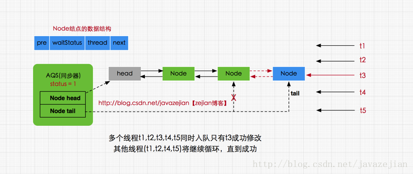
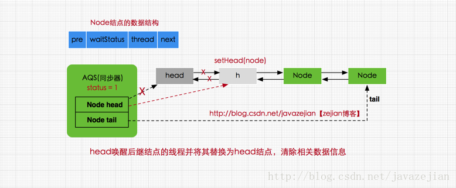
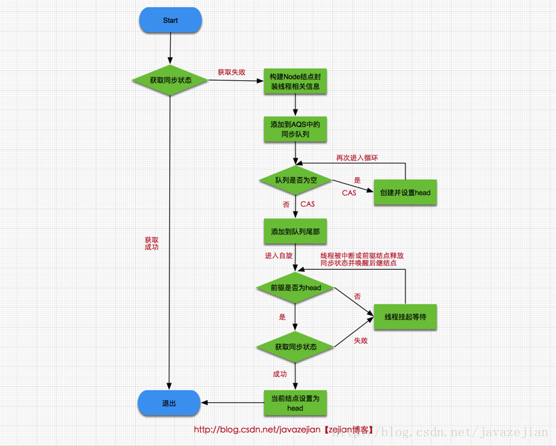
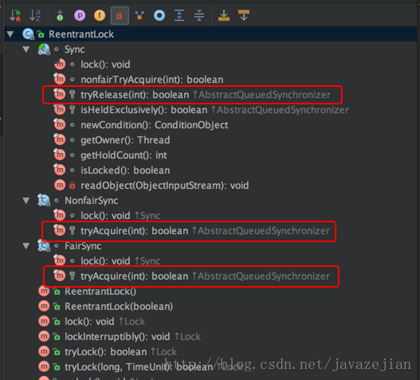

### ReetrantLock中非公平锁

​	ReetrantLocks是依赖于AQS实现的，我们先以非公平锁为例进行分析。

```java
//默认构造，创建非公平锁NonfairSync
public ReentrantLock() {
    sync = new NonfairSync();
}
//根据传入参数创建锁类型
public ReentrantLock(boolean fair) {
    sync = fair ? new FairSync() : new NonfairSync();
}

//加锁操作
public void lock() {
     sync.lock();
}
```

前面说过sync是个抽象类，存在两个不同的实现子类，这里从非公平锁入手，看看其实现

```java
/**
 * 非公平锁实现
 */
static final class NonfairSync extends Sync {
    //加锁
    final void lock() {
        //执行CAS操作，获取同步状态
        if (compareAndSetState(0, 1))
       //成功则将独占锁线程设置为当前线程  
          setExclusiveOwnerThread(Thread.currentThread());
        else
            //否则再次请求同步状态
            acquire(1);
    }
}
```

这里获取锁时，**首先对同步状态执行CAS操作，尝试把state的状态从0设置为1，如果返回true则代表获取同步状态成功，也就是当前线程获取锁成，可操作临界资源**；如果返回false，则表示已有线程持有该同步状态(其值为1)，获取锁失败，注意这里存在并发的情景，也就是可能同时存在多个线程设置state变量，因此是CAS操作保证了state变量操作的原子性。返回false后，执行 `acquire(1)`方法，该方法是AQS中的方法，它对中断不敏感，即使线程获取同步状态失败，进入同步队列，后续对该线程执行中断操作也不会从同步队列中移出，方法如下

```java
public final void acquire(int arg) {
    //再次尝试获取同步状态
    if (!tryAcquire(arg) &&
        acquireQueued(addWaiter(Node.EXCLUSIVE), arg))
        selfInterrupt();
}
```

这里传入参数arg表示*要获取同步状态后设置的值(即要设置state的值)，因为要获取锁，而status为0时是释放锁，1则是获取锁，所以这里一般传递参数为1*，进入方法后首先会执行tryAcquire(arg)方法，在前面分析过该方法在AQS中并没有具体实现，而是交由子类实现，因此该方法是由ReetrantLock类内部实现的

```java
//NonfairSync类
static final class NonfairSync extends Sync {

    protected final boolean tryAcquire(int acquires) {
         return nonfairTryAcquire(acquires);
     }
 }

//Sync类
abstract static class Sync extends AbstractQueuedSynchronizer {

  //nonfairTryAcquire方法
  final boolean nonfairTryAcquire(int acquires) {
      final Thread current = Thread.currentThread();
      int c = getState();
      //判断同步状态是否为0，并尝试再次获取同步状态，非公平的体现
      if (c == 0) {
          //执行CAS操作
          if (compareAndSetState(0, acquires)) {
              setExclusiveOwnerThread(current);
              return true;
          }
      }
      //如果当前线程已获取锁，属于重入锁，再次获取锁后将status值加1
      else if (current == getExclusiveOwnerThread()) {
          int nextc = c + acquires;
          if (nextc < 0) // overflow
              throw new Error("Maximum lock count exceeded");
          //设置当前同步状态，当前只有一个线程持有锁，因为不会发生线程安全问题，可以直接执行 setState(nextc);
          setState(nextc);
          return true;
      }
      return false;
  }
  //省略其他代码
}
```

从代码执行流程可以看出，这里做了两件事，

- 尝试再次获取同步状态，如果获取成功则将当前线程设置为OwnerThread，否则失败
- 是判断当前线程current是否为OwnerThread，如果是则属于重入锁，state自增1，并获取锁成功，返回true，反之失败，返回false，

上面两部任意返回失败，也就是`tryAcquire(arg)`执行失败，返回false。需要注意的是`nonfairTryAcquire(int acquires)`内部使用的是CAS原子性操作设置state值，可以保证state的更改是线程安全的，**因此只要任意一个线程调用`nonfairTryAcquire(int acquires)`方法并设置成功即可获取锁，不管该线程是新到来的还是已在同步队列的线程，毕竟这是非公平锁**，并不保证同步队列中的线程一定比新到来线程请求(可能是head结点刚释放同步状态然后新到来的线程恰好获取到同步状态)先获取到锁，这点跟后面还会讲到的公平锁不同。接着看之前的方法`acquire(int arg)`

```java
public final void acquire(int arg) {
    //再次尝试获取同步状态
    if (!tryAcquire(arg) &&
        acquireQueued(addWaiter(Node.EXCLUSIVE), arg))
        selfInterrupt();
}
```

如果tryAcquire(arg)返回true，`acquireQueued`自然不会执行，这是最理想的，因为毕竟当前线程已获取到锁，**如果tryAcquire(arg)返回false，则会执行`addWaiter(Node.EXCLUSIVE)`进行入队操作**，由于ReentrantLock属于独占锁，因此结点类型为`Node.EXCLUSIVE`，下面看看addWaiter方法具体实现

```java
private Node addWaiter(Node mode) {
    //将请求同步状态失败的线程封装成结点
    Node node = new Node(Thread.currentThread(), mode);

    Node pred = tail;
    //如果是第一个结点加入肯定为空，跳过。
    //如果非第一个结点则直接执行CAS入队操作，尝试在尾部快速添加
    if (pred != null) {
        node.prev = pred;
        //使用CAS执行尾部结点替换，尝试在尾部快速添加
        if (compareAndSetTail(pred, node)) {
            pred.next = node;
            return node;
        }
    }
    //如果第一次加入或者CAS操作没有成功执行enq入队操作
    enq(node);
    return node;
}
```

创建了一个`Node.EXCLUSIVE`类型Node结点用于封装线程及其相关信息，其中tail是AQS的成员变量，指向队尾(这点前面的我们分析过AQS维持的是一个双向的链表结构同步队列)，如果是第一个结点，则为tail肯定为空，那么将执行`enq(node)`操作，如果非第一个结点即tail指向不为null，直接尝试执行CAS操作加入队尾，如果CAS操作失败还是会执行`enq(node)`，继续看`enq(node)`：

```java
private Node enq(final Node node) {
    //死循环
    for (;;) {
         Node t = tail;
         //如果队列为null，即没有头结点
         if (t == null) { // Must initialize
             //创建并使用CAS设置头结点
             if (compareAndSetHead(new Node()))
                 tail = head;
         } else {//队尾添加新结点
             node.prev = t;
             if (compareAndSetTail(t, node)) {
                 t.next = node;
                 return t;
             }
         }
     }
    }
```

这个方法使用一个**死循环进行CAS操作，可以解决多线程并发问题**。这里做了两件事：

- 如果还没有初始同步队列则创建新结点并使用compareAndSetHead设置头结点，tail也指向head
- 队列已存在，则将新结点node添加到队尾

注意这两个步骤都存在同一时间多个线程操作的可能，如果有一个线程修改head和tail成功，那么其他线程将继续循环，直到修改成功，这里使用CAS原子操作进行头结点设置和尾结点tail替换可以保证线程安全，从这里也可以看出head结点本身不存在任何数据，它只是作为一个牵头结点，而tail永远指向尾部结点(前提是队列不为null)。



添加到同步队列后，**结点就会进入一个自旋过程，即每个结点都在观察时机待条件满足获取同步状态，然后从同步队列退出并结束自旋**，回到之前的`acquire()`方法，自旋过程是在`acquireQueued(addWaiter(Node.EXCLUSIVE), arg))`方法中执行的，代码如下

```java
final boolean acquireQueued(final Node node, int arg) {
    boolean failed = true;
    try {
        boolean interrupted = false;
        //自旋，死循环
        for (;;) {
            //获取前驱结点
            final Node p = node.predecessor();
            当且仅当p为头结点才尝试获取同步状态
            if (p == head && tryAcquire(arg)) {
                //将node设置为头结点
                setHead(node);
                //清空原来头结点的引用便于GC
                p.next = null; // help GC
                failed = false;
                return interrupted;
            }
            //如果前驱结点不是head，判断是否挂起线程
            if (shouldParkAfterFailedAcquire(p, node) &&
                parkAndCheckInterrupt())
                interrupted = true;
        }
    } finally {
        if (failed)
            //最终都没能获取同步状态，结束该线程的请求
            cancelAcquire(node);
    }
}
```

**当前线程在自旋(死循环)中获取同步状态，当且仅当前驱结点为头结点才尝试获取同步状态，这符合FIFO的规则，即先进先出，其次head是当前获取同步状态的线程结点，只有当head释放同步状态唤醒后继结点，后继结点才有可能获取到同步状态，因此后继结点在其前继结点为head时，才进行尝试获取同步状态，其他时刻将被挂起**。进入if语句后调用`setHead(node)`方法，将当前线程结点设置为head

```java
//设置为头结点
private void setHead(Node node) {
        head = node;
        //清空结点数据
        node.thread = null;
        node.prev = null;
}
```

设置为node结点被设置为head后，其thread信息和前驱结点将被清空，因为该线程已获取到同步状态(锁)，正在执行了，也就没有必要存储相关信息了，head只有保存指向后继结点的指针即可，便于head结点释放同步状态后唤醒后继结点，执行结果如下图



从图可知更新head结点的指向，将后继结点的线程唤醒并获取同步状态，调用`setHead(node)`将其替换为head结点，清除相关无用数据。当然如果前驱结点不是head，那么执行如下

```java
//如果前驱结点不是head，判断是否挂起线程
if (shouldParkAfterFailedAcquire(p, node) &&parkAndCheckInterrupt())

      interrupted = true;
}

private static boolean shouldParkAfterFailedAcquire(Node pred, Node node) {
        //获取当前结点的等待状态
        int ws = pred.waitStatus;
        //如果为等待唤醒（SIGNAL）状态则返回true
        if (ws == Node.SIGNAL)
            return true;
        //如果ws>0 则说明是结束状态，
        //遍历前驱结点直到找到没有结束状态的结点
        if (ws > 0) {
            do {
                node.prev = pred = pred.prev;
            } while (pred.waitStatus > 0);
            pred.next = node;
        } else {
            //如果ws小于0又不是SIGNAL状态，
            //则将其设置为SIGNAL状态，代表该结点的线程正在等待唤醒。
            compareAndSetWaitStatus(pred, ws, Node.SIGNAL);
        }
        return false;
    }

private final boolean parkAndCheckInterrupt() {
        //将当前线程挂起
        LockSupport.park(this);
        //获取线程中断状态,interrupted()是判断当前中断状态，
        //并非中断线程，因此可能true也可能false,并返回
        return Thread.interrupted();
}
```

shouldParkAfterFailedAcquire()`方法的作用是判断当前结点的前驱结点是否为`SIGNAL`状态(即等待唤醒状态)，如果是则返回true。如果结点的ws为`CANCELLED`状态(`值为1>0`),即结束状态，则说明该前驱结点已没有用应该从同步队列移除，执行while循环，直到寻找到非`CANCELLED`状态的结点。倘若前驱结点的ws值不为`CANCELLED`，也不为`SIGNAL`(当从Condition的条件等待队列转移到同步队列时，结点状态为CONDITION因此需要转换为SIGNAL)，那么将其转换为`SIGNAL`状态，等待被唤醒。若`shouldParkAfterFailedAcquire()`方法返回true，即前驱结点为`SIGNAL`状态同时又不是head结点，那么使用`parkAndCheckInterrupt()`方法挂起当前线程，称为WAITING状态，需要等待一个unpark()操作来唤醒它，到此ReetrantLock内部间接通过AQS的FIFO的同步队列就完成了lock()操作，这里我们总结成逻辑流程图



关于获取锁的操作，这里看看另外一种可中断的获取方式，即调用ReentrantLock类的`lockInterruptibly()`或者`tryLock()`方法，最终它们都间接调用到`doAcquireInterruptibly()`

```java
 private void doAcquireInterruptibly(int arg)
        throws InterruptedException {
        final Node node = addWaiter(Node.EXCLUSIVE);
        boolean failed = true;
        try {
            for (;;) {
                final Node p = node.predecessor();
                if (p == head && tryAcquire(arg)) {
                    setHead(node);
                    p.next = null; // help GC
                    failed = false;
                    return;
                }
                if (shouldParkAfterFailedAcquire(p, node) &&
                    parkAndCheckInterrupt())
                    //直接抛异常，中断线程的同步状态请求
                    throw new InterruptedException();
            }
        } finally {
            if (failed)
                cancelAcquire(node);
        }
    }
```

最大的不同是

```java
if (shouldParkAfterFailedAcquire(p, node) &&
                    parkAndCheckInterrupt())
     //直接抛异常，中断线程的同步状态请求
       throw new InterruptedException();
```

检测到线程的中断操作后，直接抛出异常，从而中断线程的同步状态请求，移除同步队列，加锁流程到此。下面接着看unlock()操作

```java
//ReentrantLock类的unlock
public void unlock() {
    sync.release(1);
}

//AQS类的release()方法
public final boolean release(int arg) {
    //尝试释放锁
    if (tryRelease(arg)) {

        Node h = head;
        if (h != null && h.waitStatus != 0)
            //唤醒后继结点的线程
            unparkSuccessor(h);
        return true;
    }
    return false;
}

//ReentrantLock类中的内部类Sync实现的tryRelease(int releases) 
protected final boolean tryRelease(int releases) {

      int c = getState() - releases;
      if (Thread.currentThread() != getExclusiveOwnerThread())
          throw new IllegalMonitorStateException();
      boolean free = false;
      //判断状态是否为0，如果是则说明已释放同步状态
      if (c == 0) {
          free = true;
          //设置Owner为null
          setExclusiveOwnerThread(null);
      }
      //设置更新同步状态
      setState(c);
      return free;
  }
```

释放同步状态的操作相对简单些，`tryRelease(int releases)`方法是ReentrantLock类中内部类自己实现的，因为AQS对于释放锁并没有提供具体实现，必须由子类自己实现。释放同步状态后会使用`unparkSuccessor(h)`唤醒后继结点的线程，这里看看`unparkSuccessor(h)`

```java
private void unparkSuccessor(Node node) {
    //这里，node一般为当前线程所在的结点。
    int ws = node.waitStatus;
    if (ws < 0)//置零当前线程所在的结点状态，允许失败。
        compareAndSetWaitStatus(node, ws, 0);

    Node s = node.next;//找到下一个需要唤醒的结点s
    if (s == null || s.waitStatus > 0) {//如果为空或已取消
        s = null;
        for (Node t = tail; t != null && t != node; t = t.prev)
            if (t.waitStatus <= 0)//从这里可以看出，<=0的结点，都是还有效的结点。
                s = t;
    }
    if (s != null)
        LockSupport.unpark(s.thread);//唤醒
}
```

​	从代码执行操作来看，这里主要作用是用unpark()唤醒同步队列中最前边未放弃线程(也就是状态为CANCELLED的线程结点s)。此时，回忆前面分析进入自旋的函数`acquireQueued()`，s结点的线程被唤醒后，会进入`acquireQueued()`函数的`if (p == head && tryAcquire(arg))`的判断，如果`p!=head`也不会有影响，因为它会执行`shouldParkAfterFailedAcquire()`，由于s通过`unparkSuccessor()`操作后已是同步队列中最前边未放弃的线程结点，那么通过shouldParkAfterFailedAcquire()内部对结点状态的调整，s也必然会成为head的next结点，因此再次自旋时`p==head`就成立了，然后s把自己设置成head结点，表示自己已经获取到资源了，最终`acquire()`也返回了，这就是独占锁释放的过程。
​	关于独占模式的加锁和释放锁的过程到这就分析完，总之呢，在AQS同步器中维护着一个同步队列，当线程获取同步状态失败后，将会被封装成Node结点，加入到同步队列中并进行自旋操作，当当前线程结点的前驱结点为head时，将尝试获取同步状态，获取成功将自己设置为head结点。在释放同步状态时，则通过调用子类(ReetrantLock中的Sync内部类)的`tryRelease(int releases)`方法释放同步状态，释放成功则唤醒后继结点的线程。

### ReetrantLock中公平锁

了解完ReetrantLock中非公平锁的实现后，我们再来看看公平锁。**与非公平锁不同的是，在获取锁的时，公平锁的获取顺序是完全遵循时间上的FIFO规则，也就是说先请求的线程一定会先获取锁，后来的线程肯定需要排队，这点与前面我们分析非公平锁的`nonfairTryAcquire(int acquires)`方法实现有锁不同**，下面是公平锁中tryAcquire()方法的实现

```java
//公平锁FairSync类中的实现
protected final boolean tryAcquire(int acquires) {
            final Thread current = Thread.currentThread();
            int c = getState();
            if (c == 0) {
            //注意！！这里先判断同步队列是否存在结点
                if (!hasQueuedPredecessors() &&
                    compareAndSetState(0, acquires)) {
                    setExclusiveOwnerThread(current);
                    return true;
                }
            }
            else if (current == getExclusiveOwnerThread()) {
                int nextc = c + acquires;
                if (nextc < 0)
                    throw new Error("Maximum lock count exceeded");
                setState(nextc);
                return true;
            }
            return false;
        }
```

​	该方法与`nonfairTryAcquire(int acquires)`方法唯一的不同是在使用CAS设置尝试设置state值前，调用了`hasQueuedPredecessors()`判断同步队列是否存在结点，如果存在必须先执行完同步队列中结点的线程，当前线程进入等待状态。这就是非公平锁与公平锁最大的区别，**即公平锁在线程请求到来时先会判断同步队列是否存在结点，如果存在先执行同步队列中的结点线程，当前线程将封装成node加入同步队列等待。而非公平锁呢，当线程请求到来时，不管同步队列是否存在线程结点，直接尝试获取同步状态，获取成功直接访问共享资源**，但请注意在绝大多数情况下，*非公平锁才是我们理想的选择，毕竟从效率上来说非公平锁总是胜于公平锁*。
 	以上便是ReentrantLock的内部实现原理，这里我们简单进行小结，重入锁ReentrantLock，是一个基于AQS并发框架的并发控制类，其内部实现了3个类，分别是Sync、NoFairSync以及FairSync类，其中Sync继承自AQS，实现了释放锁的模板方法tryRelease(int)，而NoFairSync和FairSync都继承自Sync，实现各种获取锁的方法tryAcquire(int)。ReentrantLock的所有方法实现几乎都间接调用了这3个类，因此当我们在使用ReentrantLock时，大部分使用都是在间接调用AQS同步器中的方法，这就是ReentrantLock的内部实现原理,最后给出张类图结构
