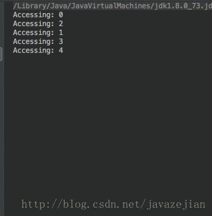
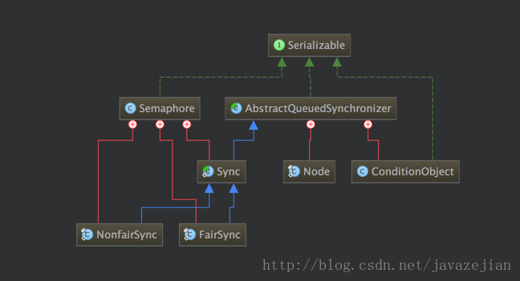
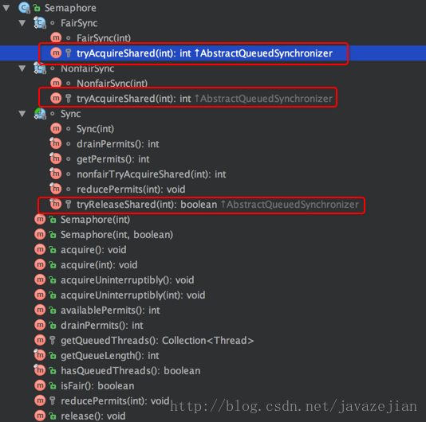
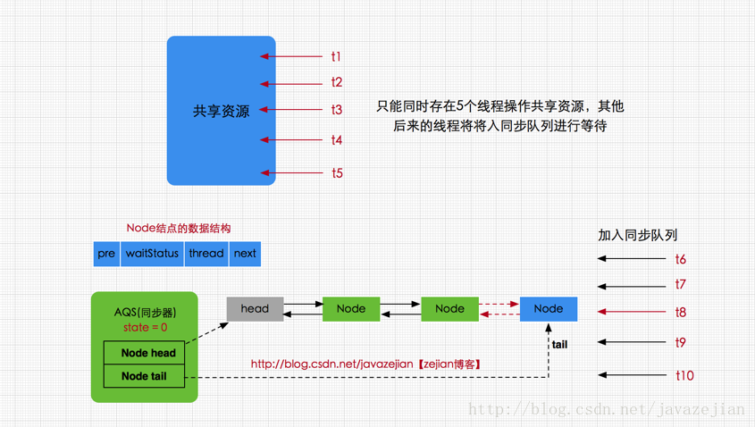

## Semaphore共享锁的使用(重入时会再次消耗共享数量)

信号量(Semaphore)，又被称为信号灯，在多线程环境下用于协调各个线程, 以保证它们能够正确、合理的使用公共资源。信号量维护了一个许可集，我们在初始化Semaphore时需要为这个许可集传入一个数量值，该数量值代表同一时间能访问共享资源的线程数量。**线程可以通过`acquire()`方法获取到一个许可，然后对共享资源进行操作，注意如果许可集已分配完了，那么线程将进入等待状态，直到其他线程释放许可才有机会再获取许可，线程释放一个许可通过`release()`方法完成**。下面通过一个简单案例来演示

```java
public class SemaphoreTest {
    public static void main(String[] args) {  
       // 线程池 
       ExecutorService exec = Executors.newCachedThreadPool();  
       //设置信号量同时执行的线程数是5 
       final Semaphore semp = new Semaphore(5);  
       // 模拟20个客户端访问 
       for (int index = 0; index < 20; index++) {
           final int NO = index;  
           Runnable run = new Runnable() {  
               public void run() {  
                   try {  
                       //使用acquire()获取锁 
                       semp.acquire();  
                       System.out.println("Accessing: " + NO);  
                       //睡眠1秒
                       Thread.sleep(1000);  

                   } catch (InterruptedException e) {  
                   }  finally {
                        //使用完成释放锁 
                        semp.release();
                    }
               }  
           };  
           exec.execute(run);  
       }  
       // 退出线程池 
       exec.shutdown();  
   }  
}1234567891011121314151617181920212223242526272829303132
```

上述代码中，在创建Semaphore时初始化5个许可，这也就意味着同一个时间点允许5个线程进行共享资源访问，使用`acquire()`方法为每个线程获取许可，并进行休眠1秒，如果5个许可已被分配完，新到来的线程将进入等待状态。如果线程顺利完成操作将通过`release()`方法释放许可，我们执行代码，可以发现每隔1秒几乎同一时间出现5条线程访，如下图



## Semaphore实现互斥锁

在初始化信号量时传入1，使得它在使用时最多只有一个可用的许可，从而可用作一个相互排斥的锁。这通常也称为二进制信号量，因为它只能有两种状态：一个可用的许可或零个可用的许可。按此方式使用时，二进制信号量具有某种属性（与很多 Lock 实现不同），即可以由线程释放“锁”，而不是由所有者（因为信号量没有所有权的概念）。下面简单看一个Semaphore实现互斥功能的例子

```java
/**
 * Created by zejian on 2017/7/30.
 * Blog : http://blog.csdn.net/javazejian [原文地址,请尊重原创]
 */
public class SemaphoreMutex {
    //初始化为1,互斥信号量
    private final static Semaphore mutex = new Semaphore(1);

    public static void main(String[] args){
        ExecutorService pools = Executors.newCachedThreadPool();

        for (int i=0 ; i < 10;i++){
            final int index = i;
           Runnable run = new Runnable() {
               @Override
               public void run() {
                   try {
                       mutex.acquire();
                       System.out.println(String.format("[Thread-%s]任务id --- %s",Thread.currentThread().getId(),index));
                       TimeUnit.SECONDS.sleep(1);

                   } catch (InterruptedException e) {
                       e.printStackTrace();
                   } finally {
                        //使用完成释放锁 
                       mutex.release();
                       System.out.println("-----------release");
                    }
               }
           };
            pools.execute(run);
        }
        pools.shutdown();
    }
}
```

除了获取许可的aquire()方法和release()方法外，还提供了其他方法如下

```java
//构造方法摘要
//创建具有给定的许可数和非公平的公平设置的Semaphore。
Semaphore(int permits) 

//创建具有给定的许可数和给定的公平设置的Semaphore，true即为公平锁     
Semaphore(int permits, boolean fair) 

//从此信号量中获取许可，不可中断
void acquireUninterruptibly() 

//返回此信号量中当前可用的许可数。      
int availablePermits() 

//获取并返回立即可用的所有许可。    
int drainPermits() 

//返回一个 collection，包含可能等待获取的线程。       
protected  Collection<Thread> getQueuedThreads();

//返回正在等待获取的线程的估计数目。        
int getQueueLength() 

//查询是否有线程正在等待获取。       
boolean hasQueuedThreads() 

//如果此信号量的公平设置为 true，则返回 true。          
boolean isFair() 

//仅在调用时此信号量存在一个可用许可，才从信号量获取许可。          
boolean tryAcquire() 

//如果在给定的等待时间内，此信号量有可用的许可并且当前线程未被中断，则从此信号量获取一个许可。        
boolean tryAcquire(long timeout, TimeUnit unit) 
```

# Semaphore中共享锁的实现

## Semaphore的实现内部原理概要

在深入分析Semaphore的内部原理前先看看一张类图结构



​	根据类图可知，信号量Semaphore的类结构与ReetrantLock的类结构几乎如出一辙。Semaphore内部同样存在继承自AQS的内部类Sync以及继承自Sync的公平锁(FairSync)和非公平锁(NofairSync)，从这点也足以说明Semaphore的内部实现原理也是基于AQS并发组件的，AQS是基础组件，只负责核心并发操作，如加入或维护同步队列，控制同步状态，等，而具体的加锁和解锁操作交由子类完成，因此子类*Semaphore共享锁的获取与释放需要自己实现，这两个方法分别是获取锁的`tryAcquireShared(int arg)`方法和释放锁的`tryReleaseShared(int arg)`方法*，这点从Semaphore的内部结构完全可以看出来



从图可知，Semaphore的内部类公平锁(FairSync)和非公平锁(NoFairSync)各自实现不同的获取锁方法即`tryAcquireShared(int arg)`，毕竟公平锁和非公平锁的获取稍后不同，而释放锁`tryReleaseShared(int arg)`的操作交由Sync实现，因为释放操作都是相同的，因此放在父类Sync中实现当然是最好的。需要明白的是，我们在调用Semaphore的方法时，其内部则是通过间接调用其内部类或AQS执行的。下面我们就从Semaphore的源码入手分析共享锁实现原理，这里先从非公平锁入手。

## 非公平锁中的共享锁

Semaphore的构造函数如下

```java
//默认创建公平锁，permits指定同一时间访问共享资源的线程数
public Semaphore(int permits) {
        sync = new NonfairSync(permits);
    }

public Semaphore(int permits, boolean fair) {
     sync = fair ? new FairSync(permits) : new NonfairSync(permits);
 }
```

显然我们通过默认构造函数创建时，诞生的就是非公平锁，

```java
static final class NonfairSync extends Sync {
    NonfairSync(int permits) {
          super(permits);
    }
   //调用父类Sync的nonfairTryAcquireShared
   protected int tryAcquireShared(int acquires) {
       return nonfairTryAcquireShared(acquires);
   }
}
```

显然传入的许可数permits传递给了父类，最终会传给AQS中的state变量，也就是同步状态的变量，如下

```java
//AQS中控制同步状态的state变量
public abstract class AbstractQueuedSynchronizer
    extends AbstractOwnableSynchronizer {

    private volatile int state;

    protected final int getState() {
        return state;
    }

    protected final void setState(int newState) {
        state = newState;
    }

    //对state变量进行CAS 操作
    protected final boolean compareAndSetState(int expect, int update) {
        return unsafe.compareAndSwapInt(this, stateOffset, expect, update);
    }

}
```

从这点可知，Semaphore的初始化值也就是state的初始化值。当我们调用Semaphore的acquire()方法后，执行过程是这样的，当一个线程请求到来时，**如果state值代表的许可数足够使用，那么请求线程将会获得同步状态即对共享资源的访问权，并更新state的值(一般是对state值减1)，但如果state值代表的许可数已为0，则请求线程将无法获取同步状态，线程将被加入到同步队列并阻塞，直到其他线程释放同步状态(一般是对state值加1)才可能获取对共享资源的访问权**。调用Semaphore的`acquire()`方法后将会调用到AQS的`acquireSharedInterruptibly()`如下

```java
//Semaphore的acquire()
public void acquire() throws InterruptedException {
      sync.acquireSharedInterruptibly(1);
  }

/**
*  注意Sync类继承自AQS
*  AQS的acquireSharedInterruptibly()方法
*/ 
public final void acquireSharedInterruptibly(int arg)
        throws InterruptedException {
    //判断是否中断请求
    if (Thread.interrupted())
        throw new InterruptedException();
    //如果tryAcquireShared(arg)不小于0，则线程获取同步状态成功
    if (tryAcquireShared(arg) < 0)
        //未获取成功加入同步队列等待
        doAcquireSharedInterruptibly(arg);
}
```

从方法名就可以看出该方法是可以中断的，也就是说Semaphore的`acquire()`方法也是可中断的。在`acquireSharedInterruptibly()`方法内部先进行了线程中断的判断，如果没有中断，那么先尝试调用`tryAcquireShared(arg)`方法获取同步状态，如果获取成功，那么方法执行结束，如果获取失败调用`doAcquireSharedInterruptibly(arg);`方法加入同步队列等待。这里的`tryAcquireShared(arg)`是个模板方法，AQS内部没有提供具体实现，由子类实现，也就是有Semaphore内部自己实现，该方法在Semaphore内部非公平锁的实现如下

```java
//Semaphore中非公平锁NonfairSync的tryAcquireShared()
protected int tryAcquireShared(int acquires) {
    //调用了父类Sync中的实现方法
    return nonfairTryAcquireShared(acquires);
}

//Syn类中
abstract static class Sync extends AbstractQueuedSynchronizer {

    final int nonfairTryAcquireShared(int acquires) {
         //使用死循环
         for (;;) {
             int available = getState();
             int remaining = available - acquires;
             //判断信号量是否已小于0或者CAS执行是否成功
             if (remaining < 0 ||
                 compareAndSetState(available, remaining))
                 return remaining;
         }
     }
}
```

`nonfairTryAcquireShared(int acquires)`方法内部，先获取state的值，并执行减法操作，得到remaining值，如果remaining不小于0，那么线程获取同步状态成功，可访问共享资源，并更新state的值，如果remaining大于0，那么线程获取同步状态失败，将被加入同步队列(通过`doAcquireSharedInterruptibly(arg)`)，注意Semaphore的`acquire()`可能存在并发操作，因此`nonfairTryAcquireShared()`方法体内部采用无锁(CAS)并发的操作保证对state值修改的安全性。如何尝试获取同步状态失败，那么将会执行`doAcquireSharedInterruptibly(int arg)`方法

```java
private void doAcquireSharedInterruptibly(int arg)
        throws InterruptedException {
     //创建共享模式的结点Node.SHARED，并加入同步队列
   final Node node = addWaiter(Node.SHARED);
     boolean failed = true;
     try {
         //进入自旋操作
         for (;;) {
             final Node p = node.predecessor();
             //判断前驱结点是否为head
             if (p == head) {
                 //尝试获取同步状态
                 int r = tryAcquireShared(arg);
                 //如果r>0 说明获取同步状态成功
                 if (r >= 0) {
                     //将当前线程结点设置为头结点并传播               
                     setHeadAndPropagate(node, r);
                     p.next = null; // help GC
                     failed = false;
                     return;
                 }
             }
           //调整同步队列中node结点的状态并判断是否应该被挂起
           //并判断是否需要被中断，如果中断直接抛出异常，当前结点请求也就结束
             if (shouldParkAfterFailedAcquire(p, node) &&
                 parkAndCheckInterrupt())
                 throw new InterruptedException();
         }
     } finally {
         if (failed)
             //结束该结点线程的请求
             cancelAcquire(node);
     }
    }
```

在方法中，由于当前线程没有获取同步状态，因此创建一个**共享模式（`Node.SHARED`）**的结点并通过`addWaiter(Node.SHARED)`加入同步队列，加入完成后，当前线程进入自旋状态，首先判断前驱结点是否为head，如果是，那么尝试获取同步状态并返回r值，如果r大于0，则说明获取同步状态成功，将当前线程设置为head并传播，传播指的是，**同步状态剩余的许可数值不为0，通知后续结点继续获取同步状态，到此方法将会return结束，获取到同步状态的线程将会执行原定的任务**。但如果前驱结点不为head或前驱结点为head并尝试获取同步状态失败，那么调用`shouldParkAfterFailedAcquire(p, node)`方法判断前驱结点的waitStatus值是否为SIGNAL并调整同步队列中的node结点状态，如果返回true，那么执行`parkAndCheckInterrupt()`方法，将当前线程挂起并返回是否中断线程的flag。

```java
private static boolean shouldParkAfterFailedAcquire(Node pred, Node node) {
        //获取当前结点的等待状态
        int ws = pred.waitStatus;
        //如果为等待唤醒（SIGNAL）状态则返回true
        if (ws == Node.SIGNAL)
            return true;
        //如果ws>0 则说明是结束状态，
        //遍历前驱结点直到找到没有结束状态的结点
        if (ws > 0) {
            do {
                node.prev = pred = pred.prev;
            } while (pred.waitStatus > 0);
            pred.next = node;
        } else {
            //如果ws小于0又不是SIGNAL状态，
            //则将其设置为SIGNAL状态，代表该结点的线程正在等待唤醒。
            compareAndSetWaitStatus(pred, ws, Node.SIGNAL);
        }
        return false;
    }

private final boolean parkAndCheckInterrupt() {
        //将当前线程挂起
        LockSupport.park(this);
        //获取线程中断状态,interrupted()是判断当前中断状态，
        //并非中断线程，因此可能true也可能false,并返回
        return Thread.interrupted();
}
```

到此，加入同步队列的整个过程完成。这里小结一下，在AQS中存在一个变量state，当我们创建Semaphore对象传入许可数值时，最终会赋值给state，state的数值代表同一个时刻可同时操作共享数据的线程数量，每当一个线程请求(如调用Semaphored的acquire()方法)获取同步状态成功，state的值将会减少1，直到state为0时，表示已没有可用的许可数，也就是对共享数据进行操作的线程数已达到最大值，其他后来线程将被阻塞，此时AQS内部会将线程封装成共享模式的Node结点，加入同步队列中等待并开启自旋操作。只有当持有对共享数据访问权限的线程执行完成任务并释放同步状态后，同步队列中的对于的结点线程才有可能获取同步状态并被唤醒执行同步操作，注意在同步队列中获取到同步状态的结点将被设置成head并清空相关线程数据(毕竟线程已在执行也就没有必要保存信息了)，AQS通过这种方式便实现共享锁，简单模型如下



前面我们分析的是可中断的请求，与只对应的不可中的的请求(这些方法都存在于AQS，由子类Semaphore间接调用)如下

```java
//不可中的acquireShared()
public final void acquireShared(int arg) {
        if (tryAcquireShared(arg) < 0)
            doAcquireShared(arg);
}

private void doAcquireShared(int arg) {
        final Node node = addWaiter(Node.SHARED);
        boolean failed = true;
        try {
            boolean interrupted = false;
            for (;;) {
                final Node p = node.predecessor();
                if (p == head) {
                    int r = tryAcquireShared(arg);
                    if (r >= 0) {
                        setHeadAndPropagate(node, r);
                        p.next = null; // help GC
                        if (interrupted)
                            selfInterrupt();
                        failed = false;
                        return;
                    }
                }
                if (shouldParkAfterFailedAcquire(p, node) &&
                    parkAndCheckInterrupt())
                    //没有抛出异常中的。。。。
                    interrupted = true;
            }
        } finally {
            if (failed)
                cancelAcquire(node);
        }
    }

 private void setHeadAndPropagate(Node node, int propagate) {
        Node h = head; // Record old head for check below
        setHead(node);//设置为头结点
        /* 
         * 尝试去唤醒队列中的下一个节点，如果满足如下条件： 
         * 调用者明确表示"传递"(propagate > 0), 
         * 或者h.waitStatus为PROPAGATE(被上一个操作设置) 
         * 并且 
         *   下一个节点处于共享模式或者为null。 
         * 
         * 这两项检查中的保守主义可能会导致不必要的唤醒，但只有在有
         * 有在多个线程争取获得/释放同步状态时才会发生，所以大多
         * 数情况下会立马获得需要的信号
         */  
        if (propagate > 0 || h == null || h.waitStatus < 0 ||
            (h = head) == null || h.waitStatus < 0) {
            Node s = node.next;
            if (s == null || s.isShared())
            //唤醒后继节点，因为是共享模式，所以允许多个线程同时获取同步状态
                doReleaseShared();
        }
    }
```

显然与前面带中断请求`doAcquireSharedInterruptibly(int arg)`方法不同的是少线程中断的判断以及异常抛出，其他操作都一样,关于`doReleaseShared()`，放后面分析。ok~，了解完请求同步状态的过程，我们看看释放请求状态的过程，当每个线程执行完成任务将会释放同步状态，此时state值一般都会增加1。先从Semaphore的release()方法入手

```java
//Semaphore的release()
public void release() {
       sync.releaseShared(1);
}

//调用到AQS中的releaseShared(int arg) 
public final boolean releaseShared(int arg) {
       //调用子类Semaphore实现的tryReleaseShared方法尝试释放同步状态
      if (tryReleaseShared(arg)) {
          doReleaseShared();
          return true;
      }
      return false;
  }
```

显然Semaphore间接调用了AQS中的releaseShared(int arg)方法，通过`tryReleaseShared(arg)`方法尝试释放同步状态，如果释放成功，那么将调用`doReleaseShared()`唤醒同步队列中后继结点的线程，`tryReleaseShared(int releases)`方法如下

```java
//在Semaphore的内部类Sync中实现的
protected final boolean tryReleaseShared(int releases) {
       for (;;) {
              //获取当前state
             int current = getState();
             //释放状态state增加releases
             int next = current + releases;
             if (next < current) // overflow
                 throw new Error("Maximum permit count exceeded");
              //通过CAS更新state的值
             if (compareAndSetState(current, next))
                 return true;
         }
        }
```

逻辑很简单，释放同步状态，更新state的值，值得注意的是这里必须操作无锁操作，即for死循环和CAS操作来保证线程安全问题，因为可能存在多个线程同时释放同步状态的场景。释放成功后通过`doReleaseShared()`方法唤醒后继结点。

```java
private void doReleaseShared() {
    /* 
     * 保证释放动作(向同步等待队列尾部)传递，即使没有其他正在进行的  
     * 请求或释放动作。如果头节点的后继节点需要唤醒，那么执行唤醒  
     * 动作；如果不需要，将头结点的等待状态设置为PROPAGATE保证   
     * 唤醒传递。另外，为了防止过程中有新节点进入(队列)，这里必  
     * 需做循环，所以，和其他unparkSuccessor方法使用方式不一样  
     * 的是，如果(头结点)等待状态设置失败，重新检测。 
     */  
    for (;;) {
        Node h = head;
        if (h != null && h != tail) {
            // 获取头节点对应的线程的状态
            int ws = h.waitStatus;
            // 如果头节点对应的线程是SIGNAL状态，则意味着头
            //结点的后继结点所对应的线程需要被unpark唤醒。
            if (ws == Node.SIGNAL) {
                // 修改头结点对应的线程状态设置为0。失败的话，则继续循环。
                if (!compareAndSetWaitStatus(h, Node.SIGNAL, 0))
                    continue;
                // 唤醒头结点h的后继结点所对应的线程
                unparkSuccessor(h);
            }
            else if (ws == 0 &&
                     !compareAndSetWaitStatus(h, 0, Node.PROPAGATE))
                continue;                // loop on failed CAS
        }
        // 如果头结点发生变化，则继续循环。否则，退出循环。
        if (h == head)                   // loop if head changed
            break;
    }
}


//唤醒传入结点的后继结点对应的线程
private void unparkSuccessor(Node node) {
    int ws = node.waitStatus;
      if (ws < 0)
          compareAndSetWaitStatus(node, ws, 0);
       //拿到后继结点
      Node s = node.next;
      if (s == null || s.waitStatus > 0) {
          s = null;
          for (Node t = tail; t != null && t != node; t = t.prev)
              if (t.waitStatus <= 0)
                  s = t;
      }
      if (s != null)
          //唤醒该线程
          LockSupport.unpark(s.thread);
    }
```

显然`doReleaseShared()`方法中通过调用`unparkSuccessor(h)`方法唤醒head的后继结点对应的线程。注意这里把head的状态设置为`Node.PROPAGATE`是为了保证唤醒传递，博主认为是可能同时存在多个线程并发争取资源，如果线程A已执行到doReleaseShared()方法中，正被唤醒后正准备替换head（实际上还没替换），而线程B又跑来请求资源，此时调用`setHeadAndPropagate(Node node, int propagate)`时，传入的propagate=0

```java
 if (propagate > 0 || h == null || h.waitStatus < 0 ||
            (h = head) == null || h.waitStatus < 0) {
            Node s = node.next;
            if (s == null || s.isShared())
            //唤醒后继节点，因为是共享模式，所以允许多个线程同时获取同步状态
                doReleaseShared();
        }
```

但为了保证持续唤醒后继结点的线程即`doReleaseShared()`方法被调用，可以把head的waitStatus设置为`Node.PROPAGATE`，这样就保证线程B也可以执行`doReleaseShared()`保证后续结点被唤醒或传播，注意`doReleaseShared()`可以同时被释放操作和获取操作调用，但目的都是为唤醒后继节点，因为是共享模式，所以允许多个线程同时获取同步状态。ok~，释放过程的分析到此完结，对于释放操作的过程还是相对简单些的，即尝试更新state值，更新成功调用`doReleaseShared()`方法唤醒后继结点对应的线程。

## 公平锁中的共享锁

事实上公平锁的中的共享模式实现除了在获取同步状态时与非公平锁不同外，其他基本一样，看看公平锁的实现

```java
static final class FairSync extends Sync {
        FairSync(int permits) {
            super(permits);
        }

        protected int tryAcquireShared(int acquires) {
            for (;;) {
                //这里是重点，先判断队列中是否有结点再执行
                //同步状态获取。
                if (hasQueuedPredecessors())
                    return -1;
                int available = getState();
                int remaining = available - acquires;
                if (remaining < 0 ||
                    compareAndSetState(available, remaining))
                    return remaining;
            }
        }
    }
```

从代码中可以看出，与非公平锁`tryAcquireShared(int acquires)`方法实现的唯一不同是，在尝试获取同步状态前，先调用了`hasQueuedPredecessors()`方法判断同步队列中是否存在结点，如果存在则返回-1，即将线程加入同步队列等待。从而保证先到来的线程请求一定会先执行，也就是所谓的公平锁。至于其他操作，与前面分析的非公平锁一样。

## 小结

​	到此我们通过对Semaphore的内部实现原理分析后，对共享锁的实现有了基本的认识，即AQS中**通过state值来控制对共享资源访问的线程数，每当线程请求同步状态成功，state值将会减1，如果超过限制数量的线程将被封装共享模式的Node结点加入同步队列等待，直到其他执行线程释放同步状态，才有机会获得执行权，而每个线程执行完成任务释放同步状态后，state值将会增加1，这就是共享锁的基本实现模型**。*至于公平锁与非公平锁的不同之处在于公平锁会在线程请求同步状态前，判断同步队列是否存在Node，如果存在就将请求线程封装成Node结点加入同步队列，从而保证每个线程获取同步状态都是先到先得的顺序执行的。非公平锁则是通过竞争的方式获取，不管同步队列是否存在Node结点，只有通过竞争获取就可以获取线程执行权*。