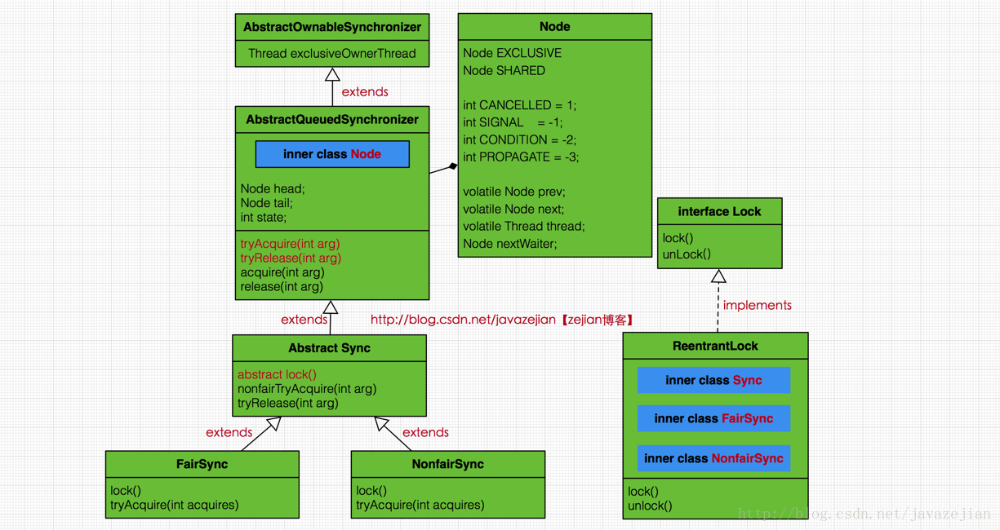
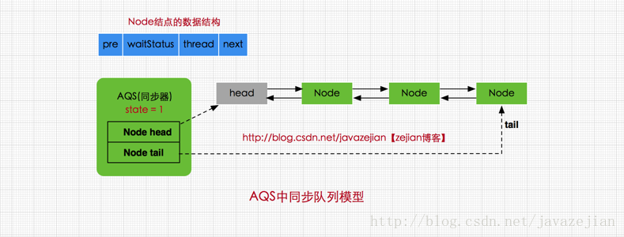
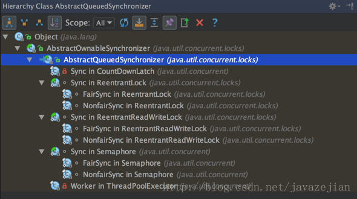
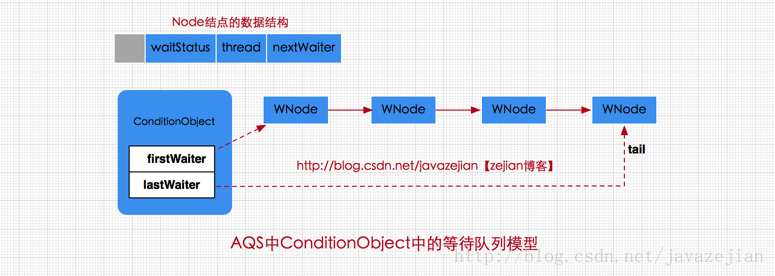
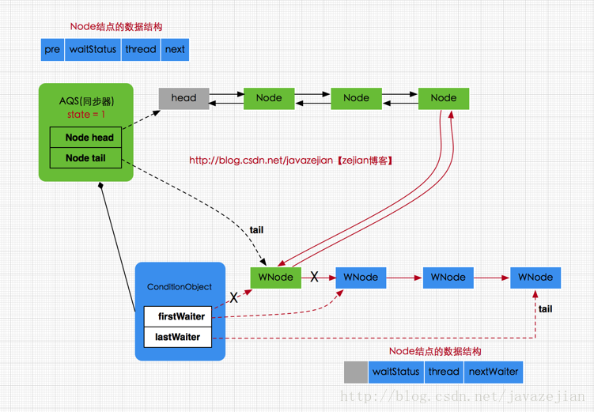

#  ## AQS概要

	

​	AbstractQueuedSynchronizer又称为队列同步器(简称AQS)，通过volatile状态变量state控制锁状态。AQS内部通过内部类Node构成**FIFO的同步队列**来完成线程获取锁的排队工作；同时利用内部类ConditionObject构建等待队列，当Condition调用wait()方法后，线程将会加入**等待队列**中；而当Condition调用signal()方法后，线程将从等待队列转移动**同步队列**中进行锁竞争。注意这里涉及到两种队列，一种的同步队列，当线程请求锁而等待的后将加入同步队列等待，而另一种则是等待队列(可有多个)，通过Condition调用await()方法释放锁后，将加入等待队列。

```java
/**
 * AQS抽象类
 */
public abstract class AbstractQueuedSynchronizer
    extends AbstractOwnableSynchronizer{
//指向同步队列队头
private transient volatile Node head;

//指向同步的队尾
private transient volatile Node tail;

//同步状态，0代表锁未被占用，1代表锁已被占用, 
private volatile int state;

//省略其他代码......
}
```

​	head和tail分别是AQS中的变量，其中head指向同步队列的头部，注意head为空结点，不存储信息。而tail则是同步队列的队尾，同步队列采用的是双向链表的结构这样可方便队列进行结点增删操作。*state变量则是代表同步状态，执行当线程调用lock方法进行加锁后，**如果此时state的值为0，则说明当前线程可以获取到锁，同时将state设置为1，表示获取成功。如果state已为1，也就是当前锁已被其他线程持有，那么当前执行线程将被封装为Node结点加入同步队列等待**。其中Node结点是对每一个访问同步代码的线程的封装，从图中的Node的数据结构也可看出，其包含了需要同步的线程本身以及线程的状态，如是否被阻塞，是否等待唤醒，是否已经被取消等。每个Node结点内部关联其前继结点prev和后继结点next，这样可以方便线程释放锁后快速唤醒下一个在等待的线程，Node是AQS的内部类，其数据结构如下：	

```java
static final class Node {
    //共享模式
    static final Node SHARED = new Node();
    //独占模式
    static final Node EXCLUSIVE = null;

    //标识线程已处于结束状态
    static final int CANCELLED =  1;
    //等待被唤醒状态
    static final int SIGNAL    = -1;
    //条件状态，
    static final int CONDITION = -2;
    //在共享模式中使用表示获得的同步状态会被传播
    static final int PROPAGATE = -3;

    //等待状态,存在CANCELLED、SIGNAL、CONDITION、PROPAGATE 4种
    volatile int waitStatus;

    //同步队列中前驱结点
    volatile Node prev;

    //同步队列中后继结点
    volatile Node next;

    //请求锁的线程
    volatile Thread thread;

    //等待队列中的后继结点，这个与Condition有关，稍后会分析
    Node nextWaiter;

    //判断是否为共享模式
    final boolean isShared() {
        return nextWaiter == SHARED;
    }

    //获取前驱结点
    final Node predecessor() throws NullPointerException {
        Node p = prev;
        if (p == null)
            throw new NullPointerException();
        else
            return p;
    }
}
```

​		其中SHARED和EXCLUSIVE常量分别代表共享模式和独占模式，所谓共享模式是一个锁允许多条线程同时操作，如信号量Semaphore采用的就是基于AQS的共享模式实现的；而独占模式则是同一个时间段只能有一个线程对共享资源进行操作，多余的请求线程需要排队等待，如ReentranLock。变量waitStatus则表示当前被封装成Node结点的等待状态，共有4种取值CANCELLED、SIGNAL、CONDITION、PROPAGATE。

- CANCELLED：值为1，在同步队列中等待的线程等待超时或被中断，需要从同步队列中取消该Node的结点，其结点的waitStatus为CANCELLED，即结束状态，进入该状态后的结点将不会再变化。
- SIGNAL：值为-1，被标识为该等待唤醒状态的后继结点，当其前继结点的线程释放了同步锁或被取消，将会通知该后继结点的线程执行。说白了，就是处于唤醒状态，只要前继结点释放锁，就会通知标识为SIGNAL状态的后继结点的线程执行。
- CONDITION：值为-2，与Condition相关，该标识的结点处于等待队列中，结点的线程等待在Condition上，当其他线程调用了Condition的signal()方法后，CONDITION状态的结点将从等待队列转移到同步队列中，等待获取同步锁。
- PROPAGATE：值为-3，与共享模式相关，在共享模式中，该状态标识结点的线程处于可运行状态。
- 0状态：值为0，代表初始化状态。

pre和next，分别指向当前Node结点的前驱结点和后继结点，thread变量存储的请求锁的线程。nextWaiter，与Condition相关，代表等待队列中的后继结点，关于这点这里暂不深入，后续会有更详细的分析，嗯，到此我们对Node结点的数据结构也就比较清晰了。总之呢，AQS作为基础组件，对于锁的实现存在两种不同的模式，即共享模式(如Semaphore)和独占模式(如ReetrantLock)，无论是共享模式还是独占模式的实现类，其内部都是基于AQS实现的，也都维持着一个虚拟的同步队列，当请求锁的线程超过现有模式的限制时，会将线程包装成Node结点并将线程当前必要的信息存储到node结点中，然后加入同步队列等会获取锁，而这系列操作都有AQS协助我们完成，这也是作为基础组件的原因，无论是Semaphore还是ReetrantLock，其内部绝大多数方法都是间接调用AQS完成的，下面是AQS整体类图结构



​	事实上，从设计模式角度来看，AQS采用的**模板模式**的方式构建的，其内部除了提供并发操作核心方法以及同步队列操作外，还提供了一些模板方法让子类自己实现，如加锁操作以及解锁操作，为什么这么做？这是因为**AQS作为基础组件，封装的是核心并发操作，但是实现上分为两种模式，即共享模式与独占模式，而这两种模式的加锁与解锁实现方式是不一样的，但AQS只关注内部公共方法实现并不关心外部不同模式的实现，所以提供了模板方法给子类使用**，也就是说实现独占锁，如ReentrantLock需要自己实现tryAcquire()方法和tryRelease()方法，而实现共享模式的Semaphore，则需要实现tryAcquireShared()方法和tryReleaseShared()方法，这样做的好处是显而易见的，无论是共享模式还是独占模式，其基础的实现都是同一套组件(AQS)，只不过是加锁解锁的逻辑不同罢了，更重要的是如果我们需要自定义锁的话，也变得非常简单，只需要选择不同的模式实现不同的加锁和解锁的模板方法即可，AQS提供给独占模式和共享模式的模板方法如下:

```java
//AQS中提供的主要模板方法，由子类实现。
public abstract class AbstractQueuedSynchronizer
    extends AbstractOwnableSynchronizer{

    //独占模式下获取锁的方法
    protected boolean tryAcquire(int arg) {
        throw new UnsupportedOperationException();
    }

    //独占模式下解锁的方法
    protected boolean tryRelease(int arg) {
        throw new UnsupportedOperationException();
    }

    //共享模式下获取锁的方法
    protected int tryAcquireShared(int arg) {
        throw new UnsupportedOperationException();
    }

    //共享模式下解锁的方法
    protected boolean tryReleaseShared(int arg) {
        throw new UnsupportedOperationException();
    }
    //判断是否为持有独占锁
    protected boolean isHeldExclusively() {
        throw new UnsupportedOperationException();
    }
}
```

## codition接口

​	与synchronized的等待唤醒机制相比Condition具有更多的灵活性以及精确性，这是因为`notify()`在唤醒线程时是随机(同一个锁)，而Condition则可通过多个Condition实例对象建立更加精细的线程控制，也就带来了更多灵活性了，我们可以简单理解为以下两点

- 通过Condition能够精细的控制多线程的休眠与唤醒。

- 对于一个锁，我们可以为多个线程间建立不同的Condition。

  Condition是一个接口类，其主要方法如下：

  ```java
  public interface Condition {
  
   /**
    * 使当前线程进入等待状态直到被通知(signal)或中断
    * 当其他线程调用singal()或singalAll()方法时，该线程将被唤醒
    * 当其他线程调用interrupt()方法中断当前线程
    * await()相当于synchronized等待唤醒机制中的wait()方法
    */
   void await() throws InterruptedException;
  
   //当前线程进入等待状态，直到被唤醒，该方法不响应中断要求
   void awaitUninterruptibly();
  
   //调用该方法，当前线程进入等待状态，直到被唤醒或被中断或超时
   //其中nanosTimeout指的等待超时时间，单位纳秒
   long awaitNanos(long nanosTimeout) throws InterruptedException;
  
    //同awaitNanos，但可以指明时间单位
    boolean await(long time, TimeUnit unit) throws InterruptedException;
  
   //调用该方法当前线程进入等待状态，直到被唤醒、中断或到达某个时
   //间期限(deadline),如果没到指定时间就被唤醒，返回true，其他情况返回false
    boolean awaitUntil(Date deadline) throws InterruptedException;
  
   //唤醒一个等待在Condition上的线程，该线程从等待方法返回前必须
   //获取与Condition相关联的锁，功能与notify()相同
    void signal();
  
   //唤醒所有等待在Condition上的线程，该线程从等待方法返回前必须
   //获取与Condition相关联的锁，功能与notifyAll()相同
    void signalAll();
  }
  ```

  ## AQS中的codition实现

  ​	**Condition的具体实现类是AQS的内部类ConditionObject**，前面我们分析过AQS中存在两种队列，一种是同步队列，一种是等待队列，**而等待队列就相对于Condition而言的**。注意在使用Condition前必须获得锁，同时在Condition的等待队列上的结点与前面同步队列的结点是同一个类即Node，其结点的waitStatus的值为CONDITION。在实现类ConditionObject中有两个结点分别是firstWaiter和lastWaiter，firstWaiter代表等待队列第一个等待结点，lastWaiter代表等待队列最后一个等待结点，如下

  ```java
   public class ConditionObject implements Condition, java.io.Serializable {
      //等待队列第一个等待结点
      private transient Node firstWaiter;
      //等待队列最后一个等待结点
      private transient Node lastWaiter;
      //省略其他代码.......
  }
  ```

  ​	**每个Condition都对应着一个等待队列，也就是说如果一个锁上创建了多个Condition对象，那么也就存在多个等待队列**。*等待队列是一个FIFO的队列，在队列中每一个节点都包含了一个线程的引用，而该线程就是Condition对象上等待的线程。当一个线程调用了await()相关的方法，那么该线程将会释放锁，并构建一个Node节点封装当前线程的相关信息加入到等待队列中进行等待，直到被唤醒、中断、超时才从队列中移出*。Condition中的等待队列模型如下



正如图所示，Node节点的数据结构，在等待队列中使用的变量与同步队列是不同的，**Condtion中等待队列的结点只有直接指向的后继结点并没有指明前驱结点，而且使用的变量是nextWaiter而不是next**，这点我们在前面分析结点Node的数据结构时讲过。*firstWaiter指向等待队列的头结点，lastWaiter指向等待队列的尾结点，等待队列中结点的状态只有两种即CANCELLED 1和CONDITION-2，前者表示线程已结束需要从等待队列中移除，后者表示条件结点等待被唤醒*。再次强调每个Codition对象对于一个等待队列，也就是说AQS中只能存在一个同步队列，但可拥有多个等待队列。下面从代码层面看看被调用await()方法(其他await()实现原理类似)的线程是如何加入等待队列的，而又是如何从等待队列中被唤醒的

```java
public final void await() throws InterruptedException {
      //判断线程是否被中断
      if (Thread.interrupted())
          throw new InterruptedException();
      //创建新结点加入等待队列并返回
      Node node = addConditionWaiter();
      //释放当前线程锁即释放同步状态
      int savedState = fullyRelease(node);
      int interruptMode = 0;
      //判断结点是否同步队列(SyncQueue)中,即是否被唤醒
      while (!isOnSyncQueue(node)) {
          //挂起线程
          LockSupport.park(this);
          //判断是否被中断唤醒，如果是退出循环。
          if ((interruptMode = checkInterruptWhileWaiting(node)) != 0)
              break;
      }
      //被唤醒后执行自旋操作争取获得锁，同时判断线程是否被中断
      if (acquireQueued(node, savedState) && interruptMode != THROW_IE)
          interruptMode = REINTERRUPT;
       // clean up if cancelled
      if (node.nextWaiter != null) 
          //清理等待队列中不为CONDITION状态的结点
          unlinkCancelledWaiters();
      if (interruptMode != 0)
          reportInterruptAfterWait(interruptMode);
  }
```

执行`addConditionWaiter()`添加到等待队列。

```java
 private Node addConditionWaiter() {
    Node t = lastWaiter;
      // 判断是否为结束状态的结点并移除
      if (t != null && t.waitStatus != Node.CONDITION) {
          unlinkCancelledWaiters();
          t = lastWaiter;
      }
      //创建新结点状态为CONDITION
      Node node = new Node(Thread.currentThread(), Node.CONDITION);
      //加入等待队列
      if (t == null)
          firstWaiter = node;
      else
          t.nextWaiter = node;
      lastWaiter = node;
      return node;
       }
```

`await()`方法主要做了3件事:

- 是调用`addConditionWaiter()`方法将当前线程封装成node结点加入等待队列，
- 是调用`fullyRelease(node)`方法释放同步状态并唤醒后继结点的线程
- 三是调用`isOnSyncQueue(node)`方法判断结点是否在同步队列中，注意是个while循环，如果同步队列中没有该结点就直接挂起该线程

需要明白的是如果线程被唤醒后就调用`acquireQueued(node, savedState)`执行自旋操作争取锁，即当前线程结点从等待队列转移到同步队列并开始努力获取锁。

接着看看唤醒操作singal()方法

```java
 public final void signal() {
     //判断是否持有独占锁，如果不是抛出异常
   if (!isHeldExclusively())
          throw new IllegalMonitorStateException();
      Node first = firstWaiter;
      //唤醒等待队列第一个结点的线程
      if (first != null)
          doSignal(first);
 }
```

这里`signal()`方法做了两件事:

- 判断当前线程是否持有独占锁，没有就抛出异常，从这点也可以看出只有独占模式先采用等待队列，而共享模式下是没有等待队列的，也就没法使用Condition
- 唤醒等待队列的第一个结点，即执行`doSignal(first)`

```java
 private void doSignal(Node first) {
     do {
             //移除条件等待队列中的第一个结点，
             //如果后继结点为null，那么说没有其他结点将尾结点也设置为null
            if ( (firstWaiter = first.nextWaiter) == null)
                 lastWaiter = null;
             first.nextWaiter = null;
          //如果被通知节点没有进入到同步队列并且条件等待队列还有不为空的节点，则继续循环通知后续结点
         } while (!transferForSignal(first) &&
                  (first = firstWaiter) != null);
        }

//transferForSignal方法
final boolean transferForSignal(Node node) {
    //尝试设置唤醒结点的waitStatus为0，即初始化状态
    //如果设置失败，说明当期结点node的waitStatus已不为
    //CONDITION状态，那么只能是结束状态了，因此返回false
    //返回doSignal()方法中继续唤醒其他结点的线程，注意这里并
    //不涉及并发问题，所以CAS操作失败只可能是预期值不为CONDITION，
    //而不是多线程设置导致预期值变化，毕竟操作该方法的线程是持有锁的。
    if (!compareAndSetWaitStatus(node, Node.CONDITION, 0))
         return false;

        //加入同步队列并返回前驱结点p
        Node p = enq(node);
        int ws = p.waitStatus;
        //判断前驱结点是否为结束结点(CANCELLED=1)或者在设置
        //前驱节点状态为Node.SIGNAL状态失败时，唤醒被通知节点代表的线程
        if (ws > 0 || !compareAndSetWaitStatus(p, ws, Node.SIGNAL))
            //唤醒node结点的线程
            LockSupport.unpark(node.thread);
        return true;
    }
```

注释说得很明白了，这里我们简单整体说明一下，`doSignal(first)`方法中做了两件事:

- 从条件等待队列移除被唤醒的节点，然后重新维护条件等待队列的firstWaiter和lastWaiter的指向
- 是将从等待队列移除的结点加入同步队列(在`transferForSignal()`方法中完成的)，如果进入到同步队列失败并且条件等待队列还有不为空的节点，则继续循环唤醒后续其他结点的线程

到此整个`signal()`的唤醒过程就很清晰了，即**`signal()`被调用后，先判断当前线程是否持有独占锁，如果有，那么唤醒当前Condition对象中等待队列的第一个结点的线程，并从等待队列中移除该结点，移动到同步队列中，如果加入同步队列失败，那么继续循环唤醒等待队列中的其他结点的线程，如果成功加入同步队列，那么如果其前驱结点是否已结束或者设置前驱节点状态为Node.SIGNAL状态失败，则通过`LockSupport.unpark()`唤醒被通知节点代表的线程，到此`signal()`任务完成**，*注意被唤醒后的线程，将从前面的`await()`方法中的while循环中退出，因为此时该线程的结点已在同步队列中，那么`while (!isOnSyncQueue(node))`将不在符合循环条件，进而调用AQS的`acquireQueued()`方法加入获取同步状态的竞争中，这就是等待唤醒机制的整个流程实现原理，流程如下图所示（注意无论是同步队列还是等待队列使用的Node数据结构都是同一个，不过是使用的内部变量不同罢了）*

