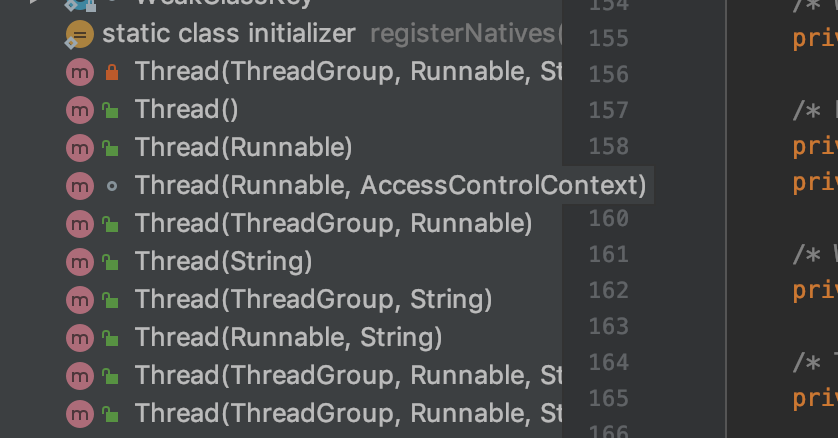
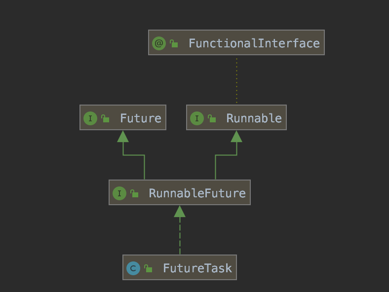
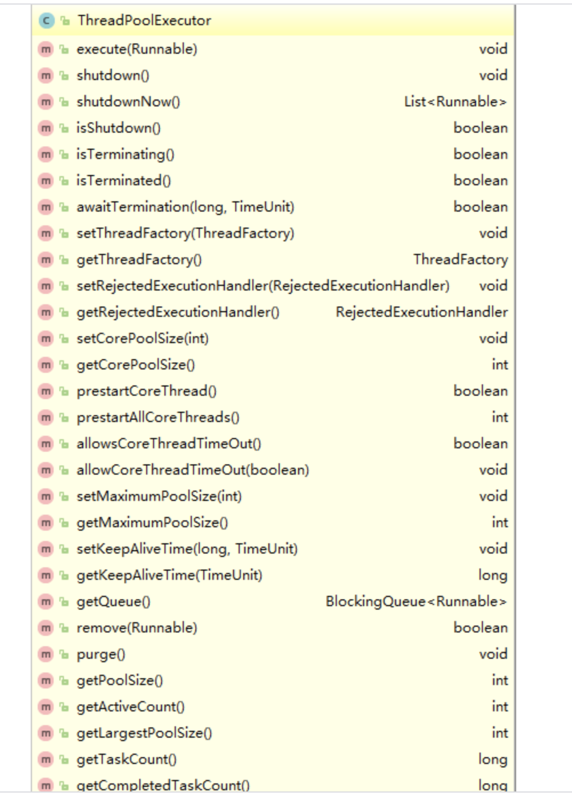

## java线程实现方式

### java实现线程的三种方式:

- **继承thread类， 重写run方法**
- **实现方法runnable接口，实现run方法**。runnable接口是函数式接口，在实现接口时可以通过lambda表达式实现
- **实现callable接口，实现call方法**。同样是函数式接口，可以通过lambad表达式实现

#### runnable VS callable

|          | runnable | Callable                                                     |
| :------- | -------- | ------------------------------------------------------------ |
| 实现方法 | run      | call                                                         |
| 返回值   | 无       | 有                                                           |
| 抛出异常 | 无       | 有                                                           |
| 执行     |          | callable执行时，可以返回一个futrue对象<br>根据future对象获取返回结果、取消任务等 |

#### 多线程的执行

​	**多线程类是通过调用start方法开启多线程执行，其中里面有个started变量表示该多线程是否已经执行，所以多线程类只能被执行一次**；*实现的多线程类和普通类相同，可以直接调用run/call方法，这样的执行还是在原有的单线程里面执行；*

- **继承thread**：直接调用start执行即可

- **实现runnable接口**：将runnable实现类在new thread对象时传入，然后调用start执行即可

  

- **实现callable接口**：通过FutureTask匹配继承runnable接口，即可传递给Thread，用同样的方式开始

  

## java线程池

**ThreadPoolExecutor七大参数**

```java
public ThreadPoolExecutor(int corePoolSize, 
                          int maximumPoolSize,
                          long keepAliveTime,
                          TimeUnit unit,
                          BlockingQueue<Runnable> workQueue,
                          ThreadFactory threadFactory,
                          RejectedExecutionHandler handler) {
```

- **corePoolSize**： 核心池大小，对于cpu密集型建议Runtime.getRuntime().availableProcessors()+1；线程池初始化线程数为0，随着任务的提交，线程数逐渐增加
- **maximumPoolSize**：线程池最大线程数，当核心池满，阻塞队列满时，会增加线程执行提交的任务，当提交的任务超过**maximumPoolSize+阻塞队列阈值**时则会执行拒绝策略
- **keepAliveTime**：线程数超出corePoolSize大小时，最大空闲时间
- **unit**：keepAliveTime单位
- **workQueue**：阻塞队列，提交任务超过corePoolSize时进入阻塞队列，超出阻塞队列阈值时根据maximumPoolSize设置判断是否新增加线程继续执行
- **threadFactory**：线程工厂，线程池线程的产生工厂类，通过实现这个可以增加日志等信息
- **handler**：拒绝策略，当提交的任务超过**maximumPoolSize+阻塞队列阈值**时执行

##### *线程工厂threadFactory*

```java
public interface ThreadFactory {
    Thread newThread(Runnable r);
}
```

*ThreadPoolExecutor内容提供了默认的线程工厂类，其主要是设置了线程分组，将线程设置为非daemon守护线程，优先级设置*

```java
private static class DefaultThreadFactory implements ThreadFactory {
    private static final AtomicInteger poolNumber = new AtomicInteger(1);
    private final ThreadGroup group;
    private final AtomicInteger threadNumber = new AtomicInteger(1);
    private final String namePrefix;

    DefaultThreadFactory() {
        SecurityManager s = System.getSecurityManager();
        group = (s != null) ? s.getThreadGroup() :
                              Thread.currentThread().getThreadGroup();
        namePrefix = "pool-" +
                      poolNumber.getAndIncrement() +
                     "-thread-";
    }

    public Thread newThread(Runnable r) {
        Thread t = new Thread(group, r,
                              namePrefix + threadNumber.getAndIncrement(),
                              0);
        if (t.isDaemon())
            t.setDaemon(false);
        if (t.getPriority() != Thread.NORM_PRIORITY)
            t.setPriority(Thread.NORM_PRIORITY);
        return t;
    }
}
```

##### *拒绝策略handle，实现RejectedExecutionHandler接口*

```java
public interface RejectedExecutionHandler {
    void rejectedExecution(Runnable r, ThreadPoolExecutor executor);
}
```

*ThreadPoolExecuto实现了四种拒绝策略*:

- **AbortPolicy（默认策略）**：抛RejectedExecutionException异常
- **DiscardPolicy**：不做任何处置，直接抛弃
- **DiscardOldestPolicy**：抛弃阻塞对列最旧的任务，并将新进来的任务提交给线程池再次执行
- **CallerRunsPolicy**：将任务返回给提交任务线程执行

**ThreadPoolExecutor常用方法**



- *shutdown：*使当前未执行的线程继续执行，而不再添加新的任务Task，该方法不会阻塞。此时再往池中添加任务，会触发拒绝策略；此时池中不会立刻退出，直到池中的任务都已经完成，才会退出

- *shutdownNow：*池子调用shutdownNow，池中状态立马变成STOP状态，并试图停止所有正在执行的线程（除非有if判断人为的抛出异常），不再处理还在池队列中等待的任务，会返还未执行的任务
  - 当在Runnable中使用 if(Thread.currentThread.isInterruptd() == true)来判断当前线程的中断状态，，中断所有的任务task，并且抛出InterruptedException异常， 
  - 如果没有if语句，则池中运行的线程直到执行完毕

- *isShutdown：* 判断线程池是否已经关闭，只要调用的shutdown()方法，则isShutdown()方法的返回值就是true
- *isTerminating() 和 isTerminated()：*前者是否正在关闭，但尚未完全终止的过程，返回true，后者是已经关闭了
- *execute：*将任务提交给线程池执行，无返回
- *submit：*将任务提交给线程池执行，返回future对象


### Executors几种现有的线程池

- **newCachedThreadPool**：

  ```java
  public static ExecutorService newCachedThreadPool() {
      return new ThreadPoolExecutor(0, Integer.MAX_VALUE,
                                    60L, TimeUnit.SECONDS,
                                    new SynchronousQueue<Runnable>());
  }
  ```

* **newFixedThreadPool**

  ```java
  public static ExecutorService newFixedThreadPool(int nThreads) {
      return new ThreadPoolExecutor(nThreads, nThreads,
                                    0L, TimeUnit.MILLISECONDS,
                                    new LinkedBlockingQueue<Runnable>());
  }
  ```

- **newSingleThreadExecutor:** 对线程池进行了封装，不能修改线程池数量，保证线程次的线程单线程执行

  ```java
  public static ExecutorService newSingleThreadExecutor() {
      return new FinalizableDelegatedExecutorService
          (new ThreadPoolExecutor(1, 1,
                                  0L, TimeUnit.MILLISECONDS,
                                  new LinkedBlockingQueue<Runnable>()));
  }
  ```

- **ScheduledThreadPoolExecutor延迟线程**：其中的延时队列是通过堆的方式实现

  ```java
  public ScheduledThreadPoolExecutor(int corePoolSize) {
      super(corePoolSize, Integer.MAX_VALUE,
            DEFAULT_KEEPALIVE_MILLIS, MILLISECONDS,
            new DelayedWorkQueue());
  }
  ```

