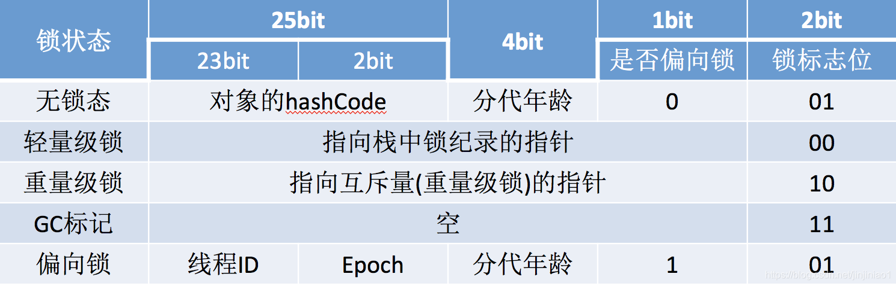
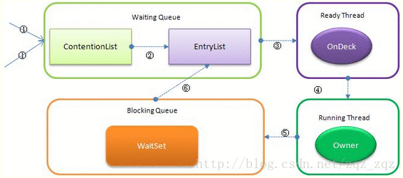

	java中的内置锁属于**每一个对象**，即**每一个java对象都可作为锁**，在**非静态方法上使用sychronized锁对象是实例对象**，在**静态方法上使用sychronized锁对象是类(Class)对象**

​	**synchronized的底层实现用到了临界区和互斥锁（重量级锁的情况下）这两个概念**

## sychronized实现原理

- **同步代码块**：sychronized是通过在方法块字节码前后加上monitorenter和monitorexit字节字节码来同步代码块的，要进入方法块执行同步方法就必须先通过monitorenter获取锁，进入后锁对象计数加1，并设置当前线程拥有者，退出monitorexit时会计数减1，锁对象计数为0时可被其它对象获得
- **同步方法**：方法级的同步是隐式的，无须通过字节码指令来控制，JVM可以从方法常量池的方法表结构中的ACC_SYNCHRONIZED访问标志得知一个方法是否声明为同步方法。当方法调用的时，调用指令会检查方法的ACC_SYNCHRONIZED访问标志是否被设置，如果设置了，执行线程就要求先持有monitor对象，然后才能执行方法，最后当方法执行完（无论是正常完成还是非正常完成）时释放monitor对象。在方法执行期间，执行线程持有了管程，其他线程都无法再次获取同一个管程

## java锁升级



- 由于java6之后偏向锁是开启的，也就是说当对一个代码块或者方法加上sychronized的时候先进入的是偏向锁获取状态。这时候依据4.1的步骤，通过CAS操作设置Mark-word格式如下

| 偏向锁 | 线程ID | Epoch | 对象分代年龄 | 1    | 01   |
| ------ | ------ | ----- | ------------ | ---- | ---- |
|        |        |       |              |      |      |

可见，偏向锁获取的阶段，只是指向了获取偏向锁的线程id，并没有用到Monitor对象。

- 当获取到某一个线程获取偏向锁的时候发现已经有线程获取了该对象的锁，当达到全局安全点（safepoint），获得偏向锁的线程被挂起，撤销偏向锁，恢复到无锁（标志位为 **01**）或轻量级锁（标志位为 **00**）的状态；这取决于持有偏向锁的线程是否还处于活动状态，如果不处于活动状态，则转为无锁状态，如仍然活着这升级为轻量级锁，将Mark-word中的锁记录指向当前栈中的锁记录。

- 在轻量级锁获取阶段，Mark-word的格式如下，这时候Mark-word指向的对象也不是Monitor对象，而是线程栈帧中开辟的一块用于存储锁记录的空间，存储的内容为Mark-word中的内容（个人认为是无锁状态下对象的hashcode，分代年龄等信息），称为Displaced Mark-word。

| 轻量级锁 | 指向栈中锁记录的指针 | 00   |
| -------- | -------------------- | ---- |
|          |                      |      |

- 在轻量级锁获取阶段，如果同时又其他线程竞争锁，这线程通过自旋来获取锁（循环CAS来修改Mark-word指向自己的锁记录地址），当自旋超时或者超过一定次数后，获取锁失败，导致锁膨胀为重量级锁，就是将Mark-word中的锁标志置为10，并指向Monitor对象，然后阻塞当前线程，当锁膨胀完成并返回对应的monitor时，并不表示该线程竞争到了锁。当持有轻量级锁的线程再次尝试进行CAS时，这时候已经被竞争线程修改，所以失败，释放锁，唤醒阻塞的线程，进入重量级锁阶段。

### sychronized重量级锁是通过monitor对象实现的

​	java对象通过在对象头中记录重量级锁（即monitor）指针并设置锁标志为10实现sychronized

###  	monitor对象

```c++
 1 ObjectMonitor() {
 2     _header       = NULL;//markOop对象头
 3     _count        = 0;
 4     _waiters      = 0,//等待线程数
 5     _recursions   = 0;//重入次数
 6     _object       = NULL;//监视器锁寄生的对象。锁不是平白出现的，而是寄托存储于对象中。
 7     _owner        = NULL;//指向获得ObjectMonitor对象的线程或基础锁
 8     _WaitSet      = NULL;//处于wait状态的线程，会被加入到wait set；
 9     _WaitSetLock  = 0 ;
10     _Responsible  = NULL ;
11     _succ         = NULL ;
12     _cxq          = NULL ;
13     FreeNext      = NULL ;
14     _EntryList    = NULL ;//处于等待锁block状态的线程，会被加入到entry set；
15     _SpinFreq     = 0 ;
16     _SpinClock    = 0 ;
17     OwnerIsThread = 0 ;// _owner is (Thread *) vs SP/BasicLock
18     _previous_owner_tid = 0;// 监视器前一个拥有者线程的ID
19   }
```

在Java虚拟机(HotSpot)中，monitor是由ObjectMonitor实现的，其主要数据结构如下(位于HotSpot虚拟机源码ObjectMonitor.hpp文件，C++实现的)

ObjectMonitor中有几个关键属性：

- _count用来记录该线程获取锁的次数
- _WaitSet存放处于wait状态的线程队列
- _EntryList存放处于等待获取锁block状态的线程队列，即被阻塞的线程
- _owner指向持有ObjectMonitor对象的线程
- OnDeck：任意时刻，最多只有一个线程正在竞争锁资源，该线程被成为OnDeck；

JVM每次从队列的尾部取出一个数据用于锁竞争候选者（OnDeck），但是并发情况下，ContentionList会被大量的并发线程进行CAS访问，为了降低对尾部元素的竞争，JVM会将一部分线程移动到EntryList中作为候选竞争线程。Owner线程会在unlock时，将ContentionList中的部分线程迁移到EntryList中，并指定EntryList中的某个线程为OnDeck线程（一般是最先进去的那个线程）。Owner线程并不直接把锁传递给OnDeck线程，而是把锁竞争的权利交给OnDeck，OnDeck需要重新竞争锁。这样虽然牺牲了一些公平性，但是能极大的提升系统的吞吐量，在JVM中，也把这种选择行为称之为“竞争切换”。

OnDeck线程获取到锁资源后会变为Owner线程，而没有得到锁资源的仍然停留在EntryList中。如果Owner线程被wait方法阻塞，则转移到WaitSet队列中，直到某个时刻通过notify或者notifyAll唤醒，会重新进去EntryList中。

处于ContentionList、EntryList、WaitSet中的线程都处于阻塞状态，该阻塞是由操作系统来完成的（Linux内核下采用pthread_mutex_lock内核函数实现的）。

**Synchronized是非公平锁** ：Synchronized在线程进入ContentionList时，等待的线程会先尝试自旋获取锁，如果获取不到就进入ContentionList，这明显对于已经进入队列的线程是不公平的，还有一个不公平的事情就是自旋获取锁的线程还可能直接抢占OnDeck线程的锁资源。

## wait、notify、notifyAll和yield

**wait（先获取了monitor锁才能调用，并且只释放当前对象锁）**：释放当前持有锁资源，并将当前线程置入wait set中

**notify**：随机唤醒一个waitset中的线程，放入entrylist参与竞争获取锁

**notifyAll**：唤醒所有waitset中的线程，放入entrylist参与竞争获取锁

**yield**：释放cpu资源和锁资源，将当前线程放入ready thread参与竞争锁（为了让更高优先级的线程先获取锁）

## 锁造成活跃性的原因

- **死锁**：存在竞争要素，且这一要素被多个锁保护，获取锁的顺序有多种方式（显示与非显示）
- **饥饿**：获取锁的线程在等待其它外部条件执行完成，造成其它线程等待
- **活锁**：获取锁的线程进入了错误的无休止执行环境